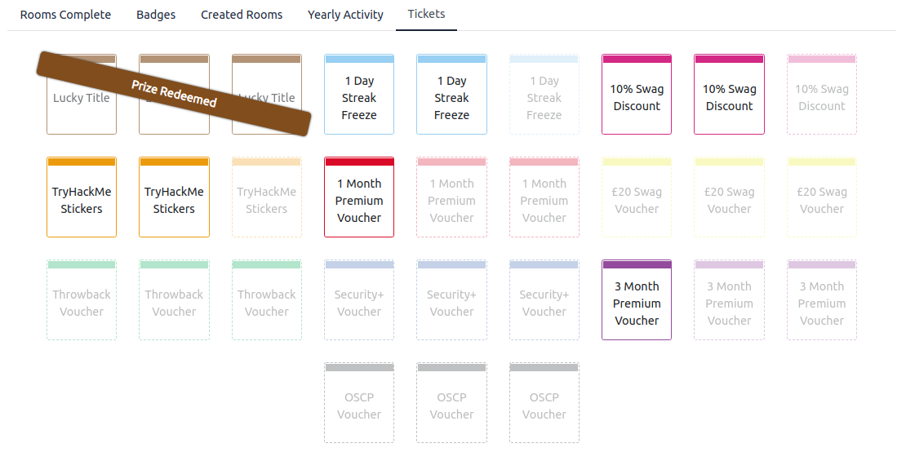

## Hack Your Way To Learn with TryHackMe

You are probably here because you want to start in the cyber security space, and to make the things easier and beginners friendly, [TryHackMe](https://tryhackme.com/) created a new learning path called ["Pre Security"](https://tryhackme.com/path/outline/presecurity) so you can get the fundamentals of some topics, here it’s the list:

In my humble opinion, the [Linux rooms](https://tryhackme.com/room/linuxfundamentalspart1) are sooo nice! If you are from another field, or you don’t have any technical/IT background it will be perfect for you, you will learn the basics and a little more in a easy way!

And that’s not all, if you don’t have a PC with Linux on it, it doesn’t matter, because they give you a free cloud based virtual machine just for you!!!
So you don’t have to worry about anyone else seeing what are you doing or breaking your own PC, because if you f\*#$ it up, you can just terminate that instance, and create another one, for free and in just 60 seconds!!

Or if you are more familiar with the Windows ecosystem you can start from there!

Also in this new path you will get the fundamentals about networking, protocols, commands, the OSI model and a lot of more things, so you can understand how the things works to later hack them!!

And if you really like the field, you can keep digging around on [TryHackMe](https://tryhackme.com/), they have over 400 rooms! More than 250 are for free! So you can give it a try, you won’t loose anything, you will win a lot a things!

And if we talk about winning, recently they created a way to win prizes for learning, yes it’s real, you will get rewarded for learning!!!

#### But, how much I have to pay for winning/participate?

Nothing! 

It’s for free!!! You will get 1 free ticket for every room, in the new path, that you complete!!

#### And what can I win?

You can even win a voucher for the OSCP certificate valued in U$D 1000!!!

So what are you waiting for? You need anything else???
Because I have more!!

If you join the [TryHackMe](https://tryhackme.com/) community with this [link](https://tryhackme.com/signup?referrer=e27e71d616a1) you will get one free ticket when you reach 100 points (it’s very easy, if you get stuck on a room, you can check my write ups!).

That’s it from me, just hack your way to learn!