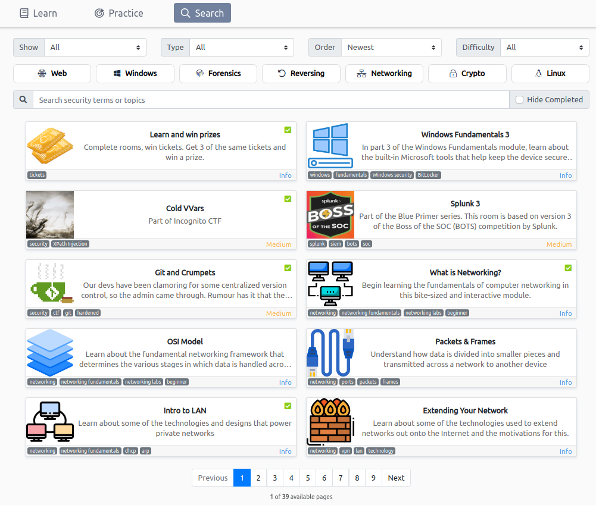

## Hackea tu forma de aprender con TryHackMe

Probablemente estés aquí porque deseas comenzar en el espacio de la seguridad cibernética, y para hacer las cosas más fáciles y amigables para los principiantes, [TryHackMe](https://tryhackme.com/) creó un nuevo curso llamado ["Pre Security"](https://tryhackme.com/path/outline/presecurity) para que puedas obtener los fundamentos de algunos temas, aquí está la lista:

En mi humilde opinión, las [salas de Linux](https://tryhackme.com/room/linuxfundamentalspart1) son de las mejors!! Si eres de otro campo, o no tienes ningún conocimiento técnico o en TI, será perfecto para ti, aprenderás los conceptos básicos y un poco más de una manera fácil.

Y eso no es todo, si no tienes una PC con Linux, no importa, porque te dan una máquina virtual gratuita en la nube solo para ti.
Por lo tanto, no tiene que preocuparse de que nadie más vea lo que está haciendo o por romper tu propia PC, porque si lo arruinas, puedes terminar esa instancia y crear otra, gratis y en solo ¡¡60 segundos!!

O si estás más familiarizado con el ecosistema de Windows, ¡puede comenzar desde allí!

¡También en este nuevo curso obtendrás los fundamentos sobre redes, protocolos, comandos, el modelo OSI y muchas más cosas, para que puedas entender cómo funcionan las cosas para luego hackearlas!

Y si realmente te gusta el campo, puedes seguir investigando en [TryHackMe](https://tryhackme.com/), ¡tienen más de 400 rooms! ¡Más de 250 son gratis! Así que puedes intentarlo, no perderás nada, ¡ganarás muchas cosas!

Y si hablamos de ganar, recientemente crearon una forma de ganar premios por aprender, sí, es real, ¡¡¡Serás recompensado por aprender!!!

#### Pero, ¿cuánto tengo que pagar por ganar/participar?

¡Nada!

¡¡¡Es gratis !!! ¡¡Obtendrás 1 boleto gratis por cada room, en el nuevo "path", que completes!!!

#### ¿Y qué puedo ganar?

Incluso puedes ganar un bono para el certificado OSCP valorado en U$D 1000 !!!

¿Entonces, Qué esperas? ¿¿¿Necesitas algo más???
¡¡Porque tengo más!!!

Si te unes a la comunidad [TryHackMe](https://tryhackme.com/) con este [enlace](https://tryhackme.com/signup?referrer=e27e71d616a1) obtendrás un boleto gratis cuando alcances los 100 puntos (es muy fácil, si te quedas atascado en algun room, ¡Puedes consultar mis write ups!).

Eso es todo de mi parte, ¡Hackea tu forma de aprender!