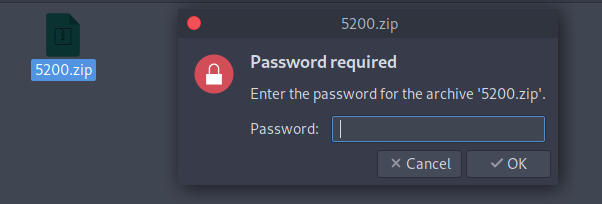
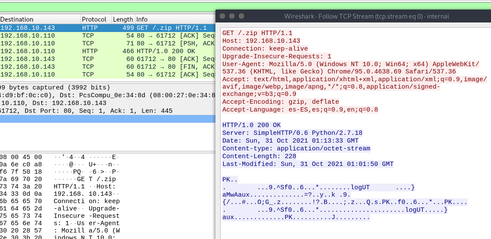

| 		Forensics		| 			  Trivia			|
|-----------------------|-------------------------------|
| [Funsys](#funsys)		| [Discord](#discord)			|
| [Locked](#locked)		| [Call me](#call-me)			|
| [Match](#match)  		| [Alternative](#alternative)  	|
| [Auth](#auth)			| [Modified](#modified)			|
| [Internal](#internal) | 								|

# Intro

Hey! Welcome!

This time I come to bring you how some CTFs of the conference were solved, challenges created by Null Life & GitHub Security Lab.

This challenges were really challenging, interesting and I even ranked 20th!! Luckily I was able to complete some of them since I am a student of the [Hackademy](https://hackademy.ekoparty.org/), the academy to learn Cybersecurity of the [Ekoparty](https://ekoparty.org/)!

Let's start with the challenges!

You also wanna share how you completed the challenges? Go [here](#the-end)!

# Forensics

## Funsys

Starting with this new forensic challenge: Let's see what kind of file we have here...

```bash
╰─ lanfran@parrot ❯ file funsys 
funsys: Linux rev 1.0 ext2 filesystem data (mounted or unclean), UUID=78f7e6f8-f21f-4553-95e4-1ac094918c51 (large files)
```
Great! We have a filesystem, so let's mount it to see what's inside!

```bash
╰─ lanfran@parrot ❯ sudo mount funsys mnt/

╰─ lanfran@parrot ❯ ls -la mnt/
total 2072
drwxr-xr-x 4 root    root       1024 lis  5 17:21 .
drwxr-xr-x 1 lanfran lanfran      18 lis  8 08:14 ..
-rw-r--r-- 1 root    root         17 paź 31 02:33 .k
drwx------ 2 root    root      12288 paź 31 02:33 lost+found
-rw-r--r-- 1 root    root    2097152 paź 31 02:33 .RhYSrEm8d

╰─ lanfran@parrot ❯ cat .k 
1TxYs0r4ZRre0r3U

╰─ lanfran@parrot ❯ file .RhYSrEm8 
.RhYSrEm8: data
```

A file wih an strange name, `.RhYSrEm8d`, that has some "data" and another file, `.k` with an string.

So, if we run `binwalk` we can extract the data from the "`.RhYSrEm8d`" file.
```bash
╰─ lanfran@parrot ❯ sudo binwalk -e .RhYSrEm8 

╰─ lanfran@parrot ❯ ls -laR
.:
total 2072
drwxr-xr-x 4 root    root       1024 lis  8 08:18 .
drwxr-xr-x 1 lanfran lanfran      18 lis  8 08:14 ..
-rw-r--r-- 1 root    root         17 paź 31 02:33 .k
drwx------ 2 root    root      12288 paź 31 02:33 lost+found
-rw-r--r-- 1 root    root    2097152 paź 31 02:33 .RhYSrEm8
drwxr-xr-x 2 root    root       1024 lis  8 08:18 _.RhYSrEm8.extracted
ls: cannot open directory './lost+found': Permission denied

./_.RhYSrEm8.extracted:
total 1875
drwxr-xr-x 2 root root    1024 lis  8 08:18 .
drwxr-xr-x 4 root root    1024 lis  8 08:18 ..
-rw-r--r-- 1 root root 1908736 lis  8 08:18 5200.zip
```

Now we have a `.zip` file, and inside a file, requesting a password to read it... 



Using the password from the `.k` file is the solution! You don't need to crack it!
```bash
╰─ lanfran@parrot ❯ cat f.t 
EKO{th1s_1s_1ncr3d1bl3}
```
Finished!

## Locked

For this challenge we need to find the IP address and the mask with most dropped packages, for this we used a simple keyword with `grep`. We used `K DROP` to filter the results, and in the list we found the flag:

```bash
╰─ lanfran@parrot ❯ cat locked.log | grep "K DROP" 
[...]
40690 3147K DROP       all  --  !lo    *       34.192.0.0/12        0.0.0.0/0           
14829 1166K DROP       all  --  !lo    *       34.208.0.0/12        0.0.0.0/0           
87870 6751K DROP       all  --  !lo    *       34.210.0.0/12        0.0.0.0/0            <-- The flag!
15610 1230K DROP       all  --  !lo    *       34.240.0.0/13        0.0.0.0/0
[...]
```
`EKO{34.210.0.0/12}`


## Match

We had 2 files, `eko.local-access.log` and `eko.local-error.log`, if we `grep` the access log with the `HTTP response 200` we can find just 3 endpoints:

```bash
╰─ lanfran@parrot ❯ cat eko.local-access.log | grep "HTTP/1.1\" 200"                                                               
10.0.3.1 - - [10/Oct/2021:04:32:31 +0000] "HEAD / HTTP/1.1" 200 258 "-" "Mozilla/5.00 (Nikto/2.1.6) (Evasions:None) (Test:Port Check)"
10.0.3.1 - - [10/Oct/2021:04:32:31 +0000] "GET / HTTP/1.1" 200 339 "-" "Mozilla/5.00 (Nikto/2.1.6) (Evasions:None) (Test:getinfo)"
10.0.3.1 - - [10/Oct/2021:04:32:31 +0000] "GET / HTTP/1.1" 200 339 "-" "Mozilla/5.00 (Nikto/2.1.6) (Evasions:None) (Test:map_codes)"
10.0.3.1 - - [10/Oct/2021:04:33:03 +0000] "GET /config.php HTTP/1.1" 200 296 "-" "Mozilla/5.00 (Nikto/2.1.6) (Evasions:None) (Test:000997)"
10.0.3.1 - - [10/Oct/2021:04:33:03 +0000] "GET /config.php.bak HTTP/1.1" 200 7411 "-" "Mozilla/5.00 (Nikto/2.1.6) (Evasions:None) (Test:006638)"
```
`EKO{config.php.bak}` was the flag.

## Auth

Again for this challenge we used yet another filter :)

We can start filtering the request by the accepted connections with the correct password, after that remove the duplicated IPs and cleaning to get only the IP, we have a file with 231 IPs, quite a lot...

But... The last IP is different from the rest and looks like a `1337(Leet)` IP. _(This is a refference to the [h4x0r](https://www.urbandictionary.com/define.php?term=1337%20h4x0r) "language")_

And that's the flag!!

`EKO{80.13.31.7}`

This is the entire bash command to get the list of IPs:

```bash
─ lanfran@parrot ❯ cat auth.log | grep "Accepted" | grep -E -o "([0-9]{1,3}[\.]){3}[0-9]{1,3}" | sort | uniq
80.10.50.1
80.10.50.10
80.10.50.100
80.10.50.101
[...]
80.10.50.96
80.10.50.97
80.10.50.98
80.10.50.99
80.13.31.7 			<--- The last one is the flag!
```

## Internal

We have a `.pcap` file, let's open it with `wireshark`.

We can follow the `TCP` stream and we can see a request of a `.zip` file. 



We can export it with wireshark _(If you don't know how: Go to File > Export Objects... > HTTP )_

This zip has a `.log` file inside, but it is password protected, so we can crack it with `fcrackzip` .

```bash
╰─ lanfran@parrot ❯ fcrackzip -D -v -p /usr/share/wordlists/rockyou.txt -u exported.zip                                            ─╯
found file '.log', (size cp/uc     54/    42, flags 9, chk a839)


PASSWORD FOUND!!!!: pw == 2222
```
After cracking the password, we can export the file.

It has a `key` and an username.
```bash
╰─ lanfran@parrot ❯ cat .log                                                                                                       ─╯
Hi Arno0x0x, your key is 4lzUySyIu9OEPv6E
```

Googling the username "Arno0x0x", we found this repository for [DNS Exfiltrator](https://github.com/Arno0x/DNSExfiltrator). A tool for transfering (exfiltrate) a file over a DNS request covert channel.

And we have some DNS requests in the `.pcacp` file, here they are:

`init.MZWGCZZOOR4HI7BR.base64.ctf.ekoparty.org`

`0.h2x6Nstk5-xLWxkTIQVtXjm0WEDjbsY3b3ikP9aJcS8rdrDjQsp1-mlYMf4NNO7.dXMpSHmfQNrEhDHc9hPKC9c_ByTPE1R1IbC725RfqAZ32eggtHRc_KXVFLMC7iz.U4R3WRJnnXxRJ-FqvW1ZGRZ1HE-9apLYZUqnjAqsnFAMH5me0b4AdA7fBzgG2-F.uHWHh1s6cifvnE.ctf.ekoparty.org`


So, editing a little the script of Arno0x0x, I created a decoder to get the flag with the information that we have.


#!/usr/bin/python
# Code created by Arno0x, Edited by Lanfran02 
# -*- coding: utf8 -*-
from base64 import b64decode
import sys

#======================================================================================================
#											HELPERS FUNCTIONS
#======================================================================================================

#------------------------------------------------------------------------
# Class providing RC4 encryption/decryption functions
#------------------------------------------------------------------------
class RC4:
	def __init__(self, key = None):
		self.state = range(256) # initialisation de la table de permutation
		self.x = self.y = 0 # les index x et y, au lieu de i et j

		if key is not None:
			self.key = key
			self.init(key)

	# Key schedule
	def init(self, key):
		for i in range(256):
			self.x = (ord(key[i % len(key)]) + self.state[i] + self.x) & 0xFF
			self.state[i], self.state[self.x] = self.state[self.x], self.state[i]
		self.x = 0

	# Decrypt binary input data
	def binaryDecrypt(self, data):
		output = [None]*len(data)
		for i in xrange(len(data)):
			self.x = (self.x + 1) & 0xFF
			self.y = (self.state[self.x] + self.y) & 0xFF
			self.state[self.x], self.state[self.y] = self.state[self.y], self.state[self.x]
			output[i] = (data[i] ^ self.state[(self.state[self.x] + self.state[self.y]) & 0xFF])
		return bytearray(output)
		
#------------------------------------------------------------------------
def fromBase64URL(msg):
	msg = msg.replace('_','/').replace('-','+')
	if len(msg)%4 == 3:
		return b64decode(msg + '=')
	elif len(msg)%4 == 2:
		return b64decode(msg + '==')
	else:
		return b64decode(msg)


qname = str("0.h2x6Nstk5-xLWxkTIQVtXjm0WEDjbsY3b3ikP9aJcS8rdrDjQsp1-mlYMf4NNO7.dXMpSHmfQNrEhDHc9hPKC9c_ByTPE1R1IbC725RfqAZ32eggtHRc_KXVFLMC7iz.U4R3WRJnnXxRJ-FqvW1ZGRZ1HE-9apLYZUqnjAqsnFAMH5me0b4AdA7fBzgG2-F.uHWHh1s6cifvnE.ctf.ekoparty.org")

msg = qname[0:-(len("ctf.ekoparty.org")+2)] # Remove the top level domain name
chunkNumber, rawData = msg.split('.',1)
chunkIndex = 0
fileData = ''

#---- Is this the chunk of data we're expecting?
if (int(chunkNumber) == chunkIndex):
	fileData += rawData.replace('.','')
	chunkIndex += 1
	nbChunks = 1

#---- Have we received all chunks of data ?
if chunkIndex == nbChunks:
	try:
		# Create and initialize the RC4 decryptor object
		rc4Decryptor = RC4("4lzUySyIu9OEPv6E") # We use the key from the .log file
		
		# Save data to a file
		outputFileName = "Extracted.zip"
		print("[+] Decrypting using password [{}] and saving to output file [{}]".format("4lzUySyIu9OEPv6E",outputFileName))
		with open(outputFileName, 'wb+') as fileHandle:
			fileHandle.write(rc4Decryptor.binaryDecrypt(bytearray(fromBase64URL(fileData))))
			fileHandle.close()
			print("[+] Output file [{}] saved successfully".format(outputFileName))
	except IOError:
		print("[!] Could not write file [{}]".format(outputFileName))


With this `python2` code we can get the flag:

```bash
╰─ lanfran@parrot ❯ python2 decode.py                                                                                              
[+] Decrypting using password [4lzUySyIu9OEPv6E] and saving to output file [Extracted.zip]
[+] Output file [Extracted.zip] saved successfully

╰─ lanfran@parrot ❯ cat flag.txt                                                                                                  
EKO{Are_you_filtering_DNS_over_UDP?}
```

# Trivia

## Alternative

In this challenge we needed to use the alternative DNS Name for the ekoparty, we can get this viewing the Certificate and in the fields, search for "Certificate Subject Alternative Name".


The flag is: `EKO{noc.eko.party}`

## Discord

This challenge was very funny xD

A lot of people started to use `/flag` in the "ctf-advanced" channel of the Ekoparty's Discord server (Even I used it... 🤡) but didn't work.

\*cough\* _Trolleds_ \*cough\*...

The flag was actually in the description of the channel.


## Modified

This time we needed to ge the last modification date for the aboutus page, for this we can use the `sitemap.xml`. It's located here https://ekoparty.org/sitemap.xml

Going to it, we can get the lastmod date of the http://eko.party/aboutus page, that is `2019-12-22`. So the flag is: `EKO{2019-12-22}`

## Call me

For this challenge we needed to get an old phone number of the Ekoparty, I used a very _bad_ but effective Google dork: `"+54" inurl:ekoparty`. Trying with some of the numbers that google showed me, I found the flag.

# The End

That's some of the CTFs that I was able to complete, if you have another write up or you want to share with me how you completed another challenge, you can contact me via [Telegram](https://t.me/lanfran02), [Twitter](https://twitter.com/lanfran02), [Linkedin](https://www.linkedin.com/in/joaquin-lanfranconi/) or even create a [Pull Request](https://github.com/lanfran02/lanfran02.github.io/pulls) for this page! (Obviously you are going to be refered and in the credits sections!)