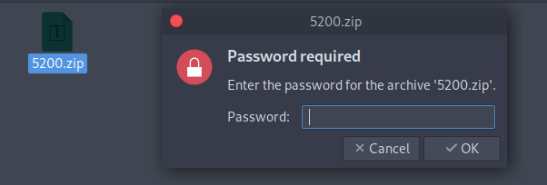
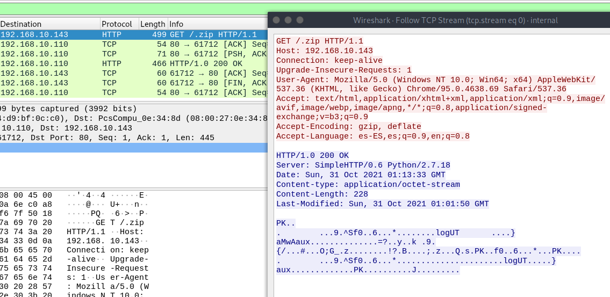
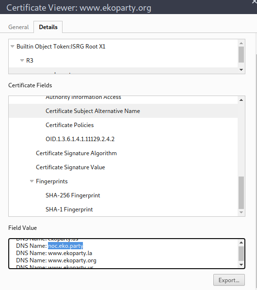
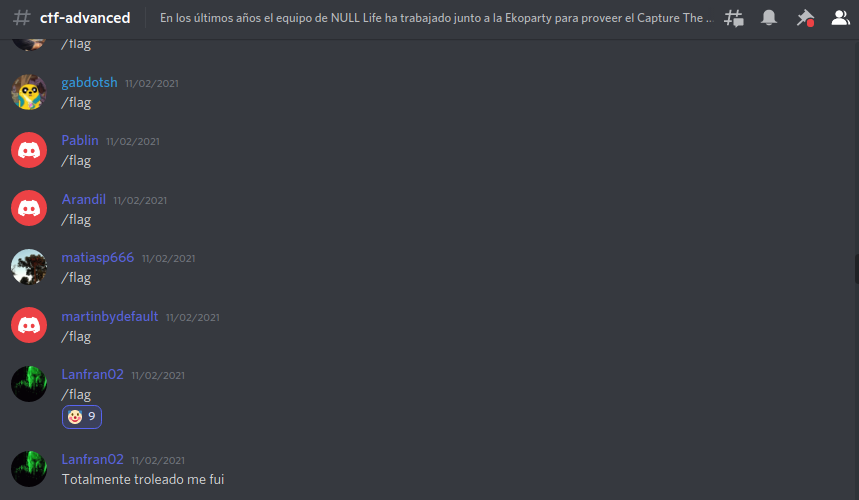
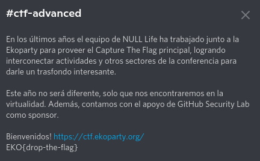

| 		Forense			| 			  Trivia			|
|-----------------------|-------------------------------|
| [Funsys](#funsys)		| [Discord](#discord)			|
| [Locked](#locked)		| [Call me](#call-me)			|
| [Match](#match)  		| [Alternative](#alternative)  	|
| [Auth](#auth)			| [Modified](#modified)			|
| [Internal](#internal) | 								|

# Introducción

¡Hey! ¡Bienvenid@!

En esta ocasión vengo a traerles cómo se resolvieron algunos CTFs de la conferencia, desafíos creados por Null Life & GitHub Security Lab.

¡Estos desafíos fueron interesantes e incluso llegué al puesto 20! Por suerte pude completar algunos de ellos ya que soy alumno de la [Hackademy](https://hackademy.ekoparty.org/), la academia para aprender Ciberseguridad de la [Ekoparty](https://ekoparty.org/)!

¡Comencemos con los desafíos!

¿También quieres compartir cómo completaste los desafíos? ¡Haz click [aquí](#the-end)!

# Forense

## Funsys

Comenzando con este nuevo desafío forense: Veamos qué tipo de archivo tenemos...

```bash
╰─ lanfran@parrot ❯ file funsys 
funsys: Linux rev 1.0 ext2 filesystem data (mounted or unclean), UUID=78f7e6f8-f21f-4553-95e4-1ac094918c51 (large files)
```
¡Excelente! Tenemos un filesystem, ¡así que montémoslo para ver qué hay dentro!

```bash
╰─ lanfran@parrot ❯ sudo mount funsys mnt/

╰─ lanfran@parrot ❯ ls -la mnt/
total 2072
drwxr-xr-x 4 root    root       1024 lis  5 17:21 .
drwxr-xr-x 1 lanfran lanfran      18 lis  8 08:14 ..
-rw-r--r-- 1 root    root         17 paź 31 02:33 .k
drwx------ 2 root    root      12288 paź 31 02:33 lost+found
-rw-r--r-- 1 root    root    2097152 paź 31 02:33 .RhYSrEm8d

╰─ lanfran@parrot ❯ cat .k 
1TxYs0r4ZRre0r3U

╰─ lanfran@parrot ❯ file .RhYSrEm8 
.RhYSrEm8: data
```

Un archivo con un nombre raro, `.RhYSrEm8d`, que tiene algunos "datos" y otro archivo, `.k` con texto plano dentro.

Entonces, si ejecutamos `binwalk` podemos extraer los datos del archivo "`.RhYSrEm8d`".
```bash
╰─ lanfran@parrot ❯ sudo binwalk -e .RhYSrEm8 

╰─ lanfran@parrot ❯ ls -laR
.:
total 2072
drwxr-xr-x 4 root    root       1024 lis  8 08:18 .
drwxr-xr-x 1 lanfran lanfran      18 lis  8 08:14 ..
-rw-r--r-- 1 root    root         17 paź 31 02:33 .k
drwx------ 2 root    root      12288 paź 31 02:33 lost+found
-rw-r--r-- 1 root    root    2097152 paź 31 02:33 .RhYSrEm8
drwxr-xr-x 2 root    root       1024 lis  8 08:18 _.RhYSrEm8.extracted
ls: cannot open directory './lost+found': Permission denied

./_.RhYSrEm8.extracted:
total 1875
drwxr-xr-x 2 root root    1024 lis  8 08:18 .
drwxr-xr-x 4 root root    1024 lis  8 08:18 ..
-rw-r--r-- 1 root root 1908736 lis  8 08:18 5200.zip
```

Ahora tenemos un archivo `.zip` y dentro un archivo que solicita una contraseña para leerlo...



¡Usar la contraseña del archivo `.k` es la solución! ¡No necesitas crackearlo!
```bash
╰─ lanfran@parrot ❯ cat f.t 
EKO{th1s_1s_1ncr3d1bl3}
```
¡Finalizado!

## Locked

Para este desafío, necesitamos encontrar la dirección IP y la máscara con la mayoría de los paquetes descartados(DROP), para esto usamos una palabra clave simple con `grep`. Usamos `K DROP` para filtrar los resultados, y en la lista encontramos la bandera:

```bash
╰─ lanfran@parrot ❯ cat locked.log | grep "K DROP" 
[...]
40690 3147K DROP       all  --  !lo    *       34.192.0.0/12        0.0.0.0/0           
14829 1166K DROP       all  --  !lo    *       34.208.0.0/12        0.0.0.0/0           
87870 6751K DROP       all  --  !lo    *       34.210.0.0/12        0.0.0.0/0            <-- La flag!
15610 1230K DROP       all  --  !lo    *       34.240.0.0/13        0.0.0.0/0
[...]
```
`EKO{34.210.0.0/12}`


## Match

Teníamos 2 archivos, `eko.local-access.log` y `eko.local-error.log`, si usamos `grep` con el registro de acceso para las peticiones con `respuesta HTTP 200` podemos encontrar solo 3 archivos:
```bash
╰─ lanfran@parrot ❯ cat eko.local-access.log | grep "HTTP/1.1\" 200"                                                               
10.0.3.1 - - [10/Oct/2021:04:32:31 +0000] "HEAD / HTTP/1.1" 200 258 "-" "Mozilla/5.00 (Nikto/2.1.6) (Evasions:None) (Test:Port Check)"
10.0.3.1 - - [10/Oct/2021:04:32:31 +0000] "GET / HTTP/1.1" 200 339 "-" "Mozilla/5.00 (Nikto/2.1.6) (Evasions:None) (Test:getinfo)"
10.0.3.1 - - [10/Oct/2021:04:32:31 +0000] "GET / HTTP/1.1" 200 339 "-" "Mozilla/5.00 (Nikto/2.1.6) (Evasions:None) (Test:map_codes)"
10.0.3.1 - - [10/Oct/2021:04:33:03 +0000] "GET /config.php HTTP/1.1" 200 296 "-" "Mozilla/5.00 (Nikto/2.1.6) (Evasions:None) (Test:000997)"
10.0.3.1 - - [10/Oct/2021:04:33:03 +0000] "GET /config.php.bak HTTP/1.1" 200 7411 "-" "Mozilla/5.00 (Nikto/2.1.6) (Evasions:None) (Test:006638)"
```
`EKO{config.php.bak}` era la flag.

## Auth

Nuevamente para este desafío usamos otro filtro :)

Podemos empezar a filtrar la solicitud por las conexiones aceptadas con la contraseña correcta, luego de eso eliminamos las IPs duplicadas y limpiamos para obtener solo la IP, tenemos un archivo con 231 IPs, bastantes...

Pero... La última IP es diferente del resto y parece una IP `1337 (Leet)`. _(Esta es una referencia al "lenguaje" [h4x0r](https://www.urbandictionary.com/define.php?term=1337%20h4x0r))_

¡¡Y esa es la bandera !!

`EKO{80.13.31.7}`

Este es el comando bash completo para obtener la lista de direcciones IP:

```bash
─ lanfran@parrot ❯ cat auth.log | grep "Accepted" | grep -E -o "([0-9]{1,3}[\.]){3}[0-9]{1,3}" | sort | uniq
80.10.50.1
80.10.50.10
80.10.50.100
80.10.50.101
[...]
80.10.50.96
80.10.50.97
80.10.50.98
80.10.50.99
80.13.31.7 			<--- La ultima es la flag!
```

## Internal

Tenemos un archivo `.pcap`, vamos a abrirlo con `wirehark`.

Podemos seguir la secuencia `TCP` y podemos ver una solicitud de un archivo `.zip`.



Podemos exportarlo con wirehark _(Si no sabe cómo: vaya a Archivo> Exportar objetos ...> HTTP)_

Este zip tiene un archivo `.log` dentro, pero está protegido con contraseña, por lo que podemos conseguirla con `fcrackzip`.

```bash
╰─ lanfran@parrot ❯ fcrackzip -D -v -p /usr/share/wordlists/rockyou.txt -u exported.zip                                            ─╯
found file '.log', (size cp/uc     54/    42, flags 9, chk a839)


PASSWORD FOUND!!!!: pw == 2222
```
Después de descifrar la contraseña, podemos exportar el archivo, que tiene una "clave" y un nombre de usuario.
```bash
╰─ lanfran@parrot ❯ cat .log                                                                                                       ─╯
Hi Arno0x0x, your key is 4lzUySyIu9OEPv6E
```

Buscando en Google el nombre de usuario "Arno0x0x", encontramos este repositorio: [DNS Exfiltrator](https://github.com/Arno0x/DNSExfiltrator). Una herramienta para transferir (exfiltrar) un archivo a través de un canal encubierto de solicitud de DNS.

Y tenemos algunas solicitudes de DNS en el archivo `.pcacp`, aquí están:

`init.MZWGCZZOOR4HI7BR.base64.ctf.ekoparty.org`

`0.h2x6Nstk5-xLWxkTIQVtXjm0WEDjbsY3b3ikP9aJcS8rdrDjQsp1-mlYMf4NNO7.dXMpSHmfQNrEhDHc9hPKC9c_ByTPE1R1IbC725RfqAZ32eggtHRc_KXVFLMC7iz.U4R3WRJnnXxRJ-FqvW1ZGRZ1HE-9apLYZUqnjAqsnFAMH5me0b4AdA7fBzgG2-F.uHWHh1s6cifvnE.ctf.ekoparty.org`


Entonces, editando un poco el script de Arno0x0x, creé un decodificador para obtener la bandera con la información que tenemos.


#!/usr/bin/python
# Code created by Arno0x, Edited by Lanfran02 
# -*- coding: utf8 -*-
from base64 import b64decode
import sys

#======================================================================================================
#											HELPERS FUNCTIONS
#======================================================================================================

#------------------------------------------------------------------------
# Class providing RC4 encryption/decryption functions
#------------------------------------------------------------------------
class RC4:
	def __init__(self, key = None):
		self.state = range(256) # initialisation de la table de permutation
		self.x = self.y = 0 # les index x et y, au lieu de i et j

		if key is not None:
			self.key = key
			self.init(key)

	# Key schedule
	def init(self, key):
		for i in range(256):
			self.x = (ord(key[i % len(key)]) + self.state[i] + self.x) & 0xFF
			self.state[i], self.state[self.x] = self.state[self.x], self.state[i]
		self.x = 0

	# Decrypt binary input data
	def binaryDecrypt(self, data):
		output = [None]*len(data)
		for i in xrange(len(data)):
			self.x = (self.x + 1) & 0xFF
			self.y = (self.state[self.x] + self.y) & 0xFF
			self.state[self.x], self.state[self.y] = self.state[self.y], self.state[self.x]
			output[i] = (data[i] ^ self.state[(self.state[self.x] + self.state[self.y]) & 0xFF])
		return bytearray(output)
		
#------------------------------------------------------------------------
def fromBase64URL(msg):
	msg = msg.replace('_','/').replace('-','+')
	if len(msg)%4 == 3:
		return b64decode(msg + '=')
	elif len(msg)%4 == 2:
		return b64decode(msg + '==')
	else:
		return b64decode(msg)


qname = str("0.h2x6Nstk5-xLWxkTIQVtXjm0WEDjbsY3b3ikP9aJcS8rdrDjQsp1-mlYMf4NNO7.dXMpSHmfQNrEhDHc9hPKC9c_ByTPE1R1IbC725RfqAZ32eggtHRc_KXVFLMC7iz.U4R3WRJnnXxRJ-FqvW1ZGRZ1HE-9apLYZUqnjAqsnFAMH5me0b4AdA7fBzgG2-F.uHWHh1s6cifvnE.ctf.ekoparty.org")

msg = qname[0:-(len("ctf.ekoparty.org")+2)] # Remove the top level domain name
chunkNumber, rawData = msg.split('.',1)
chunkIndex = 0
fileData = ''

#---- Is this the chunk of data we're expecting?
if (int(chunkNumber) == chunkIndex):
	fileData += rawData.replace('.','')
	chunkIndex += 1
	nbChunks = 1

#---- Have we received all chunks of data ?
if chunkIndex == nbChunks:
	try:
		# Create and initialize the RC4 decryptor object
		rc4Decryptor = RC4("4lzUySyIu9OEPv6E") # We use the key from the .log file
		
		# Save data to a file
		outputFileName = "Extracted.zip"
		print("[+] Decrypting using password [{}] and saving to output file [{}]".format("4lzUySyIu9OEPv6E",outputFileName))
		with open(outputFileName, 'wb+') as fileHandle:
			fileHandle.write(rc4Decryptor.binaryDecrypt(bytearray(fromBase64URL(fileData))))
			fileHandle.close()
			print("[+] Output file [{}] saved successfully".format(outputFileName))
	except IOError:
		print("[!] Could not write file [{}]".format(outputFileName))


Con este código en `python2` podemos obtener la bandera:

```bash
╰─ lanfran@parrot ❯ python2 decode.py                                                                                              
[+] Decrypting using password [4lzUySyIu9OEPv6E] and saving to output file [Extracted.zip]
[+] Output file [Extracted.zip] saved successfully

╰─ lanfran@parrot ❯ cat flag.txt                                                                                                  
EKO{Are_you_filtering_DNS_over_UDP?}
```

# Trivia

## Alternative

En este desafío, necesitábamos usar el nombre DNS alternativo para la ekoparty, podemos obtenerlo viendo el Certificado y en los campos, buscar el SAN _"Certificate Subject Alternative Name"_(Nombre alternativo del sujeto(?)).



La flag es: `EKO{noc.eko.party}`

## Discord

Este desafío fue muy divertido xD

Mucha gente comenzó a usar `/flag` en el canal "ctf-advanced" del servidor de Discord de Ekoparty (incluso yo lo usé ... 🤡) pero no funcionó.

\*tos\* _Trolleados_ \*tos\*...

La bandera estaba realmente en la descripción del canal.



## Modified

Esta vez necesitamos obtener la última fecha de modificación para la página "aboutus", para esto podemos usar el `sitemap.xml`. Se encuentra aquí https://ekoparty.org/sitemap.xml

Yendo a esa dirección, podemos obtener la última fecha de modificación de la página http://eko.party/aboutus, que es `2019-12-22`. Entonces la bandera es: `EKO {2019-12-22}`

## Call me

Para este desafío necesitábamos conseguir un número de teléfono antiguo de la Ekoparty, utilicé una dork de Google muy _mala_ pero efectiva: `" +54 "inurl: ekoparty`. Intentando con algunos de los números que google me dió, encontré la bandera.

# The End

Esos son algunos de los CTF que pude completar, si tiene otro o quiere compartir conmigo cómo completaste otro desafío, puede contactarme a través de [Telegram](https://t.me/lanfran02), [Twitter](https://twitter.com/lanfran02), [Linkedin](https://www.linkedin.com/in/joaquin-lanfranconi/) o incluso crear un [Pull Request](https://github.com/lanfran02/lanfran02.github.io/pulls) para esta página. (¡Obviamente vas a ser referido y en las secciones de créditos!)